## Fähre 1: Santorini

Ja, Freunde des wiederkehrenden Newsletters aus fernen und manchmal nicht-ganz-so-fernen Ländern, ich sitze
auf Fähre Nummer 1. Meine Nummerierung ist dabei chronologisch, nicht so wie bei Taxifahrer Nr. 7. Der war
zwar der erste auf der Insel seiner Aussage nach, aber hat die Lizenz Nummer 7. Aber ich greife vor bzw.
nach.

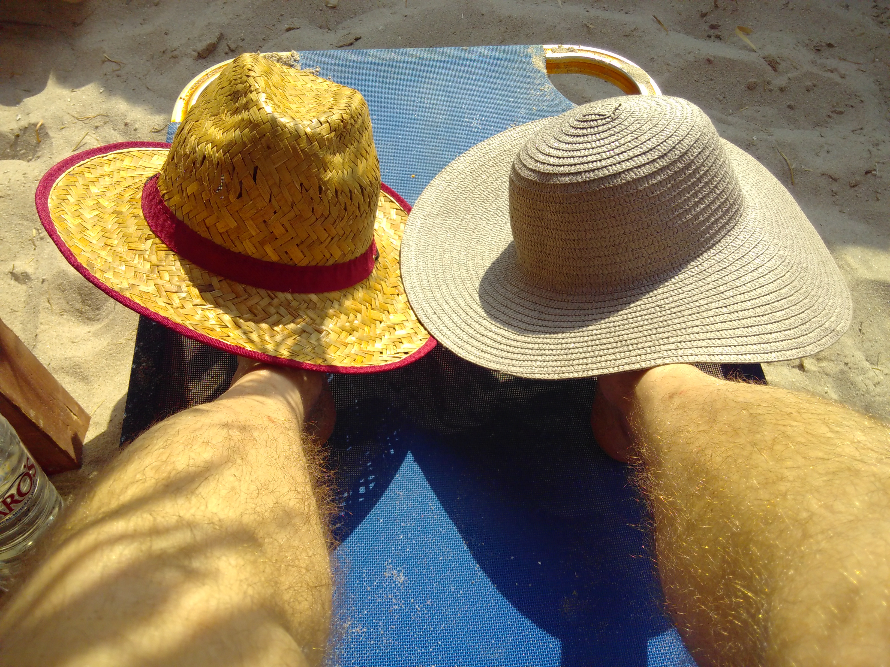

Denn diese Fähre bringt uns von Santorini nach Milos und die Kundigen unter euch wissen wo das liegt: In
Griechenland, genauer gesagt in den Zykladen. 12 Tage wohlverdienten lang ersehnten Urlaubs brachen endlich
wieder an. Der Flug, diesmal so gebucht dass wir nicht in Herrgottsfrühe im Dunkeln aufbrechen mussten,
verlief unaufregend. Das einzige was meinen Puls in die Höhe trieb war das neugierige Begutachten der
Schokoladenpreise im Athener Dutyfree-Bereich: ein Standardglas Nutella mit einer Tasse als „Sonderbeigabe“
für schlappe 19 Euro. Heroindealer gehen hier in die Lehre war mein Gedanke. Jedoch hatten wir über 6
Stunden Zeit bevor unser Flug weiter nach Santorini ging, so dass es möglich war mit der Metro einen
Abstecher für einen Kaffee, einen Snack und einen kleinen Spaziergang in die Athener Innenstadt machen
konnten, inkl. kurzer Blick hoch zu Akropolis.

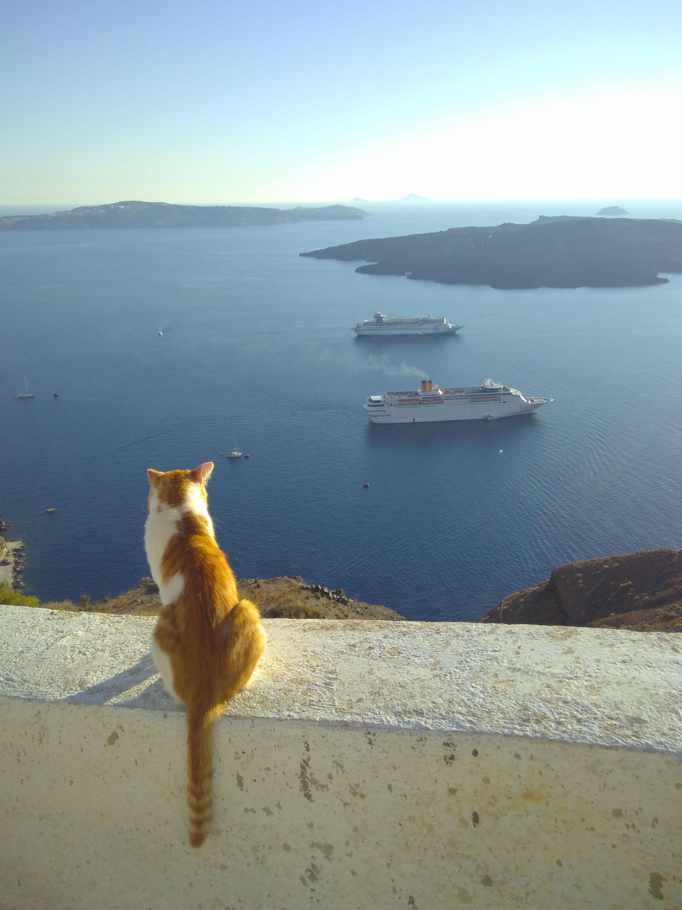

Zurück und ab in den Flieger, wo mein Augen eine Reihe vor mir eine Dame erblicken konnten, die ebenfalls
ein Fairphone ihr eigen nennt. Klingt wie Schleichwerbung, aber ich krieg keinen Cent dafür, nur ein wenig
besseres Gewissen :-)

Untergekommen waren wir in Perissa auf der günstigeren Ostseite, die jedoch gleichwertig wenn nicht sogar
besser für Strand/Sonnen/Essen/Chillaxing geeignet ist als die teure Westseite. Ein kleiner Pool, großes
Bett, saubere Zimmer, staubiger Vorplatz, super freundliche DameDesHauses, die sich mehr und mehr in uns
zwei verliebte. Fast schon natürlich wurden wir alle mit ‚Honey‘ angeredet, am letzten der 4 Abende wollte
sie mich und Stef zum Heiraten drängen und am Abschiedsmorgen gab sie als Krönung den freundlichen Rat:
„You will enjoy Milos, you can make a baby there.“ Wäre wir eine Nacht länger geblieben hätten wir sicher
Barry-White-CDs, Champagner und perforierte Kondome bei uns im Zimmer vorgefunden...

Apropos freundlich: Der freundliche Taxifahrer, der uns vom Airport in die Unterkunft brachte. Natürlich
versuchte er uns einen höheren Preis abzunehmen und liess sich dann doch auf den Standard ein. Er erzählt
uns auch, dass es nur 39 Taxis auf der Insel gibt, der Rest wird via Bus, Mietauto, Minivan oder Moped/Quad
erledigt, wobei insbesondere letztere trotz Helmpflicht aber dank Ignoranz derselbigen zu vielen Unfällen
führt.

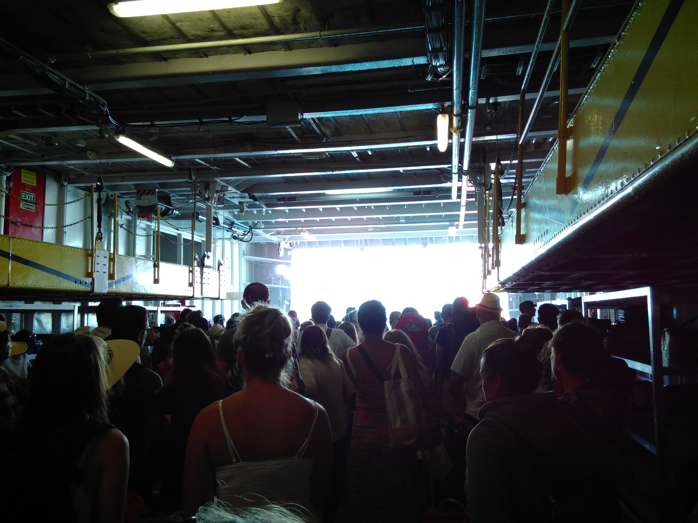

Also ein Mietauto an einem Tag geleistet und die Insel erkundet, auch die Dame an meiner Seite fuhr dank
neuerworbener Fahrerlaubnis die ländlichen Straßen dieses Eilands. Vom südlichen Leuchtturm bis hin zu
Fira, der zweit-nördlichsten Stadt der grade mal 18 km langen Insel, sind wir gefahren. In dieser an
Klippen gelegenen weißgetünchten Stadt genossen wir bei einem Cocktail wie die Sonne romantisch spektakulär
im Meer versank. Von Oia, der nördlichsten und noch mehr für diese Dinge von Touristen aufgesuchte Stadt
haben wir die Finger bzw. Füße gelassen, schon in Fira gab es genug andere die mit uns die Pflastersteine
in den schmalen Gässchen gefüllt mit Souvenierschmuckshops teilten. Dies spiegelte sich auch im
Cocktailpreis wieder, 11 EUR für ein kölschglas großen Cosmopolitan. Wie soll da erst Oia zu der Zeit sein,
wenn auch der September schon Richtung offseason sich neigt?

Dennoch: Tolle Insel, alles was man braucht in Perissa inklusive familiengeführter 24 h Bäckerei um die
Ecke, keine Stechmücken, dafür ein Museum über die industrielle Tomatenproduktion. Wir waren jedoch nicht
drin, auch wenn es mich interessierte, wo hier Tomaten im großen Stil wachsen sollen, wir sahen jedenfalls
keine Felder. Zur Fähre ging es dann mit Anfangs erwähntem Taxi Nr. 7, wobei der gute Mann a) meinte er
wäre der erste auf der Insel (vielleicht lag es daran der er 7 Brüder hatte, dass er nicht Nr. 1 bekam)
und b) wider 5 EUR einfach auf den Preis draufschlagen wolle („Reservationfee“), die ich ihm nach einem
Blick zu und von der Dame neben mir anstandslos gab. Milos, here we come...

## Fähre 2: Milos

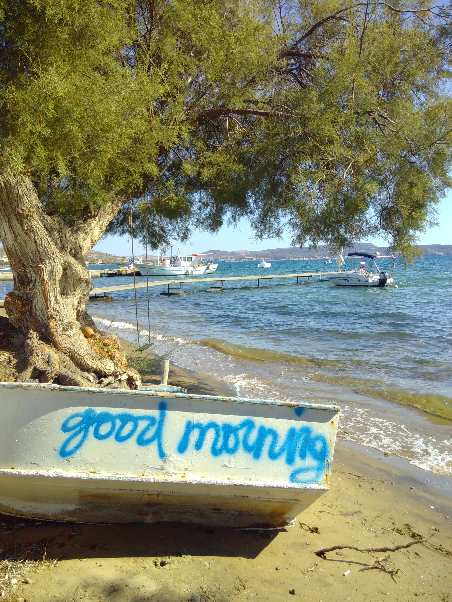

Hach, war das schön. Schön aber auch heiß auf Milos. Der Plan, im September auf griechischen Inseln so um
die 25 Grad zu haben, nicht zu wenig, nicht zu viel, ging mal so garnicht auf: 30 Grad und gefühlt noch
mehr. Im Gegensatz zu Perissa liegt Adamas, der Hafenort und gleichzeitig unser Basislager, nicht am offenen
Meer sondern in einer Bucht, so dass die kühlende Meeresbrise dort nicht wirklich ankommt. So war jeder
Spaziergang zwischen 11 und 16 Uhr eine Anstrengung und Kühlung gab es erst wenn man direkt am lokalen
Strand lag. Unsere Unterkunft haben wir in bester Backpacker-Manier erst im Hafen vor Ort uns ausgesucht.
Wie im Reiseführer beschrieben reihen sich dort bei Ankunft der Fähre die lokalen Vermieter auf, mit
einlamierten Broschüren ihrer Unterkünfte in der Hand und preisen selbige wie geschnitten Brot an, manch
einer weniger, manch einer mehr enthusiastisch: Und so kam es dass Manolo uns in seine Ferienzimmer mit
seinem klapprigen Auto chauffieren durfte. Etwaige Bedenken, dass die Nähe zum Hafen ("Just behind those
houses up there") nur metaphorisch gemeint war, zerschlugen sich, ebenso dass die Zimmer gephotoshopped
seien: Alles weiß, kuschelig, klimaanlagig und mit Espressokanne auf kleiner Kochplatte ausgestattet :-)

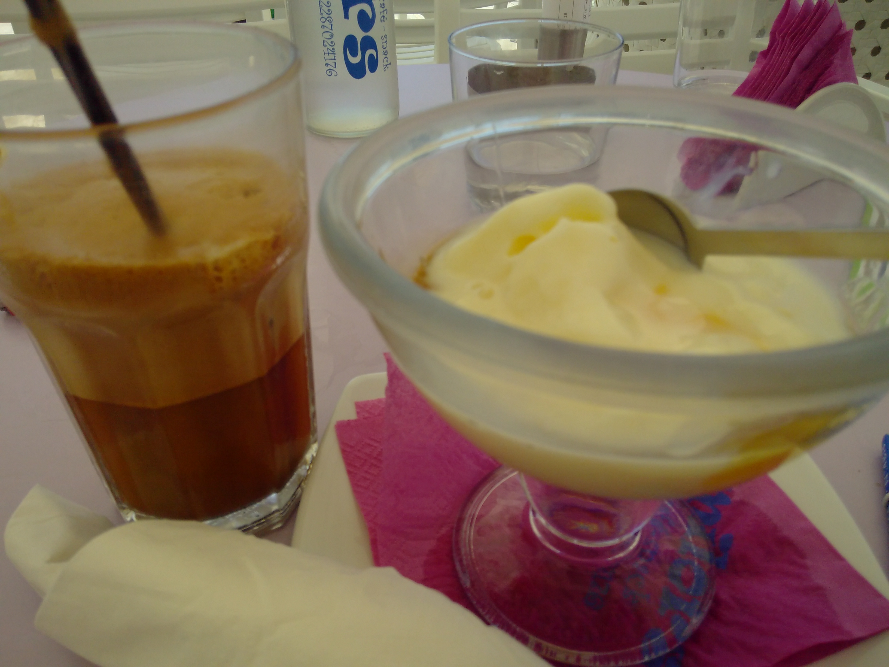

Während wir darauf warteten, dass unser Zimmer bezugsfertig wird, genossen wir an der Uferpromenade unsere
jeweiligen Lieblingsspeisen: Frozen Jogurt mit Honig für mich, kalter Eiskaffee für die Dame. Wobei ich
letzteres nicht wirklich als Speise bezeichne da es zwei Dinge hat, die ich mehr als abstoßend wenn nicht
gar blasphemisch finde: kalter Kaffee und Eis mit Kaffeegeschmack. Bäh! Jedenfalls wollte ich zu meinem
Jogurt auch ein Käffchen haben. Naiv und vielleicht noch etwas müde vom frühen Aufstehen für die Fähre
orderte ich die meiner Meinung nach lokale Kaffeespezialität "Capuccino freddo". Tja, jetzt weiß ich dass
"freddo" kalt heißt und die griechische Hauptzubereitungsart von Kaffee ist. Und diese Leute haben
Philosophie und Demokratie groß rausgebracht? Mir wird schummerig bei dem Gedanken...

Tapfer schluckte ich jedoch den Kaffee herunter, schließlich setzte schon die Mittagshitze ein und ich wollte
jede Abkühlung in mich hinein kriegen, die ich finden konnte. Erst gegen Abend erkundeten wir die
Uferpromenade wieder, die neben den üblichen Touristenläden und Restaurants auch den wie ich ihn nennen
Segelschiffstrich aufwies: Nebeneinander gereihte Segelschiffe für Ausflüge um die Insel, davor die
jeweiligen Verkäufer mit Broschüren und Aufstellern, die ihre Tour als die beste und tollste anpreisen und
dich sofort anquatschen wenn du nur in ihre Nähe kuckst. Ein Problem gab es nur: Ich hatte keine
Kontaktlinsen dabei, um ungestört auf eine Schnorcheltour zu gehen. "No Problem" sagte einer der Verkäufer,
es gäbe einen Augenarzt auf der Insel, der meine Augen vermessen und mir Linsen verschreiben könnte.

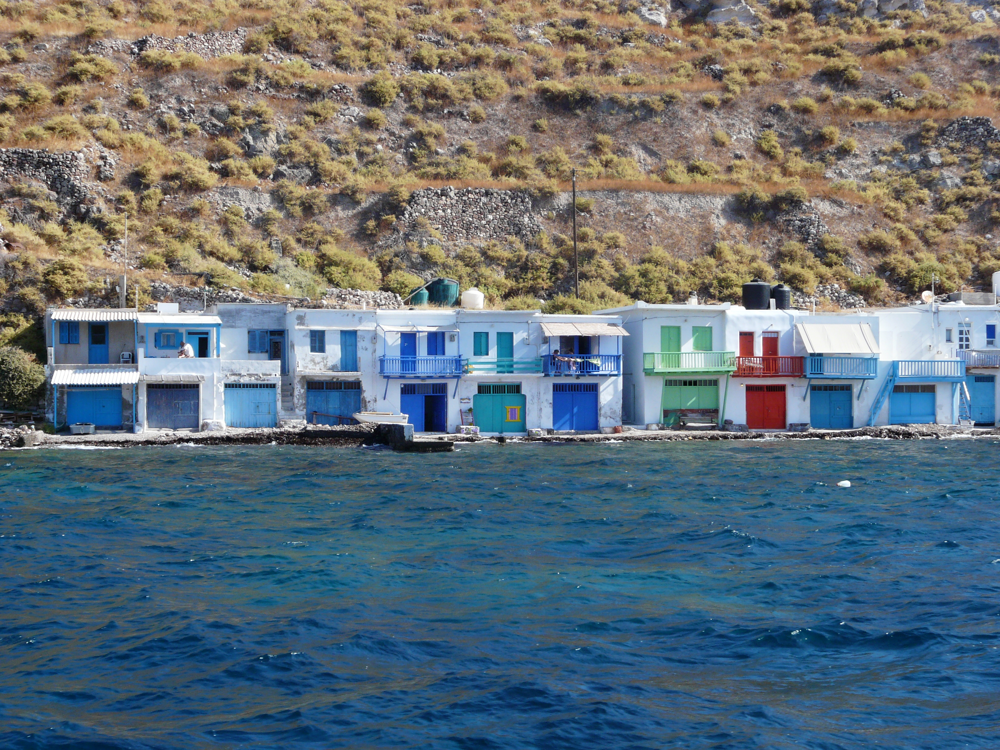

Mit diesem Ziel vor Augen ging ich am nächsten Tag zum Augenarzt, vielmehr trat ich vor unsere Tür und traf
auf Manolo, der im Auto vor unserer Unterkunft saß und dem ich von meinem Vorhaben berichtete. Sofort
schlug er vor, dass er mich zu dem Doktor fährt, er hätte eh nix vor gerade und seine Tochter auf dem
Rücksitz freue sich, wenn er mit ihr Auto fährt. Ok, fahren wir halt die 500m zum Doktor. Jedoch, der hatte
Mittagspause bis 18 Uhr, der clevere Mensch :-) Für Manolo kein Problem, wir fahren einfach zum Krankenhaus,
das liegt auch nur 5 Minuten entfernt, sagte er, dort könne man mir sicher auch helfen. Naja, 5 Minuten
waren untertrieben, 15 Minuten und etliche Serpentinen- und Dorfstraßen später stellte sich, welche
Überraschung, heraus, die die mir dort auch nicht weiterhelfen konnten, schließlich seien sie keine
Augenklinik :-) Dennoch, toll diese Freundlichkeit und Hilfsbereitschaft, die uns entgegen gebracht wurde,
trotz unserer deutschen Wurzeln. Abends dann zum echten Augenarzt gelaufen, Rezept geholt, Tageslinsen
gekauft, ab zum Segelschiffstrich, buchen, Vorfreude!

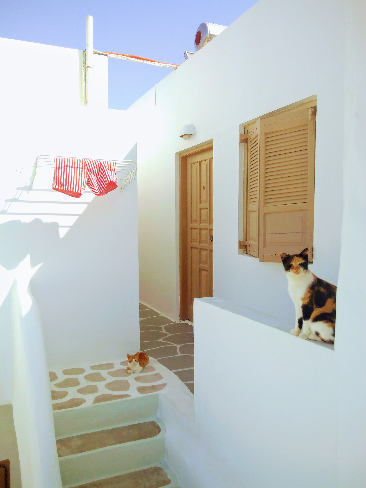

Natürlich stand auch auf dem Programm die Insel, die noch kleiner als Santorini ist, mit dem Auto zu
erkunden. Wieder viele tolle Strände mit kaltem und warmen Kaffee genossen, weißgetünchte Städtchen und
weißnaturelle Felsen gesehen und in einem kleinen Restaurant in Plaka lokale Spezialitäten (u.a. einen
ganzen Feta frittiert und mit Honig serviert) genossen. Währenddessen spielten drei Musiker griechische
Lieder und kleine Katzenbabies mit ihrer Mutter und dem Laub. Katzen gibt es auf Milos nämlich mehr als auf
Santorini, überall traf man sie, dösend oder am Tierschutzvereinfutternapf herumlungernd und wie ich schon
in Marokko theorisierte, sehr sauber gepflegt, da sie meiner Meinung nach sich jeden Morgen im Wasser
waschen gehen (man stelle sich dazu passend eine Szene aus Tom &amp; Jerry vor mit Tom in Badebuchsen :-)

Auch die Bootstour um die Insel enttäuschte nicht: Ein Kapitän, der sich nur mit "Jack Sparrow" anreden ließ
und dem Namen entsprechend gerne mit den Damen auf dem Boot flirtete, eine hilfreiche Stewardess namens
Johanna, die für die Verpflegung zuständig war, einsame Strände mit klarstem Wasser auf einer Insel neben
Milos, wo nur ein Ziegenhirte lebt. Dazu Vulkangesteinsformationen am Wasser, daneben malerische
Fischerdörfchen, die sogenannten Syrmatas, und am Ende mehr als ein Schnaps als wir wieder anlegten in
Adamas. So beschwingt schrieb ich einige Beobachtungen bzw. Gedanken nieder:

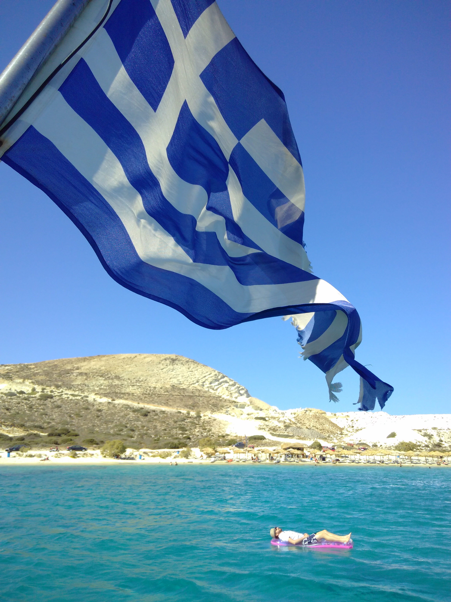

- Briefkästen gibt es keine an den Häusern, sondern Sammelbriefkästen an Straßenecken
- Das Konzept von abschließbaren Toiletten hat auch nicht jedes Restaurant umgesetzt, oft saß ich dort
  mit der Hand an der Türklinke. So geht Abenteuerurlaub!
- Meist wird die Rechnung in einem kleinen Glas gebracht, ist das eine Einladung selbige zu flambieren
  oder runterzu-exen?

Mit diesen Gedanken im Kopf und einem leckerem Souflaki-Sandwich in der Hand endete der letzte Abend in
Milos. Okay, einen Cocktail gab es vielleicht noch, wer weiß das schon noch :-) Am nächsten Morgen nahmen
wir die Fähre gen Athen, die wir nach einem letzten Jogurt und Kaffee gerade noch rechtzeitig erreichten.
Denn der auf neue Kundschaft wartende Manolo bemerkte, dass wir noch im Cafe sassen, während die Fähre schon
um die Ecke herum anlegte. Hach, herrlich diese Hilfsbereitschaft und Freundlichkeit...

## Fähre 3: Athen

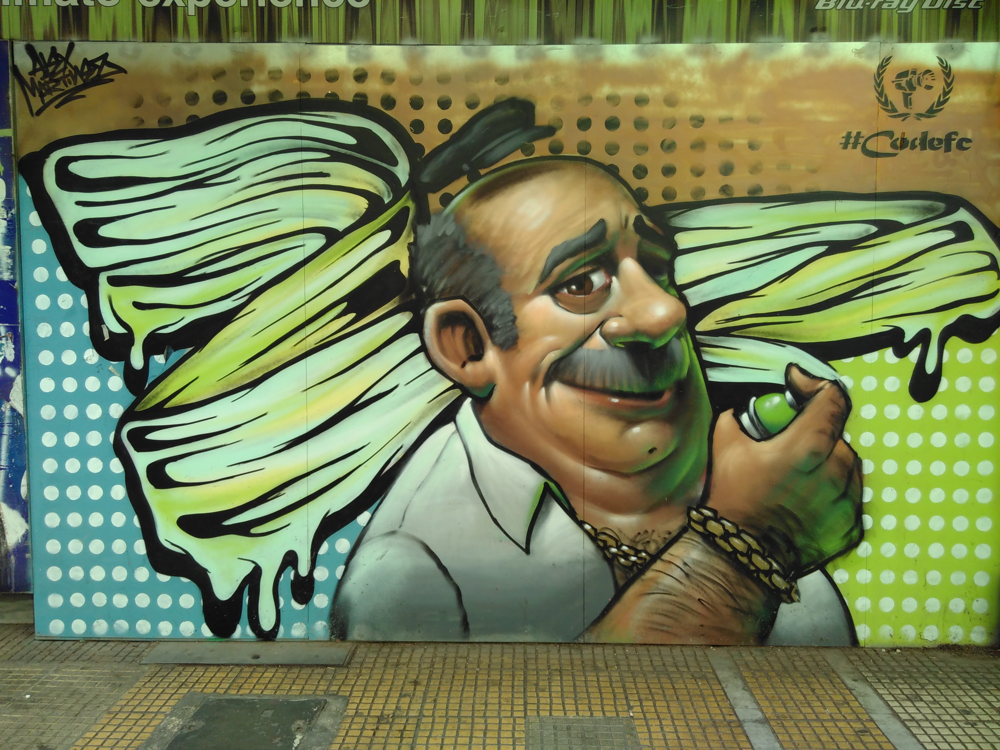

Eulen-Anspielung, Odysseus Vergleich, Sparta-Rufe, womit fängt man wohl nen Athen-Tagebucheintrag an? Wieder
was mit ner Fähre schreiben wäre ja auch blöd... Wir waren ja auch schonmal da gewesen auf dem Hinweg, die
gleichen Straßen wieder passiert, nachdem wir vom Hafen in Piräus mit der Metro reingefahren waren. Die
Hitze hat uns begrüßt wie in Milos, aber dank enger Straßen und reeeeelativ wenig stinkendem Verkehr in
den Seitengassen war es erträglicher (ausgenommen in der Mittagshitze natürlich).

Aber genau wegen dieser Hitze wanderten wir auch schon früh um achte morgens auf die Akropolis. Natürlich
auch um allzu vielen Touristengruppen aus dem Weg zu gehen, die so ab 10 Uhr mit Bussen angekarrt werden
als ob es Lama-Wärmedecken für lau gäbe. Doch auch so früh waren schon die typische Besuchergruppen zu
erkennen: dort wurde in russisch die Führung abgehalten, dort fachsimpelte ein britisches älteres Ehepaar,
Asiaten liefen mit und ohne Regenschirme umher und für mich zum ersten Mal in freier Wildbahn gesehen:
das Instagram-Girl, die blonden Haare in griechisch-antik geflochten, feines weisses Kleid, sich von
ihrem Freund in Pose an einem Olivenbaum, die Akropolis im Hintergrund, mit dem Smartphone knippsen lässt.
Oh well... Nicht meine Generation halt...

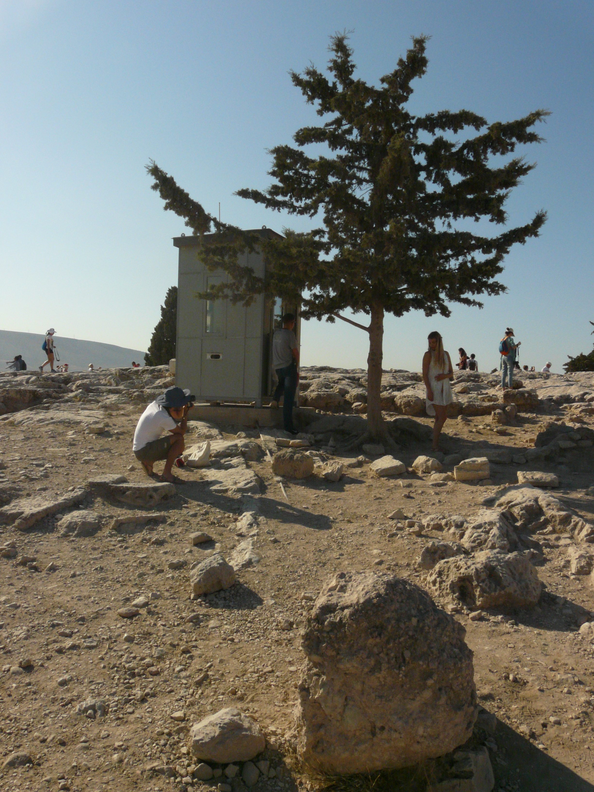

Apropos Instagram: Ein Grund, warum ich bei dem Namen so innerlich aufseufze: Man sieht ja nur das Schöne
gepostet. Wenige schreiben wohl mal was wie: "Mein langweiliger Bürotisch". Viele posten das schöne Bild der
Akropolis, den Dreck in den Strassen jedoch nicht. Der Satz war zwar nur metaphorisch gemeint, aber
natürlich war es nicht überall tiptop. Wir wohnten auch eher in nem links-alternativen Viertel mit dem
heruntergekommenen Haus ab und an. Jugendliche sassen und kifften in ein paar kleinen Gässchen, die zu
einem Platz führten, wo sich verkehrsberuhigt alle Arten von Alternative trafen, die Studenten, die Trinker,
die Punks, die Anti-Fa. Grasgeruch umwehte Transparente, die sicherlich Freiheit für wen forderten, der im
Hungerstreik war. G20-Graffitis an den Wohnhäusern und daneben Pizza und Souflaki Läden an den Seiten des
Platzes, wo auch wir sassen und das normale Leben spürten. Oder die Schnauze eines Hundes an unserer Hand,
der was zu essen darin suchte...

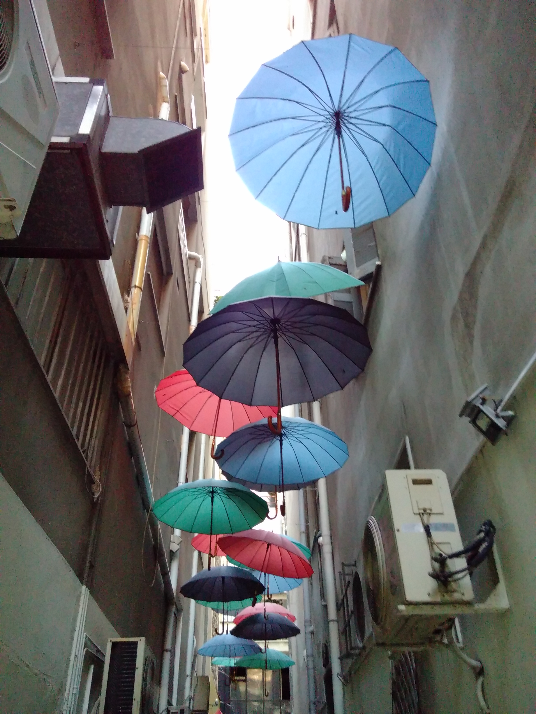

Und so wie wir von der Dachterasse unseres Hotel in diesem Viertel einen Super-Ausblick beim Frühstück auf
die Akropolis hatten, sie am Abend in 2 km Entfernung angeleuchtet sahen und dabei Sandy aus London drei
Tische weiter zuhören konnten, wie sie mit ihren wohl beim Rundreisen durch Europa kennengelernten
Freundinnen "I never ever" spielte und dabei verriet, dass sie schon in nem Club war wo Leute auf der Bühne
Sex hatten, und wie sie bei ihrem Ex Tommy mal mit ner sündhaft teuren Weinflasche nen fetten Fleck an die
Decke gemacht hat und und und inkl Billy, der aber zu crazy war... Ne Ne Ne, hinter diesem Instagram Leben,
da steckt auch das unangenehme, das einen schwitzig und dreckig zurücklässt, hier im Hotel und zwar:

**Die Defekte Klimaanlage**
Abends, ermüdet durch die Tageshitze und das leckere Essen bei einem Touri- aber dennoch einem guten
Touriladen, wollten wir schlafen. Und ich lasse mal so ne paar Worte einfach fallen: Alternatives Viertel,
Jugendliche, Bierchen, Musik, Treppenstufen, Treppe direkt neben Hotel, unser Zimmer an Treppe, Musik,
Bierchen, Jugendliche.

- Option 1: Fenster zu, alles gut, Klimaanlage an. Klimaanlage macht nicht kalt?
- Option 2: Zu warm, Fenster auf, Gabba Techno um 4 Uhr morgens. Konflikt.

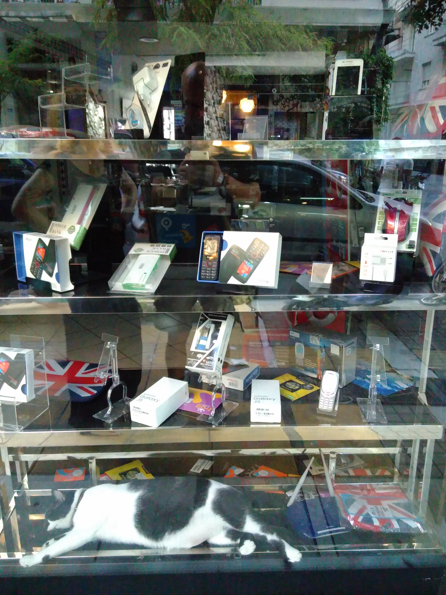

Übermüdet wußte ich dennoch, dass der Nachtportier weder um die Zeit die Jugendlichen mit Argumenten
überzeugen könnte, noch dass er einen Mechaniker finden würde, der schon aufstehen möchte. Aber er könne
anbieten, sagte er auf englisch und griff in eine Schublade. "Take these" und drückte mir Ohrstöpsel in die
Hand. Doch auch irgendwann wird der größte Gabba Fan müde, die Drogen lassen nach und die Sonne ist zu
grell. Dann konnten auch wir schlafen. Nur das postet ja keiner...

Auch das Titelfoto dieser Seite: Ein Bild hinter der Instagram Welt, wie sich dutzende Touristen um den
Sonnenuntergangsblick von dem Wolfsberg in der Nachbarschaft unseres Hotels balgen, Selfiesticks und Hälse
reckend, zehenspitzelnd und quetschend. Wenn man das erkennt, kann man sich auch an der Menschenmenge
erfreuen, wie gleich wir doch alle sind, auch wenn manche sich mehr in Szene setzen wollen. Genug
Philosphiegemansche aber nun, zurück ins Programm, was haben wir von der Antike mitgenommen nun:

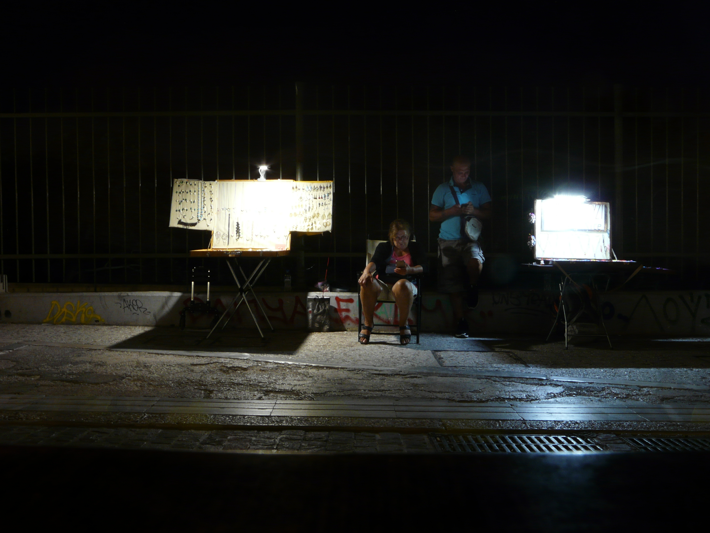

Akropolis, wie erwähnt, schön, am renovieren, aber wirkt so merkwürdig, davon den ganzen Talkessel zu
überblicken, der ja auch nur ein Teil Athens darstellt. Schon von der Fähre weiss man nicht wo Piräus
anfängt, oder ob das schon Athen ist. Alles relativ flache Häuser, vier bis fünf Stockwerke, erst im 19/20.
Jahrhundert so gewachsen und unter anderem von einem deutschen Städtebauer ein rechteckiges Strassenbild
spendiert bekommen. Übersichtlich. Der alte Teile hat natürlich seine kleinen verwinkelten kurvigen
Gässchen, aber der macht nur einen Bruchteil aus, die richtig antiken Anlagen nehmen glaub ich mehr Platz
ein, die Tempel, die Kirchen, die Stadien. Schmuck, Klamotten, Touristenzeugs, Nippes, Teures direkt daneben
zu kaufen, für mich Knauserer sprang eine neue SecondHand Jacke dabei raus. Und ein neuer Strohhut schon in
Milos, Schaaaatz, hab ich was vergessen zu schreiben was wir machten? Oh, die schläft schon....

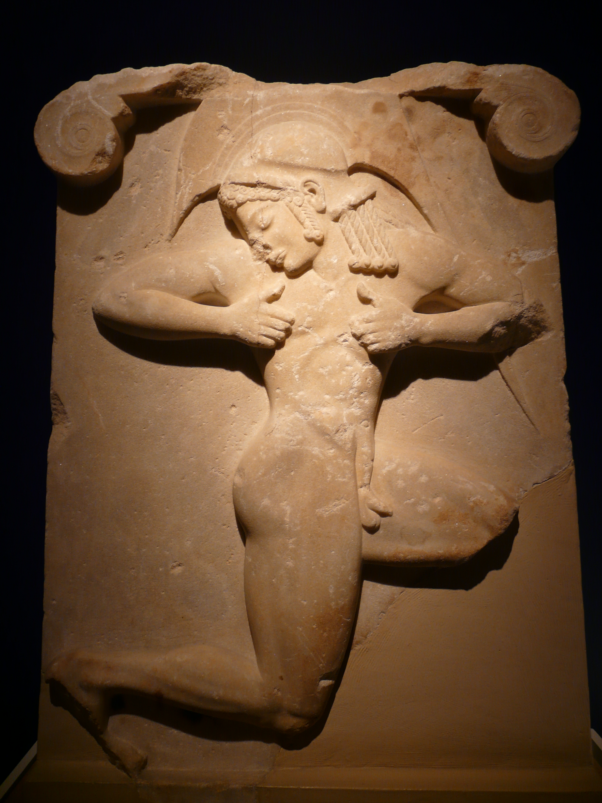

Also komme ich auch mal langsam zum Schluss, zählen wir noch was auf im Schnelldurchlauf: Museum mit
viiiiiieeeeeellleeeeen Amphoren und Büsten, lehrreich, aber irgendwann Overload, vor mancher Büste durfte
man sich aber nicht knipsen lassen, warum auch immer, Frozen Joghurt, geil! Kunst Graffiti Szene groß (wenns
schon der Stern auch schreibt isses aber für euch wohl auch schon längst bekannt), Wachablösung der
Palastwache ist wirklich drollig mit ihren Psychobob Schuhen und Ministry of Silly Walks Attitüde, viele
gesund aussehende Strassenkatzen, drolliges Frolicking von Schildkröten im Schildkrötenbecken des
Stadtparks, alte Omas, die auf der Strasse leben müssen, Wälder aus Häuserwänden mit dichtgrünbepflanzten
Balkonen, leckere kleine Bäckereien, Essen, Wärme, das griechische Dolce Vita, es war mir eine Freude und
wieder mal zu kurz. Aber, nun da der Text so lang wird, umso kürzer:

Danke fürs Zuhören, bis zum nächsten Mal!
