## 15. - 17. Dezember 2005: Panama City

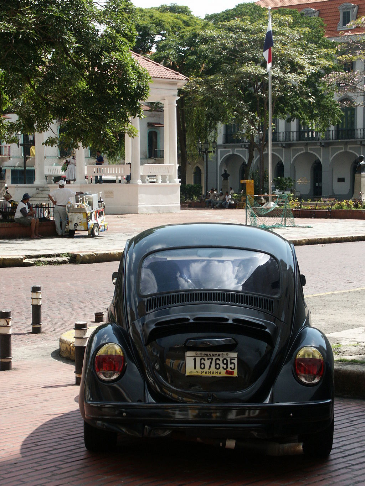

Kenner der griechischen Sprache, ihr könnt euch schon anhand der Betreffzeile
ausmalen wo ich mich befinde: Auf einem schmalen Streifen Land, der zwei größere
Landmassen verbindet, in meinem Fall für die, die noch nicht wissen, wo ich seit
18 Stunden bin, Süd- und Mittelamerika. Und um gleich zwei Dinge zu sagen, die
den Neidfaktor in die Höhe treiben:

1. Neben mir befindet sich eine Hängematte in die ich mich gleich legen werden
   um dazu eine frisch geköpfte Ananas zu genießen.

2. Während in Freiburg man beschlagene Brillenscheiben kriegt, wenn man momentan
   aus der Kälte in die warme Kneipe kommt, habe ich diese bekommen, als ich aus
   dem kühlen Taxi in die Hitze der Altstadt ausstieg. Der Flug verlief recht
   unspektakulär, außer dass ich sehr enttäuscht von der Zuverlässigkeit der
   westlichen Arzneimitteltechnik bin. Während die Packungsbeilage von Dramamin
   (und vor allem Konsumenten selbiger Seekrankheitspillen) nach Einnahme einer
   Tablette von einem achtstündigen Schlaferlebnis berichten, so ist dieses auch
   nach Einnahme einer zweiten Pille bei mir nicht eingetreten und ich musste
   mich mit gelegentlichem Wegdösen und zweitklassigen Filmen (z.B. Gremlins aus
   den 80ern) begnügen. Und da das Bier wie üblich auf diesen Flügen 5\$ kostet,
   konnte ich mich auch nicht dazu überwinden, die Wechselwirkungen von Alkohol
   und diesen Tabletten auszutesten.

Egal, Panama Stadt an sich ist schön, zumindest die Ecken, die man als Tourist
sich ansehen sollte. Auf dem Weg dorthin fährt man dann aber auch durch Gegenden
wo man selbst bei Tag nicht alleine durchlaufen will. Und wenn sogar die
schönste Ecke von PanamaCity, wo alte spanische Häuser und sogar der
PräsidentenPalast sind und tagsüber Fahrradpolizisten patrouillieren und einem
freundlich weiterhelfen, des nachts zu einem
“Da-gehn-sie-besser-nicht-hin”-Revier wird, dann sollte man so etwas nicht in
eine Email schreiben, die auch die eigene Mutter liest. Also Mama, mach dir mal
keine Sorgen, wir gehen da nicht hin (zumindest nachts).

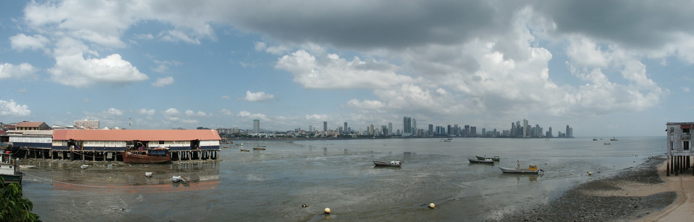

Wohin wir aber gehen werden, ist morgen Richtung Süden in die Provinz Los
Santos. Da soll es schöne unberührte Strände haben und wenn es uns da nicht
gefällt, zieht’s uns gleich weiter Richtung Westen zu dem höchsten Berg Panamas
(dies war natürlich Teynas Idee).

So, jetzt geht es ab in die Hängematte, mal sehen ob da schon ne kleine Deutsche
auf mich wartet.

Adios, V

PS: Kann mal jemand meinem Cousin Mike und seiner Frau Bescheid sagen, dass ihr
Emailpostfach voll ist? Und hat Silke überhaupt noch eine Emailadresse? Verkauft
LikeAStuntman immer noch Platten in Japan? Geht irgendjemand gerne auf
Klassentreffen?

## 18. - 23. Dezember 2005: Santa Catalina

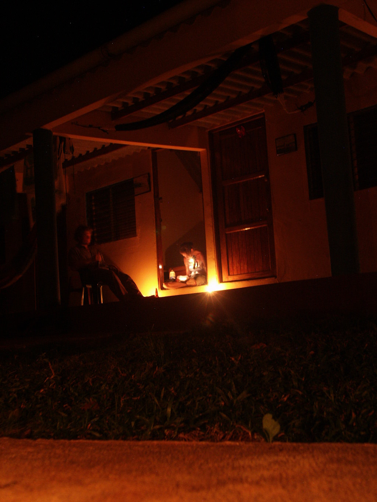

Freunde des eisigen Winters, es reicht momentan leider nur für eine knappe
Ortsangabe, da das einzige lokale Internetcafe nur via Guatemaltekischem
Satelliten Verbindung zur Außenwelt aufnehmen kann: Santa Catalina südöstlich
von Santiago ist wo wir uns momentan in Panama aufhalten. Den Rest kennt ihr ja
schon bzw. könnt ihn euch denken:

- heiß und regenfrei
- kühles Meer, d.h. ein Strand ist direkt daneben
- tropische Palmen und bildschöne Sonnenuntergänge
- frisches Seafood und günstiges Bier
- Tauchen und Schnorcheln in Korallenriffen

Danke, euer jetzt bis hierher zu hörendes verzweifeltes Aufschreien nach
Vergeltung ist Lohn genug für meine Arbeit diese Email zu schreiben. Mehr von
uns, wenn wir wieder in Orten sind, wo

- das einzige Telefon nicht erst gestern wieder zum ersten Mal seit 4 Wochen
  funktioniert
- jeder auch Mastercard/Visa nimmt, da man einen eigenen Telefonanschluss hat
- man auch ohne 4-Radantrieb hinkommt

So, dass zeigt hoffentlich wie abgeschieden wir hier sind (und wir lieben es).

Buenas noches, V

## 24. - 30. Dezember 2005: Boquette

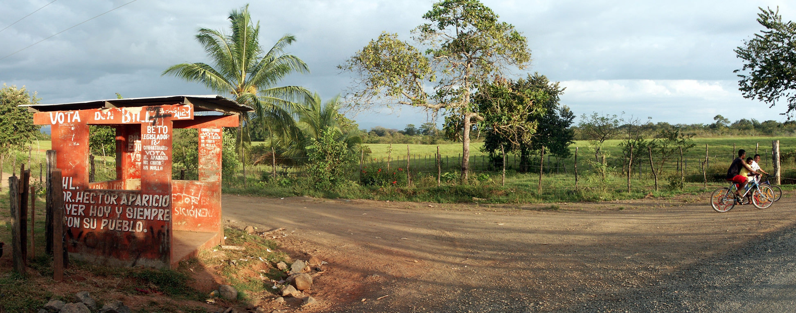

Frohe Weihnachten, Freunde, verspätet, aber aus triftigem Grund. Denn es ist
Zeit für mich, Buße zu tun, nicht für die lange Zeit ohne ein Lebenszeichen von
mir, sondern für meinen Hochmut, mit der ich meine Urlaubsreisen ankündige und
euch versuchte neidisch zu machen. Denn höret, die letzten Tage, genauer gesagt
seit dem 23. plagt mich die Rache dafür in Form eines Fiebers, was mir
körperlich zusetzt. Nun, was genau ist seit meiner letzten kurzen Email
passiert?

Wir ihr euch erinnert waren wir in dem kleinen örtchen Santa Catalina und haben
dort das Strandleben genossen, was neben Tauchen bzw Schnorcheln auch Teynas und
meine erste Surfstunden beinhalteten. Ein freundlicher Argentinier, der sonst
ein Restaurant im Dorf hat, hat uns kostenlos Lektionen erteilt und am Ende
haben wir es sogar geschafft ganz kurz auf den Brettern stehen zu bleiben (“ganz
kurz” = 0,5 - 1 Sek). Definitiv ein Sport, den ich bei Gelegenheit
weiterverfolgen sollte. Nur zu blöd, dass ich bei meinem letzten Ritt eine Finne
des geliehenen Boards abgebrochen habe. Aber wie sagte Abends dazu ein anderer
Surfer, ein Waldfeuerwehrmann aus Oregon: “And if there are no good waves out
there, at least you have nice day in the sea.”. Passend dazu gab es einen
Stromausfall fürs ganze Dorf, der erst am nächsten Morgen gefixt war, so dass
wir einen sehr romantischen Abend mit Kerzenschein verbrachten.

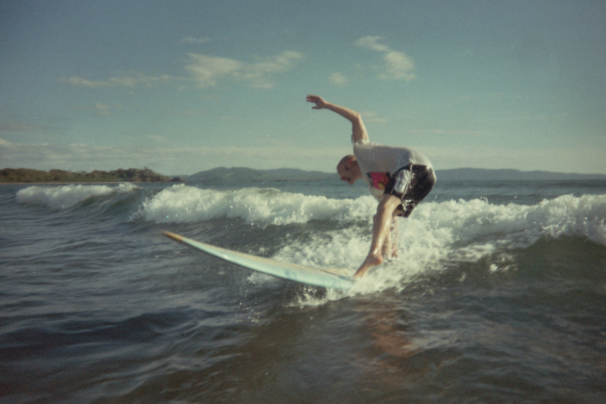

Eigentlich wollten wir am nächsten Tag dann einen Ausflug auf eine nahe
gelegene, geschützte Insel machen, aber ich wachte morgens mit Fieber auf. Der
Ausflug war damit gecancelt und Teyna meinte ganz trocken: “Ich würde ja Surfen
gehen, aber das Board hast du ja auch kaputt gemacht”. Da kein Arzt in Santa
Catalina und der nächste größere Ort 90 Minuten Autofahrt entfernt ist, machten
wir uns am nächsten Tag auf in eine Stadt zu fahren, wo wir a) einen Doktor
finden würden, wenn es nicht besser wird und b) man auch was unternehmen kann.
Da an dem Morgen auch auf einmal kein Wasser mehr aus den Hähnen kam, war das
letzte Zeichen zum Aufbruch.

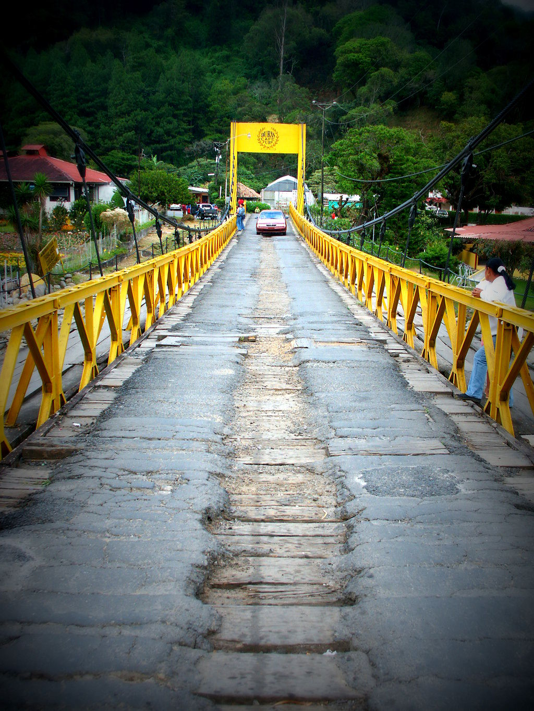

Also ging es nach Boquette, wo wir abends auch gleich Punkt a) in Anspruch
nahmen, da meine Fieber bedenklich wurde und ich auch rote Punkte an den Beinen
hatte. Jedoch gab der Arzt Entwarnung und diagnostizierte eine grippe-ähnliche
Infektion, wogegen er mit einfache paracetamol-ähnliche Tabletten gab, und Bisse
von kleinen Käfern, die vermutlich den billigen Preis des Hostels in Santa
Catalina erklärten. Weihnachten verbrachte ich somit mit Teyna im Hotelzimmer
vor einem rein spanisch sprechenden Fernseher und “Kevin allein in New York”.
Tja und so waren auch meine anderen Tage bisher in Boquette, unauffällig und
ohne große Touren. Das einzige was ich tat war eine Kaffeeplantage zu besuchen,
aber selbst das strengte mich so an, dass ich fast nicht glaube “nur” eine
Grippe zu haben. Teyna hat dafür wieder mal einen Vulkan bestiegen und macht
gerade noch eine Wanderung und dann schaffen wir uns nach David, um uns einen
weiteren Tag Pause zu können, bevor wir uns nach San Jose, Costa Rica
weitermachen. @Esther: Noch irgendwelche Tips für die Stadt? Nehmen die auch im
Zweifelsfall US-Dollar?

Also, ich hoffe ihr habt auch ohne mich alle ein frohes Fest gehabt, eventuell
sogar ein Klassentreffen, von dem ich gerne eine kurze Zusammenfassung hören
würde. Habt alle ein tolles Silvester, ich versuche zu dem Zeitpunkt nicht
wieder krank im Hotelbett zu liegen.

Demütigst, V

PS: Eine weitere unangenehme Nebenwirkung meiner Erkrankung trat auf, als Teyna
am 24. abends vom Einkaufen zurückkam und sagte: “Die einzige Apotheke, die noch
Fieberthermometer verkaufte, hatte nur noch rektale!”

## 31. Dezember 2005 - 8. Januar 2006: Bocas Del Toro

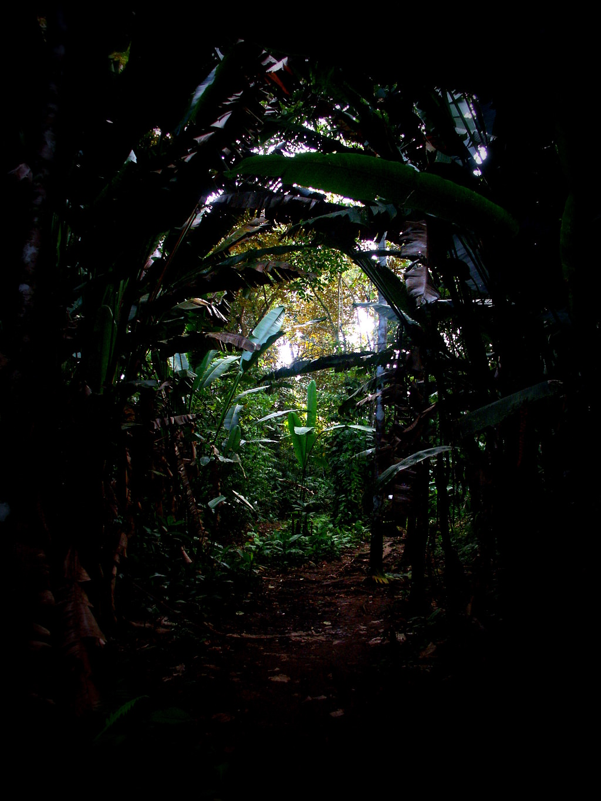

Der Urlaub ist vorbei, liebe Zuhörer, und anstatt aus tropischen Klimaten melde
ich mich nun aus dem kalten und noch mit Schneeflecken versehenen
Idar-Oberstein. Brrrrrrrr, was aber auch an der Erkältung liegen mag, die ich
mir über die Klimaanlage der Flugzeuge wohl eingefangen habe. Egal, die letzten
Tage hatten es jedenfalls nochmal in sich und in guter alter Tradition sind
Teyna und ich NICHT nach Costa Rica gefahren (der Dialog morgens im Bett vor der
Abreise lautete ungefähr: “Lass uns lieber nicht fahren” “Okay”) sondern in
Panama geblieben und hoch an die Karibikküste nach Bocas Del Toro, eine
Inselgruppe, wo wir uns nicht auf der Hauptinsel sondern notgedrungen auf der
Nebeninsel Bastimentos niederließen, denn einen Tag vor Silvester per Telefon
eine Unterkunft dort zu reservieren ist ungefähr so erfolgreich wie
Kaiserslautern vor dem Abstieg in die zweite Liga zu bewahren. Dennoch fanden
wir ein Hostel was uns für 40 $ die Nacht abnehmen wollte, also ab wieder in den
Bus, 4 Stunden mit dem Bus für 7$ über Berg und Tal an die Küste, dort ein Taxi
für 2\$ an den Anleger der nur 3 Minuten entfernt war (Ausbeuter, schreie ich da
nur), dann ein ziemlich schickes Boot betreten, dass uns zuerst nach Bocas
bringen sollte. Leider hatte das Boot die unangenehme Eigenschaft, seinen Motor
alle 100 Meter ausgehen zu lassen, also mussten wir kaum gestartet wieder
umdrehen und uns auf kleinere, wackelig aussehende Boote verteilen lassen, was
aber gut war, da wir in den nächsten Tagen immer wieder diese kleinen
Wassertaxis benutzen mussten, um auf diesen Inseln von A nach B zu kommen.

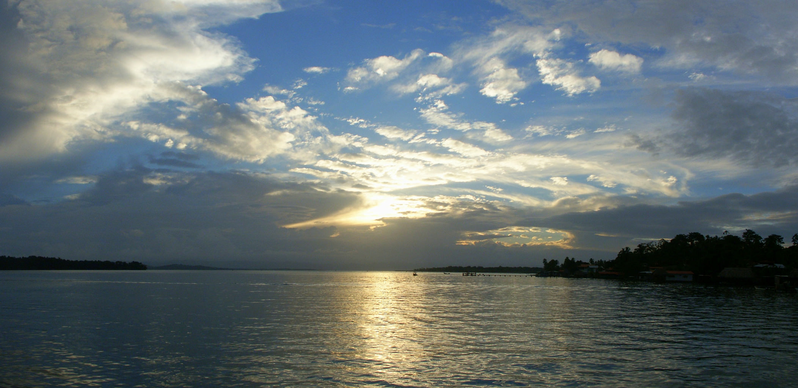

Nun, auf Bocas das nächste Taxi genommen um nach Bastimentos in unser Hostel zu
kommen und was trafen wir dort an (außer keine Autos, da es dort nur Fußwege
aber keine Straßen gibt)? Ein Hostel auf Stelzen im Meer mit Veranda und
Hängematten mit Blick aufs Meer, wo die Innenräume mit Holz verkleidet waren und
man von den Geräusch der Wellen in den Schlaf gewiegt wird. Der Preis war also
gerechtfertigt. Zum Vergleich (und als Tip für Leute die bald auf Hochzeitsreise
mehr Geld ausgeben wollen) sei noch gesagt, dass man für (nur) den doppelten
Preis im Hotel JungleLodge mitten im Urwald auf der Insel in traumhaften
Einzelbungalows in mit Moskitonetzen umwickelten Himmelbetten mit Blick auf
Flora und Fauna die Nächte verbringen kann.

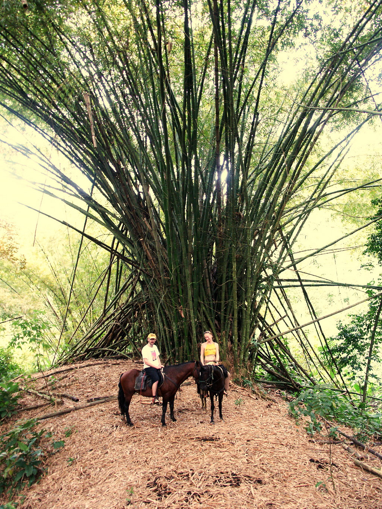

Also konnten wir nun in Ruhe Silvester dort ohne irgendwelche Fieberschübe
verbringen und die Einwohner und Sitten des einzigen Ortes der Insel genauer
studieren. Wie gute Panamanesen nehmen erster jeden Grund zum Feiern gerne an
und das taten sie auch so sehr mit Silvester, dass wir am nächsten Tag Probleme
hatten einen Platz zu finden, der noch Essen verkaufte, da anscheinend die Wirte
entweder noch im Bett oder schon wieder anderswo am saufen waren.

Nun denn, Bastimentos hatte wieder einige “Erste Male” für mich bereitgestellt,
so dass ich nach “Erstem Surfen”, “Erster Fahrt hinten im Ambulanzwagen”
(erwähnte ich das eigentlich, dass ich bei meinem Fieber mit dem Krankenwagen
vom Hotel zum Doktor gefahren wurde (den Rückweg von ca 300 Metern sind wir zu
Fuss gegangen, da der Fahrer nicht warten konnte)?) nun folgende Dinge auf meine
Liste setzen kann:

- “Erstes richtiges Panamanesisches Frühstück”: Wir trafen ein belgisches
  Pärchen im Hotel, wobei der weibliche (und schwangere) Teil ihre ersten 18
  jahre in Panama lebte und uns deshalb sagen konnte, dass Panamanesen zum
  Frühstück Steak und Würstchen essen, manchmal auch Huhn. Fantastische
  Nachrichten, die ich natürlich sofort und die nächsten Tage umsetzen musste

- “Erstes Reiten”: Ja, ich bin auf den Rücken der Tiere gegangen wo das Glück
  der Erde liegen soll. Eine Deutsche (was wir erst nach 5 Minuten englischer
  Konversation rausfanden) hat sich auf Bastimentos niedergelassen, und bietet
  dort Reitausflüge mit ganz ruhigen und zahmen Pferden an, die sich sogar von
  so blutigen Anfängern wie mich nicht aus der Ruhe bringen lassen, was aber
  dann so weit ging, dass mein “Lukas” sich nur dann in Bewegung setzte, wenn
  Bettina in dazu antrieb. Von meinen Aufforderungen und Seitenhieben ließ er
  sich jedenfalls nie beeindrucken. Dennoch scheine ich ein guter Reiter zu
  sein, denn meine Haltung war so gut dass ich weder am nächsten Tag Muskelkater
  oder Schmerzen hatte und sogar am Strand Galopp gemacht habe ohne
  runterzufallen, JippppiiieiiiiyeeeaHH

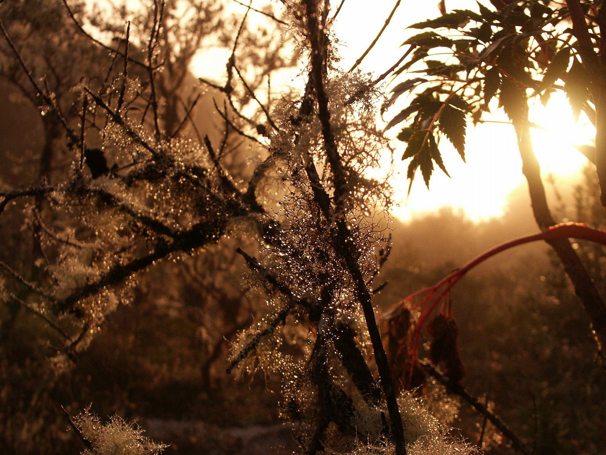

- “Erste Höhlenwanderung”: Eine der angebotenen Touren auf der Insel war eine
  Höhle mitten im Urwald zu erkunden, die erst vor wenigen Jahren entdeckt
  wurde. Nach Kanufahrt und Wildernisdurchquerung (RIESIGE Bambussträucher, die
  20 Meter in die Höhe ragten, und Kakaofrüchte wurden direkt vom Strauch
  gepflückt, geköpft und die enthalten Bohnen gelutscht) kamen wir am Eingang
  an, wo wir mit Helm und Taschenlampe versorgt wurden, beides von mir oft
  gebrauchte Utensilien. Zak, ein Amerikaner hatte das Glück, derjenige zu sein,
  der keinen Helm mehr abbekam, aber er hat gut aufgepasst. Die Höhle an sich
  war nass und teilweise kinnhoch überflutet, da ein steiger Rinnsal aus den
  hinteren Teilen entspringt, was aber garnicht so schlecht war, da zuerst viele
  Fledermäuse unsere Aufmerksamkeit erregten und die Frage, wo deren Dung
  eigentlich ist, zum Glück mit dieser dauernden Wasserspülung mit “Nicht an
  unseren Füßen” beantwortet werden konnte. Nachteil war (außer dass wir keine
  Fotos machen konnten, da keiner eine wasserfeste Kamera dabei hatte), dass man
  an einer Stelle wie erwähnt bis zum Kinn im Wasser stand (das galt zumindest
  für mich, Teyna musste aufgrund der Höhendifferenz schwimmen) und sich
  zwischen zwei engen Steinen durch die Höhle quetschen musste. Definitiv nichts
  für Leute mit Platzangst!

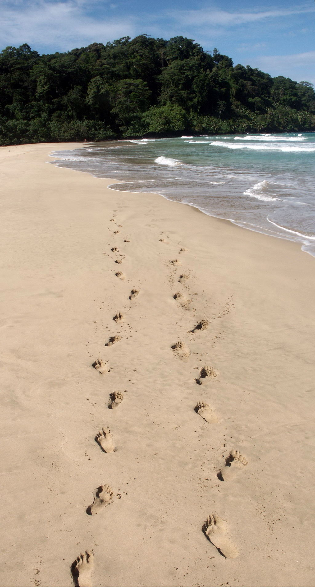

- “Erster Propellerflug”: Am vorletzten Tag ging es mit AirPanama anstatt dem
  Bus zurück nach PanamaCity in einer doch recht vertrauenserweckenden Maschine,
  nur Teyna wurde es mulmig aufgrund der leichten Schwankungen in der Luft. Die
  armen Touristen, die an diesem Tag in Bocas landeten hatten Pech, denn wir
  starteten in strömenden Regen. Gut, wenn ein Ort dann schlecht wird, wenn man
  in verlässt.

Nach dem obligatorischen Shoppingtag in PanamaCity hieß es dann Abschied nehmen
im Flughafen von Land und Teyna, da ihr Flug 45 Minuten vor meinem abheben
sollte. Man beachte mal wieder den Konjunktiv, dann hier schlägt wieder Murphys
Gesetz zu, diesmal in der Ausprägung: “Wenn du 6 Stunden Umsteigezeiten auf
deinem Flug hast und du auf einem langweiligen, miesen kleinen Flughafen
umsteigen musst wo nichts dich unterhalten könnte, dann ist dein erster Flieger
überpünktlich und dein Anschlussflug verspätet sich so, dass du 7 Stunden Löcher
in die Terminaldecke starren musst. Wenn du aber so wie ich insgesamt 6 Stunden
Umsteigezeiten auf zwei amerikanischen Flughäfen hast an dem Tag wo auf allen
Fernsehern dort live AmericanFootball-Finalspiele gezeigt werden, dann verspäten
sich schon dein erster Flug und alle andere danach so sehr, dass du immer von
Ankunftshalle nach Abfluggate hetzen musst um deinen Flug zu kriegen und du hast
nicht eine ruhige Minute um Football zu schauen.” So hatte sich mein erster
Abflug schon um eine Stunde verschoben und erst in New York, als alle Spiele
vorbei waren, hatte ich ne halbe Stunde Zeit, mir der Abspann der
Fußballübertragung anzuschauen. Juchu für Murphy!

Zusammengefasst war der Urlaub dennoch toll, trotz Krankheit und miesen
Kinoprogramm auf den Delta-Flügen. Panama ist schön, aber sicherlich nichts für
den Pauschaltouristen. Wollen wir hoffen, dass die Amerikaner und reichen
Panamanesen es nicht zubauen mit Touribunkern und Ferienhäusern. In Bastimentos
bauen sie gerade 1000 Hütten zum Verkaufen und Vermieten (inklusive einer
Straße). Was dies (was ungefähr einer Verdreifachung der Hüttenzahl entspricht)
für die Umwelt bedeuten mag, ist jetzt noch nicht absehbar. Besuchen sie also
Panama, solange es noch steht.

Denn ich denke bis heute, dass es ein leichtes Erdbeben war, was unser Zimmer in
Bastimentos auf dem Wasser hat leicht für 15 Sekunden schwanken lassen. Der Sex
unserer Nachbarn hat erst 15 Minuten später angefangen und hat zwar auch die
Wände wackeln und deren Bett quietschen lassen, aber dabei konnte man wenigsten
durch die Jubelrufe der Frau erkennen, worum es sich handelt (es sei denn sie
freut sich riesig über Erdbeben).

In diesem Sinne bis zum nächsten Urlaub (Kambodscha oder Ecuador stehen auf der
Wunschliste) verbleibe ich demütigst euer, Veeck
