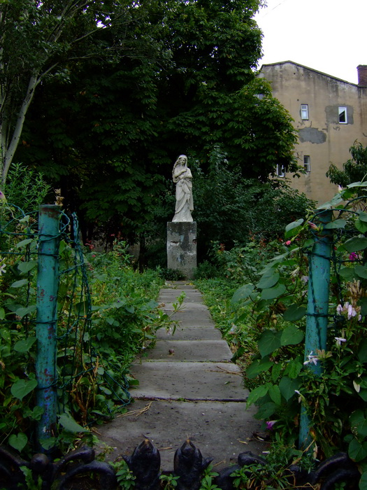

## 21. - 27. August 2006: Kiew

&#1055;&#1088;&#1080;&#1074;&#1110;&#1090;

Das, Freunde des beliebten Veeckreisenewsletters, ist, sofern euer Email-Client
das korrekt darstellt und ihr es anhand des Email-Headers noch nicht erraten
habt, ukrainisch und bedeutet “Hallo”. Somit ist das Geheimnis meines momentanen
Aufenthaltsortes auch gelüftet.

Wieso ich hier bin, ist auch relativ schnell erklärt: Eine Mischung aus
Geschäftsreise (Haufe, mein Arbeitgeber, hat hier eine Firma namens KCK
angeheuert, um die Programme, deren Software-Architektur ich mir ausdenke,
programmieren zu lassen, und nun wollten wir mal sehen wie die hier so arbeiten)
und “Hilfe-ich-bin-jetzt-30-und-will-mal-was-völlig-verrücktes-machen-
und-in-einem-Ostblockland-Urlaub-machen-wo-ich-die-Sprache-nicht-mal-ansatzweise-verstehe”
und bis jetzt ist es ein Urlaub wie jeder andere auch bisher: Ein Umwerfen von
schon gebuchten Trips zu weiteren Orten und ein Umgeworfen werden von
irgendwelchen Infektionen. Aber ich greife vor, fangen wir von vorne an, nämlich
letzten Sonntag Morgen, 10 Uhr:

Von diesem Zeitpunkt an hatte ich die nächsten 37 Stunden keinen Schlaf, da,
nachdem ich Sonntags Abend gepackt, Briefe geschrieben und mit Albrecht einen
Film gekuckt habe, die halbe Stunde, bevor der Treffpunkt zum Flughafen Basel
ausgemacht war, auch nicht mehr wirklich für Schlaf gemacht war. Im Flugzeug an
sich war auch nicht an Schlaf zu denken, da der Flug zu kurz und mit
Lufthansastewardessfragen nach Erfrischungen gefüllt war um mehr als 5 Minuten
wegzunicken.

Nun, der Empfang seitens KCK war freundlich und herzlich, die Büros sind winzig
im Vergleich zu dem was wir hier gewohnt sind, dafür waren die Zimmer, in denen
wir fünf im Hotel Sonja unterkamen, riesig. Eine Küche, Badezimmer, Toilette,
zwei Schlafzimmer mit jeweils einem Doppelbett und ein Wohnzimmer mit Couch und
zwei Sesseln. Und das war wohlgemerkt für mich alleine!!! Nur unser Chef hatte
ein besseres Zimmer, zwar kleiner als meins, aber dafür im Stil einer
Hawaii-Hütte mit so Nettigkeiten wie Muscheln als Badewanne etc. eingerichtet.
Dafür sind die Preise auch gesalzen gewesen, aber die Firma zahlt ja ;-)

Nun, abends zum ersten Mal aus gewesen mit Pavel dem Chef der Firma, und unseren
ständigen Begleiter bzw. Fahrern Oleg, tagsüber normalerweise Programmierer dort
und momentan auch mein Gastgeber, und Michael, Finanzchef soweit ich das richtig
in Erinnerung habe, er hätte aber auch als persönlicher Bodyguard mit seiner
Statue sein können. Nur ein wenig Wodka getrunken, da wir ja doch müde von der
Reise waren.

Nächster Tag war erst mit Geschäftsaufgaben versehen, Leute kennengelernt, ein
paar Präsentationen gehalten, diskutiert, Kaffee getrunken und das Gebäude, in
dem KCK drin hockt inspiziert. Highlights von letzterem waren vor allem die
baufällig aussehenden Teile, die anderen Hasenfüßen unserer Gruppe mehr Angst
machten als mir
Unerschrockenem-weil-in-Südostasien-schonmal-im-Minibus-gefahren-und-das-Leben-an-mir-vorbeirauschen-sehen.
Aber Ingo hatte Respekt vor dem seltsame Geräusche machenden Lift, der selbst
bei einer Anzahl von Leuten schon schlapp machte, die weit unter der
Maximalanzahl lag, und Bernhard ging wohl nur widerwillig auf den Raucherbalkon
raus, der bei uns schon 30 Jahre früher vom Bauamt dicht gemacht worden wäre.

Nach einer relativ unspektakulären Stadtrundfahrt (wobei die Stadt schon
spektakulär ist angesichts ihrer alten Häuser, goldverzierten Kirchen,
sowjetischen Prunkbauten und Prachtstraßen) ging es raus vor die Tore von Kiew,
wo wir mit allen Entwicklern von KCK ein Picknick abhielten mit typisch
ukrainischem Essen und Trinken. Ich verstehe nun, warum die Leute hier so gut
mit Wodka umgehen können, da nach jedem Wodka eine richtig-sauer-eingelegte
Gurke gegessen wurde. Mein Wodkakonsum beschränkte sich somit auf zwei Wodkas,
da mich beim ersten glücklicherweise keiner sah und ich deshalb keine Gurke
essen musste. Positiv ist die große Auswahl hier bei Grillgut und beim Essen
allgemein zu erwähnen. Habe ich so lecker und variantenreich nicht erwartet.

Okay, das Erwachen am nächsten Morgen war etwas ruppig, da auch hier die Regel
gilt: Wodka und Bier verträgt sich nicht perfekt. Nochmal ein wenig von der
Stadt gesehen, die anderen zum Bahnhof gebracht und ein letztes Mal Deutsche
gesehen. Deutsch gesprochen hab ich das letzte Mal an jenem Mittwochabend, als
sich auch die Übersetzerin Anna ins Wochenende von mir verabschiedete (Hallo
Anna, nebenbei), nachdem wir in der Stadt Fußball gekuckt haben. Meine Pläne
waren freitags, also heute, mich nach Odessa zu schaffen, die Leute von KCK
hatten sogar mir schon das Zugticket und eine Handykarte gekauft.

Nun, Pläne sind bei meinen Urlauben bekanntlich da, um von Krankheiten zunichte
gemacht zu werden und so wachte ich Donnerstag Morgen auf, fühlte mich wie nach
einem Gewichtheber-Wettbewerb, den ich verloren habe, und auch mein Magen- bzw.
Darmbereich führte an dem Tag wieder und wieder einen Kampf, den ich oft verlor.
Ich verbrachte also den Tag im Bett mit Salzstangen und Cola, was ich seit
meiner Kindheit schon immer als das beste Rezept bei irgendeiner Krankheit
ansehe, und lernte die kyrillischen Buchstaben, indem ich im Fernsehen die
Einblendungen von MTV und Co übersetzte.

Nun, heute geht es mir schon wieder etwas besser und ab jetzt wohne ich bei
Oleg, einem KCK Mitarbeiter, der DJ ist und mich gleich mit auf eine Beach-Party
nimmt. Denn ich weiß nicht wie es bei euch ist, hier hat es unbedeckte angenehme
25 Grad tagein tagaus und meine langen Hosen fühlen sich am falschen Platz an.
Auch der Hosenbund wieder, denn seine Mutter kocht fantastisch und typischer
Kiew-Kuchen besteht anscheinend nur aus Zucker. Weitere Highlights aus Kiew im
Schnelldurchlauf:

- eine Untergrund-Shopping-Mall, die sogar Tokios fast in den Schatten stellt,
  vom Safe zum Fuchspelz bis zur Küchen und Wohnungseinrichtung kann man alles
  im Untergeschoss kaufen und von einem Ende der Prachtstraße zur anderen führt
- eine Absage, die ich heute zwei Mädels geben musste, die fragten, ob ich in
  einer lokalen Fernsehproduktion mitspielen wollte. Da geht sie hin, meine
  Karriere als ukrainischer Fernsehstar

Okay, das soll es mal erstmal gewesen sein, Sonntag Nacht fahre ich nun
sicherlich nach Odessa, dann geht's am 31. nachts nach Lviv, und die Daten WERDE
ich einhalten, MagenSchnelldurchlauf hin oder her, denn an den Ticketschaltern
hier spricht wirklich KEINER Englisch (von englischen Beschriftungen ganz zu
schweigen) und ohne Oleg wäre ich sicherlich aufgeschmissen gewesen beim Kaufen
der Tickets. Big-up to him for that!

Also, bis die Tage, I’m out! V

PS: Greetings to all the pregnant ones out there, I know you’ll make it!

PS2: Leena, hab ich eigentlich im Kaffeehaus bezahlt gehabt oder euch mit der
Rechnung zurückgelassen? Sorry wenn ja und ich mach es in Sansibar wieder gut!
PS3: Greetings from Oleg too

## 28. - 31. August 2006: Odessa

Guten Morgen miteinander. Eine spät in der Nacht begonnene und nun nach
erholsamen Schlaf vollendete Email erwartet euch hier, was unter anderem der
Tatsache zu verdanken ist, dass das “Free Internet” in dem Hostel hier in Odessa
regelmäßig belegt ist, da es dabei sich um einen einzelnen PC handelt und 20
Leute sich darum balgen müssen. “Free irgendwas”, so lernten wir ja schon bei
dem selbst aus Pfannkuchenteig herzustellenden “Free Breakfast” in Los Angeles,
ist immer mit Haken versehen, so ist hier der “Free Coffee” Instant-Kaffee
(selbstanzurührend) und die “Free Towels” bedecken meine Hüften nur spärlich...

Aber bevor die wahrscheinlich nun schon kreischende weibliche Leserschaft ihre
Koffer packt um hierher nach Odessa zu fliegen, lest weiter, denn zuerst muss
ich kurz innehalten, um zwei Menschen um Entschuldigung zu bitten:

- zum einen mein Mitbewohner Christoph, der Montag Morgen 3:30 Uhr, als ich noch
  auf dem Weg zu unserem Abfahrtstreffpunkt einen Umweg zum Briefkasten machte,
  von meinen besorgten Mitfahrern aus dem Bett geklingelt wurde. Sorry
  Christoph, und ich hoffe, mein Zimmer steht noch und ist nicht verwüstet, wenn
  ich zurückkehre.
- zum anderen das unbekannte Mädchen, welches an der Tankstelle auf dem Heimweg
  zu Oleg nach mir die Toilette dort benutzen wollte. Als ich hinausging, hörte
  ich von hinten ein auch für meine der ukrainischen Sprache nicht mächtigen
  Ohren leicht zu verstehendes “Uuuuuaaaaaah”, und als ich mich umdrehte, sah
  ich wie sie aus sicherer Entfernung von der Tür das Duftspray längere Zeit in
  Richtung Toilette entleerte. Sorry nochmal, aber mein Magen war das Essen noch
  nicht gewohnt.

Zurück von der Buße zu den Beats: Wie schon erwähnt, nahm mich Oleg Freitag nach
diversen Besichtigungen wie mumifizierten Mönchen in alten Höhlen abends zur
Beach-House-Party mit, die mit vielen netten Ukrainern und Ukrainerinnen
bestückt war, die mir Oleg vorstellte. Nun, bis 4 Uhr Bier getrunken, eine
Telefonnummer mehr im Handy von einem unbekannten Typen, dem ich schreiben muss,
wie ich Lviv finde, wenn ich denn dort war, da seine Freundin da herkommt. Hey,
ich bin ja nicht zum Frauen aufreißen hierher gekommen, auch wenn ich mich
freue, wenn die Damen mich hier anlächeln.

Samstag war nach exzessivem Ausschlafen und noch exzessiveren Aufforderungen
seitens Olegs Mutter doch bitteschön alles was auf dem Frühstückstisch steht
auszuprobieren (inklusive süßem Käse) abends die Feiern zum Unabhängigkeitstag
der Ukraine inklusive Feuerwerk und vollen Straßen, was wir vermieden, indem wir
uns auf eine der Brücken stellten, die die Dnjepr überspannten. Nach kurzem
Ausflug auf die Prachtstraße Kiews (die sog. Chreschtschatik, die vielleicht am
deutlichsten die Unterschiede in diesem Land repräsentiert, denn dort tummeln
sich bettelnde Kinder und Frauen vor riesigen Plakaten, die eine ganze
Häuserwand mit “Hier entsteht der neue DolceUndGabana-Shop” bedecken) sind wir
doch (wieder einmal) an den Strand zur Beach-House-Party gegangen, wo diesmal
als Special-DJ-Guest ein Holländer auflegte, der in der Ukraine hängengeblieben
ist und sich nun "Flying Dutchman" nennt. Passend dazu hatte er, neben
GOGO-Tänzerinnen, auch zwei Maskottchen dabei. Zwei (hoffentlich gut bezahlte)
Typen haben sich in mannshohe Flugzeug-Kostüme (aha denkt ihr, “Flying” im Sinne
von Fliegen, nicht von Kiffen) stecken lassen. Doch, und so werden es Bilder von
mir beweisen, da diese Kostüme eher wie riesige Penisse aussahen, haben deren
Designer wohl doch eher bei der Arbeit ans Kiffen als an Flugzeuge gedacht.
Definitiv ein Showelement welches der gute Mann überdenken sollte.

Nun, Sonntag benutzte Oleg wieder einmal sein Vitamin B mit den lokalen DJs und
schaffte uns Zutritt zum relativ kleinen, aber mit nettem Buffet ausgestattetem
Backstage-Bereich der Jeans-Parade, einer von einem Mobilfunkoperator
gesponserten DJ-Veranstaltung mit extra aus UK eingeflogenem DJ auf dem
Europa-Platz mitten im Herzen Kiews. War auch ganz nett, solange jedenfalls bis
ich noch Einkäufe für meine nächtliche Zugfahrt (und Blumen für Olegs Mutter,
ich weiß ja was sich gehört) erledigen wollte, denn wie sollte es sonst sein,
mitten auf dem Heimweg öffneten sich die Himmelsschleusen und der halbe Bodensee
ergoss sich nicht nur auf mich, sondern auch die Leute vor der DJ-Bühne
(letztere ließen sich jedoch davon nicht wirklich stören, selbst die die
irgendwo Unterschlupf suchten, taten dies eher gemächlich). Klitschnass kam ich
also zurück und Oleg fuhr mich an den Bahnhof.

Nun, ich weiß nicht, ob ihr schon mal eine Zugreise ohne Kenntnisse der Sprache
gemacht habt, aber meine war recht unterhaltsam, da die 3 anderen Mitreisenden
(Vater mit Tochter und eine Frau) in meinem Abteil kein Englisch konnten, nur
die 11-jährige Tochter war mit einigen Brocken gesegnet, was aber auch nicht
ausreichte als die Schaffnerin versuchte mir klarzumachen, dass für nur 20\$ ich
ein Einzelabteil bekommen könnte. Nun, da ich mir den Spaß einer gemeinsamen
Zugreise nicht nehmen lassen wollte, lehnte ich dankend ab, als sie endlich
einen korrekt englisch sprechenden Menschen im Zug gefunden hatte, der mir das
erklären konnte. Das Abteil war somit den Rest des Abends mit ukrainischen
Sätzen gefüllt, die in der Gewichtsklasse von "Mein Name ist" und "Wie ist dein
Name" lagen und endlich konnte ich auch meine nassen Klamotten ablegen.

Morgens um 7 in Odessa angekommen und kurz darauf auch in meinem Hostel, wo mein
erster Eindruck ein Amerikaner namens Kevin war, der 15 Minuten nach mir von der
lokalen Amüsiermeile sturzbetrunken heimkam und mir von seinem dort gestohlenen
Handy erzählte, sowie von seinem Kumpel in Russland der eigentlich dort im Juli
heiraten wollte aber die Hochzeit immer weiter nach hinten verschoben wird, so
dass er mittlerweile 3 Monate hier in Osteuropa herumreist. Es gibt schlechtere
Alternativen, muss ich sagen.

Nun, und wie sollte es anders sein, auch hier traf ich Deutsche, oder wie es der
zweite Amerikaner Alex ironisch ausdrückte: "Odessa hasn’t seen so many Germans
since 1944". Unter anderem, und wieder ein Beweis für die Globalisierung unserer
Weltkugel, zwei Mädels aus Berlin und Leipzig, wobei erstere auch auf Ulis Party
in Berlin war und mich auch wiedererkannt hat. Klein, diese Welt.

Heute geht es weiter mit Besichtigungen und Bilder schießen, nachdem der
Schnupfen, den ich mir durch die nassen Klamotten geholt habe wieder abgeklungen
ist. Ich hätte wohl Wodka im Zug trinken sollen, da dies hier als Allheilmittel
gilt bis hin zu Sätzen wie: Hast du Kopfweh vom Wodka trinken? Trink Wodka, das
hilft.

Also dann, Grüße nach Deutschland und den Rest der Welt, ich geh raus in die
Sonne. Wir sehen uns wieder in

Lviv, V

PS: Kann jemand Birgit und Tobias Ullrich Bescheid sagen, dass ihre
Emailpostfächer voll sind?

## 1. - 4. September 2006: Lviv

Hallo Freunde der kyrillischen Schreibweise, die mir erlaubt das kyrillische C
als S- und Z-Ersatz zu verwenden, diesmal aus Lemberg, Lvov, Lviv, je nachdem
aus welcher Periode (deutsch, polnisch, ukrainisch) man das ganze Städtchen
sieht. Hierhin begab ich mich, nachdem ich Odessa mit einer Nachtzugfahrt
verlassen habe, die die gewohnten Dinge beinhaltete: ich konnte kein Wort
Ukrainisch, meine Mitreisenden kein Wort Englisch, wollten aber etwas von mir,
fanden dann einen radebrechenden Menschen, der in mehrere Anläufen ihr Anliegen
vortragen konnte, was kurz gesagt ein Abteiltausch zwecks
Familienzusammenführung war. Und wer wäre ich der so etwas entgegenstehen würde?

Nun, Lviv ist ein schön anzuschauender Ort mit lebendiger Innenstadt, die am
Wochenende so voll mit Brautpaaren war, dass sie teilweise Schlange vor den
schönsten Plätzen standen, was merkwürdigerweise auch die lokalen Graffitiplätze
beinhaltet. Ich frage mich ob die Geburtenrate auch so hoch ist?

Dennoch hat Lviv auch ruhige Plätzchen zu bieten, wie dem monumental riesigen
Friedhof, auf dem man entspannen und in Ruhe über Sachen sinnieren kann, wie zum
Beispiel was wir Deutsche lernen sollten:

- Lernt mehr Trinksprüche. Da saß ich also auf dem höchsten Punkt Lvivs, dem
  Castle Hill und wartete versunken in meinem Buddhismus-Buch auf den nahenden
  Sonnenuntergang, als der Trauzeuge des einzigen Brautpaars, dass sich zum
  Feiern dort hochbegab, den wohl einzigen als Touristen zu identifizierenden
  Menschen (mich) ansprach und um einen Trinkspruch auf das Paar bat, das ganze
  mit Kamera und Mikro vor meiner Nase. Ich hoffe inständig, dass die beiden nie
  Englisch lernen (oder dem Film jemanden mit solchen Kenntnissen zeigen), denn
  nachdem ich erstmal deren beiden für mich unaussprechlichen Namen über meine
  Lippen gebracht hatte (die ich natürlich schon wieder vergessen habe), fielen
  mir keine passenden Worte ein, und so stammelte ich irgendetwas von "Happy
  Day" und "Great Experience". Hoffentlich dauert es nochmal 30 Jahre bevor mich
  wieder jemand fragt.
- Reiht Friedhofsgräber nicht aneinander wie Reihenhäuser in unseren Vorstädten.
  Mit all den verwinkelten Ecken und kleinen Pfaden ist der Friedhof in Lviv
  einer, wo man sich gerne zur letzten Ruhe begibt und auch als Überlebender
  gerne darin verweilt, solange man jedenfalls wieder herausfindet bzw. nicht
  wie ich sich auf eine alte morsche Bank setzt, die unter einem zusammenbricht.
  Aber ich denke, so eine kaputte Bank verstärkt wohl noch eher das Flair dieses
  Friedhofs ;-) Ich für meine Teil will aber weiterhin verbrannt und unter einem
  Baum begraben werden, merkt es euch gefälligst die nächsten 60 Jahre lang.
- Angebracht sind Reih und Glied nur für Soldatenfriedhöfe (ebenfalls dort in
  Lviv zu bestaunen), da zeigen sie ihre Wirkung und lassen den Unsinn
  desselbigen erscheinen. Überlasst generell den Krieg den Dummen, zum Beispiel
  den Franzosen. Gebt mal bei Google "Great Military French Victories" ein und
  drückt auf "Auf gut Glück suchen". Normalerweise sollte dann
  [diese Seite](https://www.albinoblacksheep.com/text/victories.html)
  erscheinen. Wieder etwas worauf mich Alex aufmerksam machte.

Ebenso sagte Alex folgende Weisheit, als wir in der lokalen Untergrundkneipe
Odessas, dem “Exit”, saßen und als ich wieder mal meinem Unmut Ausdruck verlieh,
dass er sich mit den Leuten auf Russisch unterhalten könnte, während ich mich
auf die wenigen Englischkundigen (oder seinen Übersetzungswillen) verlassen
musste, er nur erwiderte: "Wenn deine Vorfahren gewonnen hätten, dann würde ich
jetzt das Sprachproblem haben."

Apropos Deutsch: Meiner Unterkunft hier ist ein deutscher Taubenschlag. Ein
älteres Schwesternpaar gewährte mir und zwei anderen Deutschen Zuflucht (nachdem
vor mir sich gerade zwei weitere Deutsche auf den Weg nach Polen gemacht haben)
und hat sich am Samstag übers Wochenende in die Berge verzogen, während sie uns
die Schlüssel zu ihrem EnergieEffizienzHaus in die Hand gedrückt haben. Das
bedeutet, dass sie überall nur LEDs statt Glühbirnen haben, Regenwasser
wiederverwenden, Sonnenkollektoren haben und das Klo mit einem halbdurchlässigen
Spiegel ins Wohnzimmer versehen ist, damit man nicht so oft das Licht anmacht,
da man sonst beim .... gesehen wird. Hehe. Ob das gänzlich fehlende Licht im
Treppenhaus auch Absicht ist, sei mal dahingestellt.

Nun, heute Abend geht es wieder mal per Nachtzug weiter nach Budapest, meine
letzte Station bis Samstag, wenn ich mich wieder nach Hause begeben werde.

So entlasse ich euch in die Arbeitswoche, seid achtsam, V

**Nachtrag:** ESST NIEMALS AM TAG EURER WEITERFAHRT EIN PILZ-OMELETTE IM CAFE
EUROPE IN LVIV!

Die Folgen davon waren zwar nicht tödlich (wie man lesen kann, außer ich hätte
übernatürliche Fähigkeiten), aber so lecker war es dann doch nicht, dass es den
"brechendvollen" Toilettenaufhalt im Lviver Bahnhof, die 10 EUR an die dazu
gehörende Toilettenfrau fürs Saubermachen und die Nacht mit Schüttelfrost im Zug
nach Budapest wert war.

## 5. - 9. September 2006: Budapest

Nein, Freunde der Karpatenklinik, so schlimm ist es dann nicht geworden wie im
Betreff angedeutet nach meinem letzten "bewegenden" Zwischenstopp auf der Lviver
Bahnhofstoilette, und nach einer durch fehlende Abteilinsassen glücklicherweise
einsamen und dennoch nur teilweise ruhigen Nacht (was an dem 2-stündigen
Aufenthalt an der ukrainisch-ungarischen Grenze lag, den ich nur durch ein
gelegentlich den Grenzbeamten entgegengeworfenes "I-dont-speak-your-language"
unterhaltsam gestalten konnte, denn dann kucken sie einen nur kurz an und gehen
kopfschüttelnd weiter und lassen eine in Ruhe) kam ich einigermaßen wohlbehalten
in Budapest an, wo mich keine weiteren körperlichen Gebrechen mehr plagten.

Stattdessen durfte ich mehrere entspannte Tage in Eszters Stadtwohnung
verbringen, die ich nur mit ihrer Katze (der kleine Teufelshund war zum Glück
bei ihren Eltern) und in der letzten Nacht mit einer temporär obdachlosen
Freundin von ihr teilen musste. Beide Damen waren aber entweder sehr nett oder
sehr verschmust, ihr könnt ahnen welche von beiden welches Adjektiv von mir
zugewiesen bekommt.

Nun, Eszters Wohnung ist zentral im jüdischen Viertel gelegen, ideal um die
ganze Stadt mit ihren Sehenswürdigkeiten in Ruhe zu erkunden, wenn man denn
gewillt ist sich spanische, japanische, englische und natürlich auch deutsche
Touristen zuhauf zu geben. Wobei die Deutschen manchmal bevorzugt werden, wie
z.B. am Parlamentsgebäude wo es extra deutsche Führungen gibt und man sich
deshalb ungeniert an langen Schlangen vorbeimogeln darf und den Amis etc. die
lange Nase zeigen kann.

Weitere besuchte Punkte inklusive angetroffener Besuchergruppen im
Schnelldurchlauf... Ach nee, lassen wir das, waren eh nur die gleichen
Nationalitäten wie oben beschrieben, Budapest ist eh schon touristisch völlig
erschlossen, wenn man schon die Engländer in den Kneipen Samstags mittags hocken
und Bier trinken sieht und grölen hört.

Zurück zum Entspannen: Dazu gehörte neben einem indisch-bulgarischen
All-you-can-eat auch ein Aufenthalt im Hotel-Gellert, dessen angeschlossene
Badeanstalt neben einem Wellenbad (wippiiiiiiiii) über eine exquisite Therme mit
römische Inneneinrichtungskachelverzierungen verfügt, wo man (streng nach
Männlein, Weiblein getrennt) sich in 39-Grad Becken und Saunas gehen lassen
kann, wobei das ganze (also Mann selber, wie das bei den Frauen geregelt ist,
weiß ich aus verständlichen Gründen nicht zu berichten) nur mit einem
Lendenschurz bedeckt ist. Das hat natürlich den unangenehmen Nebeneffekt, das
man aufpassen muss, nicht hinter einem älteren Mitbader aus dem Becken zu
steigen, da besagter Lendenschurz den alten S\*\*\* nur von vorne bedeckt.

Aber auch diese Anblicke überlebte ich, dank schneller Kopfdrehaktionen
meinerseits, und konnte so unbeschadet der heißen Sonne außerhalb des Beckens
frönen, denn Budapest hatte alle Tage Sonnenschein, so als ob es mich dabehalten
wolle. Nun, wer weiß...

Weitere Entspannungspunkte waren eine thailändische Rückenmassage (Hallo
Globalisierung!), durch Parks wandern mit Eszter und oben genannter Freundin von
ihr, und das obligatorische AmLetztenTagShoppingGehen, wobei nun leider mehrere
Kleidungsstücke meines zu kleinen Kleiderschrankes den Weg aller Putzlappen
gehen müssen.

Tja und nach einem wirklich unaufregenden Heimflug Samstagnacht, wo wirklich mal
ausnahmsweise gar nichts, aber auch wirklich gar nichts passiert ist (wirklich,
das aufregendste war, dass mein Rucksack zum ersten Mal mit einer der ersten
Koffer draußen auf dem Gepäckband war, uiiiiiii), bin ich nun im Alltagstrott
wieder gefangen. Wann ich wieder daraus herauskomme? Ich habe keine Ahnung wann
und vor allem wo, vielleicht mal Afrika oder Südamerika, die letzten beiden
Kontinente die mir noch fehlen. Aber ihr werdet mit die ersten sein, die es
erfahrt.

Wobei ich noch eine Bitte hätte, bevor dieses Buch geschlossen wird, und dies
geht vor allem an diejenigen Mitglieder meines Adressbuchs, die schon seit
meinen ersten Emails aus Thailand 2001 mit dabei sind und schon lange nichts
mehr von sich haben hören lassen: Sagt, hat sich mein Schreibstil über die Jahre
verändert? War ich witziger? Bin ich nun eloquenter? Ich will keine Komplimente
abgreifen, nur erfahren, ob und wie ich mich über die Zeit hinweg verändert habe
(ach ja, und natürlich rausfinden ob mancher, der sich ewig nicht gemeldet hat,
dies zum Anlass nimmt, mir zu schreiben) Vielleicht kann ich ja damit mal mein
Geld verdienen...

Passt solange auf euch auf, und wenn euch langweilig ist (und damit sind die
wieder gemeint, von denen ich lange nix gehört habe, wobei umgekehrt das gleiche
ja auch gilt, also shame on me), dann wisst ihr ja, unter welcher Adresse ihr
mich erreichen könnt.

I’m out, V

PS: Danke nochmal an Anna für ihre Ukrainisch-Übersetzungen, ich hoffe es hat
dein Deutsch verbessert.

PSS: Wenn einer von euch Lust hat, bei meiner nächsten Reise das ganze ins
Englische zu übersetzen (da ich meinen mittlerweile zahlreichen englischen
Freunden diese literarischen Hochgenüsse nicht vorenthalten will), soll er/sie
sich ruhig melden. Belohnung ist ewiger Ruhm, Erwähnung auf www.veeck.de und
Lollipops.
