## 25. - 30. Mai 2003: Auckland bis New Plymouth, NZ

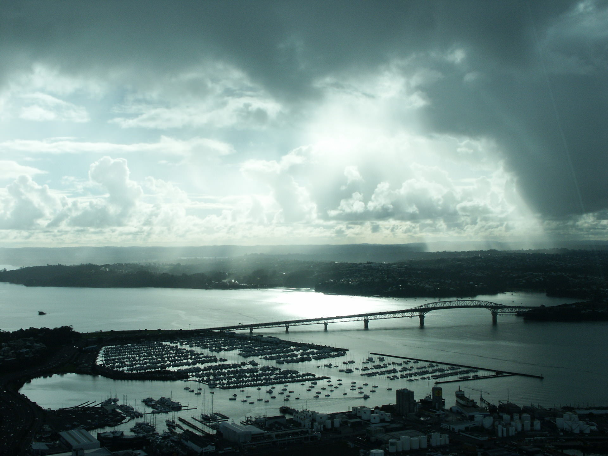

Faszinierend, als ich damals diese Email schrieb, hockte ich in einem kleinen
InternetCafe in New Plymouth, es war schon Abend, während ihr Daheimgebliebenen
morgens selbige einmal quer durch den Erdkern empfangen habt.... Aber genug
von diesem technischen MumboJumbo, ihr wollt sicherlich wissen, was damals seit
LA passiert ist! Folgende Sachen sind für die Nachwelt festzuhalten:

**ERSTENS: Quantas Airlines ist blöd!** Teyna hat wie wild versucht, mich zu
meinem Geburtstag im Flugzeug irgendwie zu überraschen, sei es mit einem Kuchen
oder mit einem Besuch im Cockpit! Leider sind die Damen am Quantas Schalter in
LA des Englischen längst nicht so mächtig wie Teyna gewesen, deshalb fiel
schonmal der Kuchen flach. Dann hat der Steward in der Maschine zwar Sekt
gereicht, aber nur mir und meiner Frau (dachte er jedenfalls), nicht aber
Albrecht, der auch als zur Gruppe gehörend zu erkennen war, und er reichte ihn
als wir gerade abgehoben hatten und es immer noch der 23. war. Und Terroristen
sind auch blöd, weil ich wegen denen (und weil ich wohl mit meinen langen
Haaren wie einer aussehe) nicht ins Cockpit durfte! Trotzdem nochmal danke an alle,
die meinen Geburtstag nicht vergessen haben, ihr hattet ja hoffentlich Spaß auf
meiner anschließenden Abschied-Vom-Studentenleben-Fete!

**ZWEITENS: Neuseeland ist geil!** Die ersten drei Tage haben wir in
Auckland verbracht. Morgens um 5 Uhr sind wir gelandet und mussten uns erst
einmal mit den dortigen Quarantänebestimmungen auseinandersetzen. Denn fünf
Meter vor der Zollkontrolle fiel uns erst wieder ein, dass wir noch
amerikanische äpfel aus unserer Marschverpflegung bei uns hatten. Im Bus in
die Innenstadt trafen wir ein nettes einheimisches Pärchen, welche uns Tonnen
von Tips gaben, bis die Frau zum Mann sagte, er solle aufhören, da wir uns
sonst garnicht mehr entscheiden könnten. Ein richtiges Problem war aber, um 7
Uhr morgens ein Hostel zu finden, da die normalerweise erst um 8 Uhr aufmachen.
Zwar war das von uns dann auserwählte Hostel etwas rustikaler, was soviel
bedeutet, es war so aufgeräumt wie mein Zimmer hier in Deutschland und
zumindest mein Bett hatte eine starke Neigung zur linken Seite hin, was
zusammen mit der Tatsache, dass es ein Hochbett und ich oben schlief, immer zu
einem leicht mulmigen Gefühl beim Einschlafen führte. Dafür lag es in einem
netten Viertel direkt neben dem Stadtzentrum und war als einziges noch nicht
voll belegt!

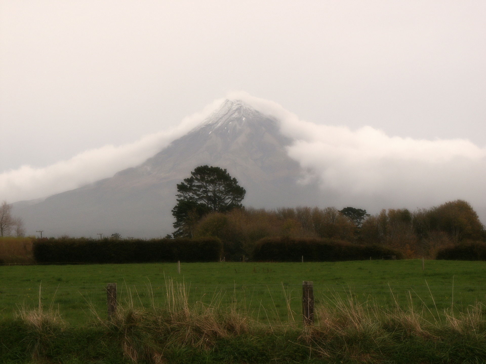

Nach den Tagen in Auckland mieteten wir uns ein Auto, was in der Nebensaison mit 13 Euro pro Tag extrem günstig war und
fuhren damit quer durchs Land. Nachdem wir also Auckland hinter uns gelassen hatten, welches nebenbei gesagt eine
sehr schöne Stadt ist ähnlich wie Sidney, wenn einer von euch schon mal da war, sind wir runter nach Waitomo gefahren,
wo es eine Menge [Kalksteinhöhlen](http://www.waitomo.com/waitomo-glowworm-caves.aspx) zu bewundern gibt. In der
Glowwormcave zum Beispiel waren zehntausende von Glühwürmchen zu beobachten, die an der Decke hingen. Da
Kameras nicht erlaubt waren, müsst ihr mal selber hinfahren! Wie ein Teppich
aus kleinen Lichtern an der Decke und man sieht sie auch im Dschungel, der dort
vorzufinden ist. Abends machten wir einen kleinen Bushwalk an einem Fluss
entlang, und dort waren ebenfalls überall an der Seite des Weges diese Lichter
von den Glühwürmchen zu sehen, die einen an Augen von Tieren erinnerten. Aber
das wildeste, was es in der Gegend dort zu sehen gab, waren Schweine!

**DRITTENS: Die Pflanzenwelt ist unglaublich!** Zum einen gibt es dort
dichten tropischen Dschungel, aber nebendran auch europäische Wiesen, wie man
sie im HerrDerRinge-Film gesehen hat. Nach einem Tag sind wir aber schon
weiter nach New Plymouth, wo wir noch einmal einen Bushwalk gemacht haben.
Dieser führte uns entlang der Seiten des 2800 Meter hohen erloschenen
Vulkanes namens [Mount Taranaki](http://www.newplymouthnz.com/events/mountain.htm)
(siehe Bild links). Soviel wie die ersten sieben Tage in Neuseeland war ich
wohl schon lange nicht mehr freiwillig gewandert (sorry Papa!).
Schauen wir mal, wo der Wind uns als nächstes hintreibt. Geplant war Richtung
Wellington, aber man weiß ja nie...

Also bis die Tage, altersackVeeck

PS: Bruder, tolle Idee, dass ich dir den AllBlacks-Pulli kaufen und nach Hause
mitbringen sollte! Es war doch etwas kühler als gedacht und so musste ich
diesen schon mal probetragen!

## 31. Mai - 2. Juni 2003: Wellington, NZ

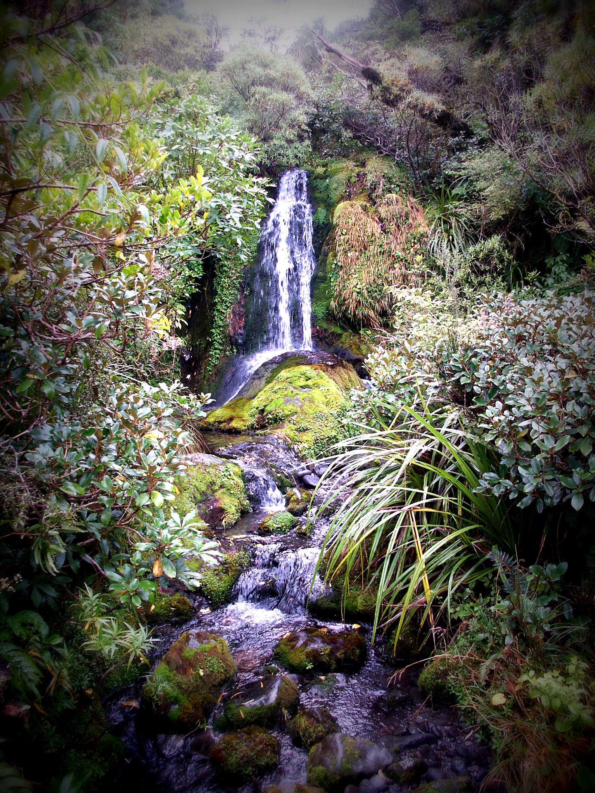

Eigentlich wollten wir von New Plymouth einen Abstecher in den [Tongariro-Nationalpark](http://www.ruapehunz.co.nz/)
und dort die sogenannte Tongariro-Crossing machen, eine Wanderung durch fantastische Vulkanlandschaften. Leider war das
Wetter für diesen Tagesmarsch zu schlecht und laut Wetterbericht sollte es auch nicht bessern und so zogen wir nach nur
einer übernachtung weiter gen Wellington. Weitere unglaubliche Landschaften und etliche der 48 Millionen Schafe
Neuseelands später fuhren wir endlich in der zweitgrößten Stadt Neuseelands ein. Und wie schon in Aukland waren ALLE
BackpackerHostels belegt. Sagte ich alle? Nein, alle bis auf eins:
[Das BeethovenHaus](https://www.facebook.com/pages/Beethoven-House-Wellington-Nz/400091936706532).

Und wer könnte ein Beethovenhaus besser führen als ein Asiate! Alan, so
sein Name, war der erste Hostelbesitzer, den ich namentlich und mit Bemerkung
über seine “direkte” Art im LonelyPlanet-Reiseführer erwähnt fand. Und wie
sich herausstellte, trug er wirklich sein Herz auf der Zunge bzw. Stift und
Papier immer bei sich: Unter den vielen Zetteln, die er quer durch das sehr
rustikal, heimelig und unter anderem mit einer BeethovenBüste eingerichtete
Haus verteilt hatte, stach auf der Veranda folgendes die Raucher unter uns
kritisierende hervor. Sinngemäß lautet der Spruch: “Wenn ihr mir euren
Zigarettenrauch ins Gesicht blast, wie würde es euch gefallen, wenn ich euch
mein durch Alkoholkonsum erzeugtes Urin ins Gesicht pisse?”. Aber am meisten
beeindruckte uns das Schild am defekten Toaster, auf dem er dem [Knucklehead](http://dict.leo.org/?p=TPi..&search=knucklehead),
der selbigen demolierte, wünschte, er wäre nie geboren worden. Weiter Highlights im Haus waren:

- Ein Wasserrohrbruch just in dem Moment, als wir ins Haus kamen! Kein
  Heißwasser oder Strom im ersten Stock, wo wir untergebracht waren, waren die
  Folge für den ersten Tag!
- Dass allmorgendliche Frühstück, wo nicht nur Toast, Tee und Porridge
  kostenlos gereicht wurden, sondern auch Weisheiten wie “Always remember your
  mother!” oder “Don’t expect anything!”.
- Damit auch keiner das Frühstück verpasst, wurde man frühmorgens mit
  Vogelgezwitscher aus den im Haus verteilten Lautsprechern geweckt, darauf folgte
  die Aufforderung von Alan zum Frühstück, danach lief Beethoven!

Wir haben uns also köstlich über Alan amüsiert, waren aber verblüfft und
verwirrt, als wir feststellen mussten, dass er etwas deutsch sprechen kann! Nach
kurzer Beratung von uns dreien kamen wir aber zu dem Ergebnis, dass wir nie in
seiner Anwesenheit über ihn gelästert hatten!

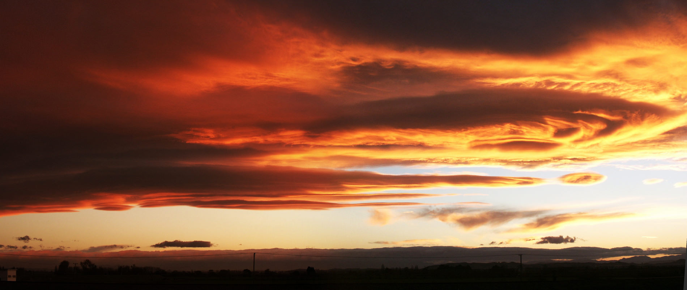

Das Beethovenhaus ist also ein MUSS, wenn man in Wellington weilt! Ansonsten
ist Wellington eine nette Stadt, sehr auf Vergnügungstourismus ausgerichtet,
was an den Spielhallen und Internetcaffes auf der Hauptvergnügungssstrasse
zu erkennen war. Ein Besuch im Zoo war auch in unserem Programm enthalten,
vor allem um Kiwis zu sehen. Da sie aber nachtaktiv und sehr scheu sind und
im Nachtterrarium ne Menge Kinder plärrend rumliefen, konnten wir einen
nur ganz kurz zu Gesicht bekommen.

<!--
@Birgit: Wir waren gestern für ne Nacht am Tongariro Nationalpark, aber
leider liess das Wetter keine Crossing über die Vulkane zu. Deshalb sind wir
schon weiter nach Süden und hoffen auf der Rückfahrt die Wanderung nachholen
zu können!
@ Hilz: Freut uns, dass es dir in Paris gefällt! Wärst du aber bloss
mitgekommen (dann würde Albrecht uns mit seinem BasketballFinalGequatsche ("Wo
krieg ich jetzt bloss das Ergebnis her....") verschonen!).
@Christoph: Wenn dir einsam bist, nehm ich gerne n MP3-File mit nem
richtigen Anschiss für dich auf und schick es dir! Eventuell sogar n Film! Wann war
eigentlich nochmal Hausfest, damit ich mich einsam fühlen kann?
@Heiko und Felix: Super, das mitm Flug hat geklappt, aber ich denke es wäre
besser, ihr hättet doch eure Leute zum kapern geschickt. Dann hätt ich
wengistens mal ins Cockpit gekonnt! PS: Puller bleibt oben!
An alle anderen: -->

Danke für die lieben Grüße und den Fisch, ich leg jetzt auf!

Gruß, M (und von Teyna natürlich auch!)

## 3. Juni 2003: Napier, NZ

Ein weiteres Leitmotiv dieses Urlaubs war sicherlich unserer Spontanität: War
abends schon die Fährfahrt auf die Südinsel und ein Hostel dort gebucht, sind
wir dann doch kurzentschlossen am nächsten Morgen auf der Nordinsel geblieben
und haben den Süden gecancelt. Uns war klar geworden, dass drei Wochen schon
gerade mal so reichen würden, um die Nordinsel zu erkunden, wie furchtbar wäre
also das Gehetze, wenn wir uns auch noch in der Südinsel hätten umschauen
wollen?

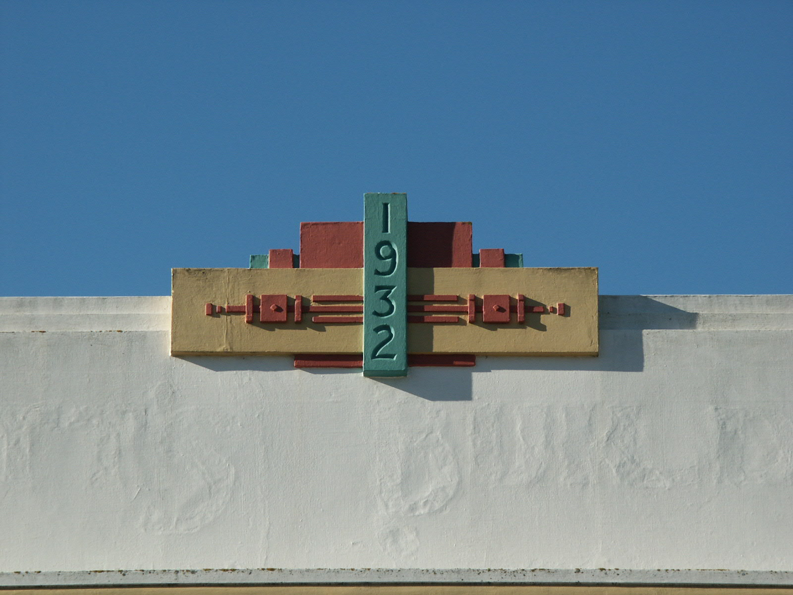

Wie gesagt entschieden wir uns extrem kurzfristig nicht auf die Südinsel
zu gehen, sondern die Zeit besser hier im Norden zu verbringen. Also ab ins Auto
und wieder nach Norden Richtung Hawke’s Bay. Auf unserem Weg hielten wir für
einen Kaffee in Hastings an, aber lasst euch eins gesagt sein:

**Diese Stadt ist tot!**

Haltet da bloß nie an! Niemals! Unter keinen Umständen! Ihr langweilt
euch! Garantiert! Jede Wette! Ich verscheisser euch nicht! Fahrt durch bzw.
vermeidet selbst dass! Fahrt gleich weiter! Zur Belohnung erblickt man dann
solche Sonnenuntergangsstimmungen wie auf dem Bild! Wo uns der Wind als
nächstes hintrieb? Nach [Napier](http://www.napier.govt.nz/)!
Die Architekten unter euch sollten nun mit der Zunge schnalzen, denn dies ist
was? Eine der wichtigsten Art-Decor-Städte der Welt! Wunderschöne Häuser,
deren Fassaden reichlich mit südamerikanisch-beeinflussten Ornamenten
verziert sind. Diese Kulisse nahm ich zum Anlass, um nach dem Wellingtoner Zoo
zum zweiten Mal die Herrschaft über Teynas Digitalkamera zu übernehmen und
hunderte Bilder von den Häusern zu machen. Sollte ich mal ein Haus bauen, wird
es ebenfalls einen Hauch Art-Decor enthalten.

<!--Seid gespannt auf extrem
unwitzige Filme, die wir mit Teynas Kamera aufgenommen haben und euch unter keine
Umständen vorenthalten wollen! Leider sind sie zu gross um sie per eMail zu
schicken, aber wenn ihr Quicktime installiert habt, stelle ich sie eventuell
mal ins Netz!
Gruesse an alle und Entschuldigung an Tanne!-->

Jetzt wird erst mal gechillt bevor es weitergeht! Veeck

## 5. - 7. Juni 2003: Lake Taupo, NZ

Puh, das stank! Und diesmal hat nicht einer der lustigen Drei einen fahren gelassen, sondern Mutter Natur,
doch dazu später mehr. Nachdem sich Teyna noch ihren Wunsch nach einem Pferdeausritt in Napier erfüllt
hatte, setzten wir unseren Weg nach Norden fort und machten Rast in [Taupo](http://www.laketauponz.com/).
Eigentlich hatten wir gehofft, von dort aus noch einmal diese Tongariro-Crossing
in Angriff nehmen zu können, aber leider hat sich das Wetter in den Bergen
nicht gebessert, sondern sogar noch weiter verschlechtert. Dafür hat uns Taupo
mit noch mehr herrlichen [Sonnenuntergangsbildern](img/panoramas/world/newzealand_laketaupo.medium.jpg)
entschädigt sowie uns erlaubt, Bilder eines [vollständigen Regenbogen](img/panoramas/world/newzealand_rainbow.medium.jpg) zu
knipsen, der sich quer von einem Ufer des Sees zum anderen erstreckte.
Dies geschah, als wir mit einem Ausflugsboot fuhren, welches einem alten
Dampfschiff nachempfunden war, um uns unter anderem Maori-Felszeichnungen am
Ufer des Sees anzuschauen. Und dieser Bootstrip war wirklich ein Trip für manch
einen auf dem Boot! Wir waren alleine an Bord, da auch in Taupo die Nebensaison
voll im Gange war, als Albrecht auf einmal aufstand und nach vorne Richtung
Steuermannkabine ging, um mit den Worten: “Der Kapitän hat ne Tüte in der
Hand!” zurückzukehren. Man kann es ihm nicht verdenken, die Ruhe des Sees, die
Abgeschiedenheit der Kajüte, wenig Passagiere an Bord, da kann man mal die
Seele baumeln lassen, sollte sich aber bewusst sein, dass man den Rauch des
Joints auf dem Deck riechen könnte. Da machte auch die coole Musik auf einmal
Sinn, die die ganze Zeit aus den Lautsprechern kam: JungleJazz, Moby und der
lokale Rocksender sind für einen normalen über-50jährigen sicher nicht
alltäglich!

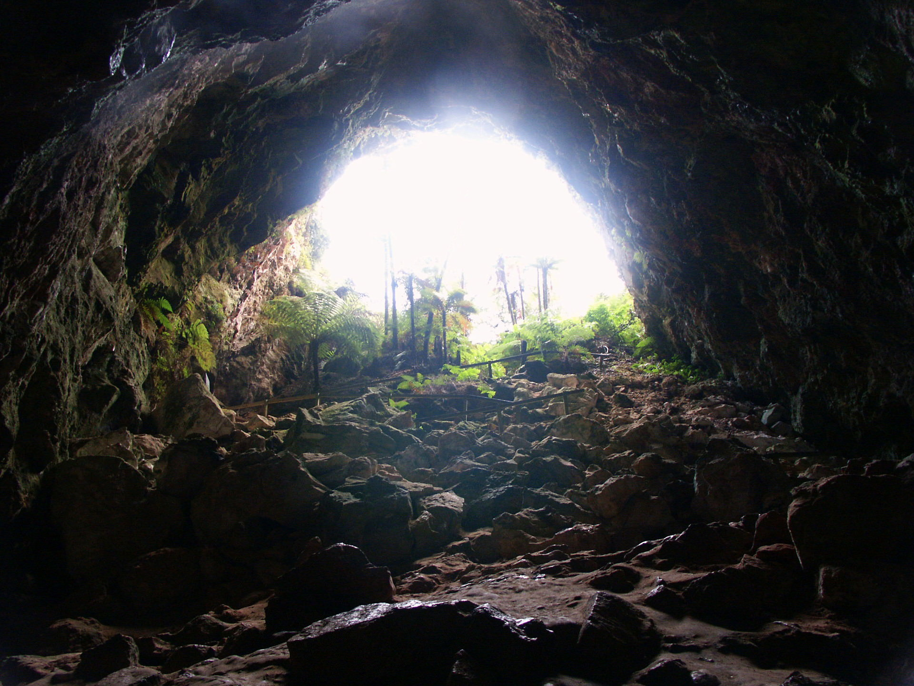

Nachdem wir uns die Felszeichungen angesehen haben, die aber zum Grossteil
nicht ewig alt sind, sondern in den 70ern von nem Weißen angefertigt worden
sind, kam dann der Käptn zu uns an Deck und vergewisserte sich, dass wir die
Sache mit der Tüte nicht in den falschen Hals bekommen hätten. Abgesehen von
Albrecht, der nach seiner Entdeckung kurz in der Kapitänslounge verschwand,
haben wir nichts in den Hals bekommen, und haben ihm versichert, dass wir
seinen Arbeitsplatz nicht gefährden würden, sind ja keine Spießer!
Weiter Highlights in Taupo waren das All-You-Can-Eat bei PizzaHut, wo drei
Deutsche länger als jeder andere Gruppe verweilten, um mit fast platzenden
Bäuchen ins Bett zu fallen, sowie die HoleInOneChallenge, die am See stattfand:
102 Meter vom Ufer ist eine Plattform mit drei Golflöchern angebracht, auf die
man Golfbälle schlagen kann. Mit meiner Erfahrung war es mir immerhin
möglich, einen von 20 Bällen auf die Plattform zu schlagen. Drei gingen sogar
weit über die Plattform hinaus. Das brachte mir immerhin einen Extraball ein.
Videos und Fotos dieser unglaublichen Performance sind auf Anfrage vorhanden!

Es waren goldenen Zeiten und unliebsame überraschungen sollten folgen...

Verheißungsvoll, Veeck

## 8. - 9. Juni 2003: Rotorua, NZ

Wir folgten dem [Thermal Explorer Highway](http://www.explorecentralnorthislandnz.com/touring-routes/thermal-explorer-highway/) nach
Rotorua, einem touristischen Fleckchen nördlich von Taupo. Neben dem ständigen Schwefelgeruch der heißen Quellen,
die in der ganzen Stadt Dampf aufsteigen lassen, pflasterten Kraterlandschaften sowie Schlammquellen mit
Schlammblubberblasen und Geysire unseren Weg sowie die Vergesslichkeit eines Mannes, dessen Namen ich hier
nicht zu nennen brauche, es aber nur allzugerne tue: **ALBRECHT ZIMMERMANN!**

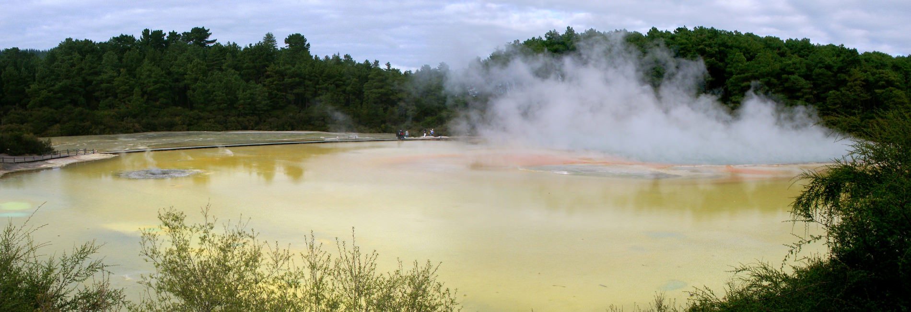

Während meine Vergesslichkeit sich noch in einem gewissen lokalen Rahmen hielt,
wurden Teyna und ich von Albrecht mit einem herzlich herausgebrüllten “Shit”
erfreut, als wir gerade auf dem Weg von Taupo nach Rotorua Station in einem
thermischen Nationalpark machten. Dies war darin begründet, dass Albrecht im
Hostel in Taupo seine Wertsachen inklusive Flugticket und Reisepass im dortigen
Safe einschließen ließ und sie immer noch dort lagen, als wir schon 50
Kilometer weiter nördlich waren! Immerhin konnten Teyna und ich so eine kleine
Pause machen, während Albrecht zurückfuhr!

Teyna nutzte diese Zeit extrem, indem sie bei [Rock\'N\'Ropes](http://www.rocknropes.co.nz/) einen
AdrenalinKick einschob: Balancieren auf 10 Meter hohen Seilen, Hängebrücken,
Baumstämmen und einem Sprung an ein Trapez! Mutig ist sie, meine kleine Freundin, oder? Ich sah mir das
ganze lieber von unten an, und machte Fotos! An einem bleibt halt die Arbeit hängen :-)
Nun, dies war aber nicht der einzige Lapsus, den unser liebenswerter Rabauke
Albrecht hinbekam: Wir saßen also zu dritt abends in Rotorua im Cactus Jack
Backpackers-Hostel (ein Haus im mexikanischen Stil, sehr cool), als Albrecht den
Autoschlüssel von mir verlangte, um noch seine Jacke aus dem Auto zu
holen. Kurze Zeit später klopfte es am Fenster. Hmm, dachte ich, Albrecht will
wohl wieder ins Hostel rein und ging zur Vordertür. Erst als Albrecht mich an
der Tür mit dem schon einmal gehörten “Shit” begrüßte, dämmerte mir,
dass er eigentlich an unserem Autoschlüssel auch der Schlüssel des Hostels
befestigt war, mit dem er die Vordertür hätte öffnen können.

Was er also geschafft hatte, war den einzigen Autoschlüssel, den wir
besaßen, im Kofferraum liegen zu lassen, während alle 4 Türen geschlossen
waren, und dann die Kofferraumklappe zu schließen! Und das ganze einen Tag
bevor wir uns weiter Richtung Norden machen wollten!

Zum Glück hat am nächsten Morgen der freundliche Herr vom lokalen ADAC (ein
Service, der glücklicherweise im Preis unserer Autovermietung mit drin war),
das Auto schadensfrei wieder geöffnet und wir konnten uns auf den Weg
in den äußersten Norden Neuseelands machen! Nun fing ich aber an, mir Sorgen
zu machen, dass ich Albrechts Fehlschläge wohl irgendwann mit einer noch
dümmeren Aktion toppen würde. Interne Spekulationen drehten sich um verpasste
Flüge und unangenehme Krankheiten in den unteren Regionen, für dich ich Teyna
nicht verantwortlich machen könnte!

Bis die Tage, ich geh jetzt MiniGolfen! Veeck

## 10. - 15. Juni 2003: The Northern Side of NZ

Freunde, kurz vor unserem Abflug nach Australien lasst uns für einen kurzen
Moment die Zeit zurück drehen, um die letzten Tage Revue passieren zu lassen.
Hier also eine kurze Zusammenfassung von Susi über die Tage in den Northlands,
wo wir uns von Rotorua aus aufmachten:

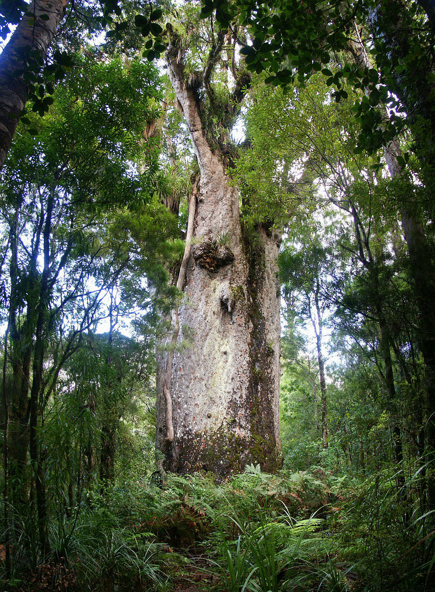

**RIESIGE BÄUME**, die gab es in den Kauri-NationalParks und wer vor einem solchen
Urwaldriesen mal gestanden hat, kann verstehen, warum die Maori ihnen so
bescheidene Namen wie “Gott des Waldes”, “Vater des Waldes” und ähnliches
gaben. Mehr als 5 Meter Durchmesser, über 20 Meter hoch und sie stehen dort
wie ein Fels in der Brandung des Waldes. Unsere Bilder werden ihnen wohl nicht
gerecht, aber wir werden es auf den Diaabenden nochmals unterstreichen.

**VERSPIELTE DELPHINE**, die wir in Pahia auf einem Bootstrip sahen. Sie schwammen
lange Zeit mit uns vor dem Boot mit, sprangen verspielt umher und es war sogar
ein Babydelphin mit, was uns leider das echte Mitschwimmen unmöglich machte.
Dies war eine Auflage der Behörden und auch verständlich, wer würde von euch
Damen schon gerne beim Stillen von Touris angegafft werden?

**EWIG VIELE FRIENDS-FOLGEN**, die wir dauernd in unserem Hostel dort oben im
Norden von Neuseeland sahen, da die einen extra DVD-Kanal hatten, den man mit
WunschDVDs bestücken lassen konnte. Wir blieben in den Northlands 4 Tage und
haben zum Frühstück bevor wir zu unseren Unternehmungen aufbrachen, immer
Friends einlegen lassen und sonst auch immer, so dass die Chefin des Hostels
dann zum Schluss den ganzen Tag Friends hat laufen lassen, wenn niemand sonst
was wollte.

Hab ich was vergessen? Mmmmh, da war noch eine Friedensreich-Hundertwasser-
Toilette in KawaKawa, dann waren wir am CapeReinga, was quasi der nordwestlichste
Punkt Neuseelands ist, haben Minigolf gespielt, in einem Kaff übernachtet, das
diese Bezeichnung wirklich verdient, da die einzige Kurve des Ortes zugleich
auch der Dorfmittelpunkt war, Albrecht hat keine Fauxpas mehr abgeliefert.
Vor dem Flug raus aus Auckland waren wir noch in “Phonebooth”, einem wirklich
sehenswerten Psychothriller, empfehlenswert! Und mir wurde ein Brieföffner
vom Zoll abgenommen, den ich mir erst ein paar Stunden vorher gekauft habe!
Und ich durfte ihn noch nicht mal per Post nachschicken!
Verdammte Zoll-Schweinebacken und -Terroristen!

Und nun, da wir Sonne in Darwin tanken werden, laßt es euch ebenfalls gutgehen, alle miteinander!

Grüße, Veeck

## 16. - 25. Juni 2003: Darwin, AUS

G’Day Mate!

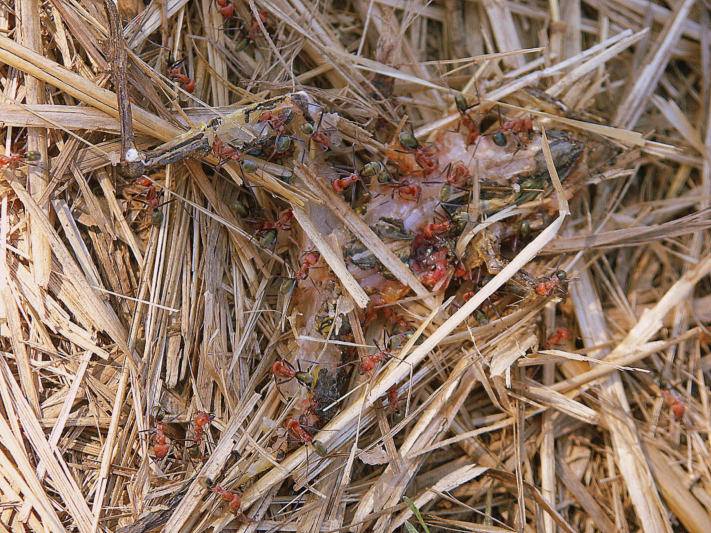

Die Freunde der Südhalbkugel unter euch erkennen sofort den typischen Gruss der australischen Bevölkerung,
wo wir uns dieser Tage aufhalten. Aber zuerst eine Beschreibung unseres momentanen
Basislagers, [Frogs Hollow Hostel](http://www.frogs-hollow.com.au/) in Darwin. Da wären zum
einen der Pool und die zwei Spas im Hostel, welche für die 25 Grad abends bzw lockere 30 Grad am Tag als
Abkühlungsmöglichkeiten wunderbar geeignet waren. Wir wussten am Anfang unseres AustralienAufenthalts noch
nicht genau, wo und wie wir uns die nächsten Tage die Zeit vertreiben würden, deshalb war diese chillige,
warme (und ich bin mir sicher, dass einer der Hostel-Betreibern schwul war) Atmosphäre nach dem rauheren
Klima in Neuseeland eine willkommenen Abwechslung.

Jedenfalls, an unserem ersten Tag in Darwin machten wir uns Spagetten, wie Teyna
sie zu nennen pflegt, und es war die bis dato einzige Mahlzeit, die ich mit
Albrecht genießen durfte, in denen er nach nur **EINEM** Teller sagte, er
wäre satt und würde nichts mehr essen. **UNFASSBAR**, sagt ihr und ihr habt Recht.
Aber es gab eine Erklärung. Zum einen war da, meiner Meinung nach, der Jetlag
nicht ganz unschuldig. Zum anderen, und das ist Fakt, hat Albrecht während
unserer drei Flüge von Auckland nach Darwin ziemlich in die Bordverpflegung
reingehauen.

Eigentlich ging ich ja von 9 Flügen aus, die ich insgesamt auf
dieser Tour hinter mich zu bringen hätte, aber es kam noch einer dazu: Denn
nicht nur sind wir von Aukland nach Melbourne geflogen, sondern von da aus
erstmal nach Adelaide und dann erst nach Darwin. Und da in Adelaide schlechte
Sicht war, mussten wir a) erstmal über ne halbe Stunde in Melbourne warten und
dann noch b) über Adelaide Warteschleife nach Warteschleife fliegen. Die Zeit
nutzte also Albrecht, um sich Bordcracker und ähnliches unter die Nägel zu
reißen, um sich somit an Quantas Airlines für die seiner Meinung nach zu
kleinen Portionen zu rächen. Die arme Quartalsbilanz der Firma! Oh, und er
wollte sich rächen, da auf dem Flug nach Darwin, der mit einer der
rütteligsten und schütteligsten meines Lebens war und für jede Cocktailshaker
-Ausbildung gelangt hätte, die Essensausgabe aufgrund besagter Turbulenzen
Zentimeter vor seinem Sitz unterbrochen werden musste und ich einen
verzweifelten Gesichtsausdruck zu sehen bekam, der sonst nur von Müttern
aufgesetzt wird, denen ihr eigenes Kind aus den Händen gerissen wird. Dazu
kamen dann noch ein zweites Hauptgericht sowie große Teile von Teynas und
meines Essens, da uns die Turbulenzen so sehr auf den magen schlugen. Aber einen
Zimmermann kann sowas nicht erschüttern und über den Tag zusammengerechnet
hatte er wohl nicht abgenommen.

Diese Tage in Darwin waren entspannt, aber die Tour, die wir in den
Kakadu-Nationalpark gemacht haben, war jeden der 340 australischen Dollars wert! Für
die die Albrechts Rundmails nicht gelesen haben, hier nochmal eine
Zusammenfassung:

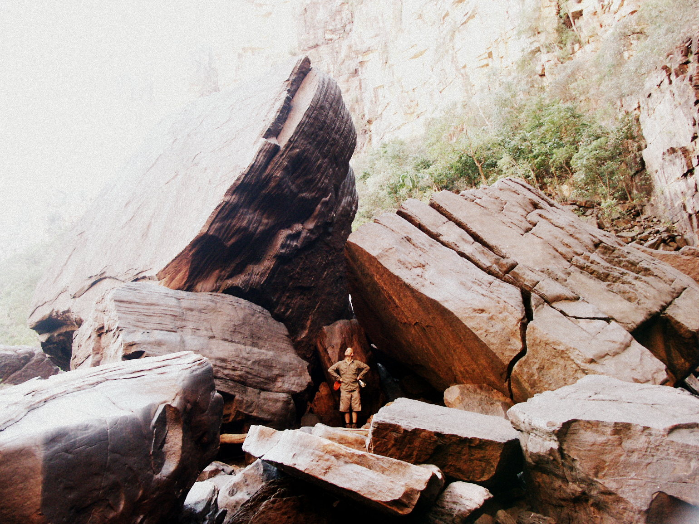

Man starte als Durchschnittstouri, nachdem man die Tour bei einem Veranstalter
(unserer war GONDWANA, empfehlenswert) gebucht hat, morgens um 6:30, indem
man vom Hostel abgeholt wird. Bis zu 9 Leute (wir waren nur zu fünft, was die
Fahrt angenehmer gestaltet, Viktoria(GB) und Paz(AUS) gesellten sich zu uns)
hocke dann in dem Allrad-Geländewagen mit Anhänger (der das leichte
Gepäck und alles was man zum Campen braucht aufnimmt und welches mit im Preis inbegriffen ist)
neben dem Fahrer (unserer hieß Ben), der als Führer alles erklärt und auch
einen Großteil des Kochens erledigt, so wie Spitznamen an die Leute verteilt.
Je nach Jahreszeit (grob gibt es zwei: Trocken- und Regenzeit) und Lust und
Laune werden dann verschiedene Stationen im Verlauf der 3 Tage abgeklappert,
bevor man dann abends um 9:30 wieder total müde, verdreckt und ausgelaugt im
Hostel abgesetzt wird und sich dennoch wie ein Schneekönig fühlt in
Anbetracht der Sachen, die man gesehen hat (und dann kommt noch der Sprung unter die
Dusche! Ein Genuss!). Unsere wichtigsten Stationen waren:

**JIMJIMFALLS**: Wasserfälle, die zwar in der Regenzeit richtig viel Wasser
führen, aber dann noch nicht mal mit nem Allradauto zu erreichen sind. Jetzt in
der Trockenzeit geht es, aber das Wasser ist dann nicht mehr so
spektakulär. Dafür sieht es schweinegeil aus, wenn man nach 2 Stunden durch die Natur
stapfend und Hügel hochkletternd am oberen Ende der Fälle ankommt und ins
200METER tiefer gelegene Tal schauen kann (Weicheier gehen nur zum Schwimmen zum
Fluss am unteren Ende, da waren wir auch noch danach!). Ein Anblick nur für
schwindelfreie und an den ungesicherten Abgrund nur herankrabbelnde Leute!
Auch am oberen Ende hats kleine Seen zum Baden und Erfrischen, obendrein hat
unser Führer noch Brot und alles mögliche für ein Picknick mit hochgeschleppt,
so dass wir alle extrem glücklich und vollgefressen waren. Was auch neu
für mich Westeuropäer war, ist dass wir Trinkwasser aus dem die Fälle
speisenden Fluss entnehmen konnten, so klar war selbiger!

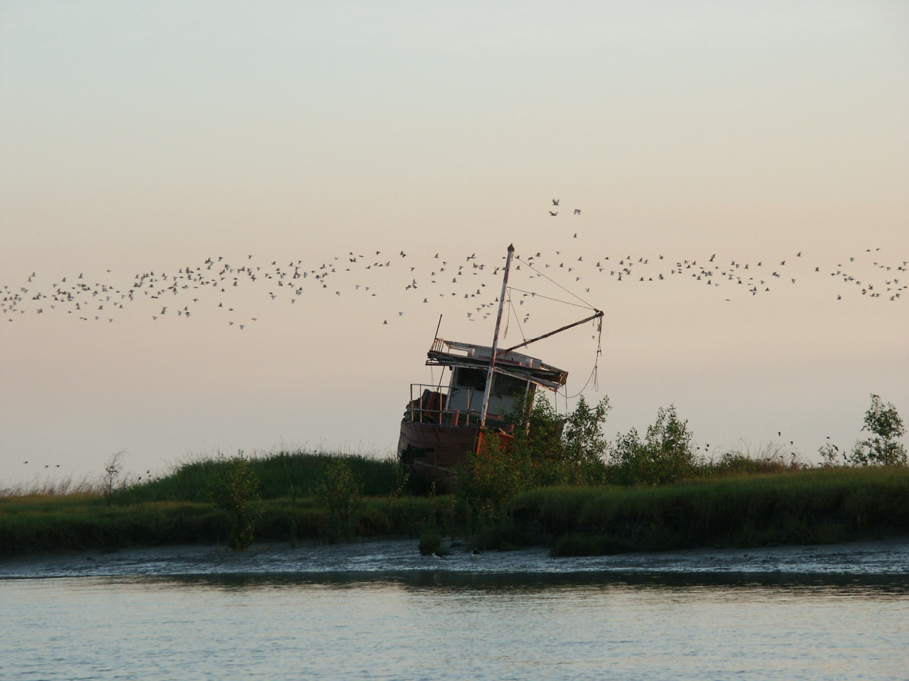

**SHADY CAMP**: Vor die Wahl am letzten Tag gestellt, zu diesem Camp zu hetzen,
oder in Ruhe zu Mittag zu essen, entschieden wir uns für die Ruhe! Was sich
auch gelohnt hat, denn a) war das Mittagessen lecker und b) waren wir immer
noch rechtzeitig da, da die Ebbe noch nicht eingesetzt hatte, als wir den Fluss
erreicht hatten, der am Shady Camp entlang fließt.

Und was macht man an dem Fluss? Man fährt mit dem Boot lang!

Und wer durfte das Boot fahren? Albrecht!

Nun, auch ich hatte Bedenken, aber wie man lesen kann, haben wirs alle überstanden, ohne dass Albrecht es
geschafft hätte, mich oder Teyna in den Fluss zu katapultieren. Was schlecht gewesen wäre in Anbetracht der
vielen Salzwasserkrokodile, die in dem Fluss ihr Unwesen treiben und einen Touri als Hauptgang gerne zu
sich nehmen (siehe dazu [diesen Artikel](http://home.snafu.de/l.moeller/Wild/Krokodil.htm))! Trotzdem extrem cool, an dem Fluss entlang zu fahren und alle 20 Meter ein
Krokodil im Wasser schwimmen oder an Land liegend zu sehen (von dem spektakulären Sonnenuntergang ganz zu
schweigen)

**UBIRR**: Ein Ort, an dem viele Zeichnungen von Aborigines auf Steinen zu sehen
sind. Sehr beeindruckend, wie diese Leute in dem Land überleben konnten,
bis der weiße Mann auftauchte! Im selben Maße ist genauso bedrückend, wenn man
sieht, wie viele Aborigines als Penner auf der Straße anzutreffen sind. Ein
weiteres Beispiel für die überheblichkeit, die der zivilisierte Westen manchmal
an den Tag legt, da immer wieder in der australischen Geschichte versucht
wurde, diese Ureinwohner in die westliche Kultur zu assimilieren, ohne auf deren
eigene Kultur und Identität zu achten!

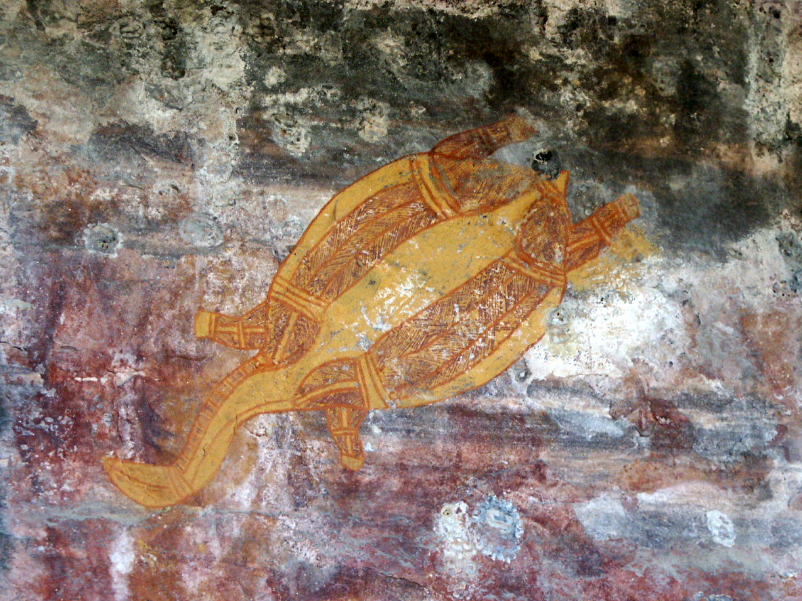

5 Wochen sind nun vergangen, liebe Zuleser, seitdem ich mich aufgemacht
habe, einmal die Welt zu umrunden. Zeit also auf wichtige Fragen einzugehen, die
sich zwangsläufig stellen:

- Hab ich es bisher bereut? Nein.
- Würde ich es wieder tun? Nein, ich war ja schon mal da, müsste mir also
  andere Ziele suchen!
- Geht mir Albrecht manchmal auf den Sack? Sicher!
- Hat er seit Neuseeland nochmal so ’nen Brüller hingekriegt? Leider noch
  nicht!
- Verliert Teyna dauernd irgendwelche Sachen und sucht ihren Geldbeutel? Immer
  wieder!
- Find ich sie trotzdem noch ’ne tolle Freundin? Klar, solange ich ihr meinen
  Geldbeutel nicht zur Aufbewahrung geben muss!
- Hab ich noch genug Geld für den Rest der Reise? Ja, keine Angst, Mutter!
- Wird die Reise ab jetzt anstrengender? Ja, denn heute nacht gehts ab nach
  Indonesien!

Dann ist es vorbei mit KuschelKindergartenBackpacken! Da wird ans
Eingemachte gegangen, da kommt Butter bei die Fisch, da trennt sich die Spreu
vom Weizen und die Jungs von den Männern, da sind die Straßen etwas holpriger
und die Zimmer etwas belegter mit Krabbelviechern!

Besinnliche Grüße, Veeck
