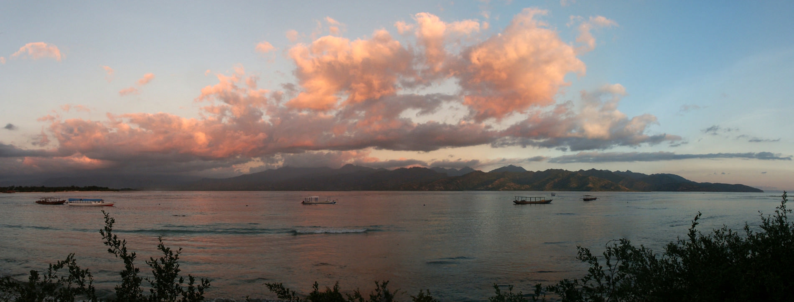
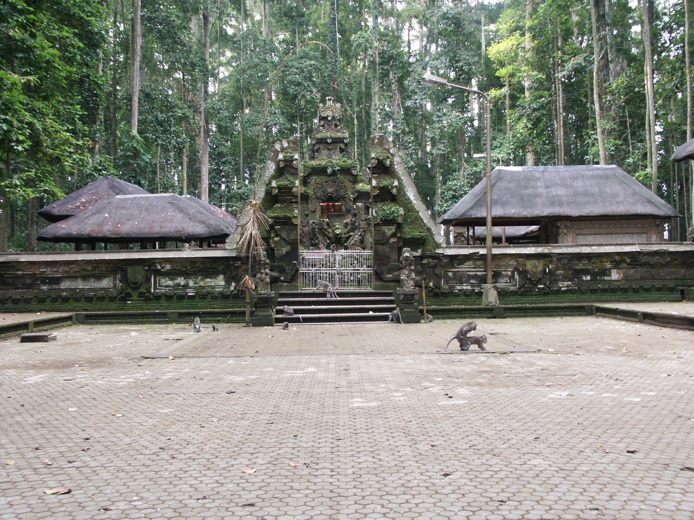
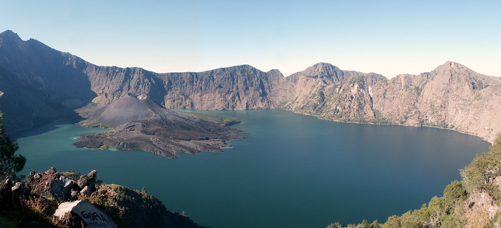
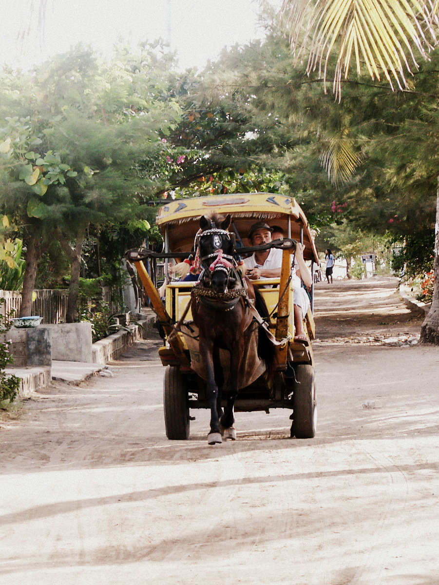
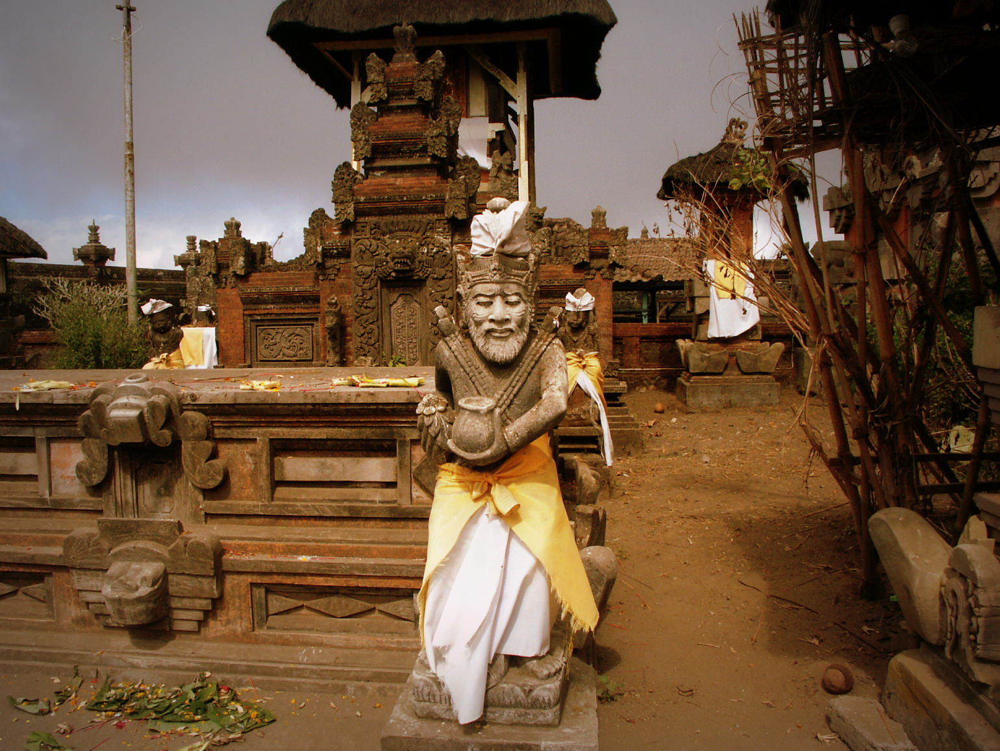
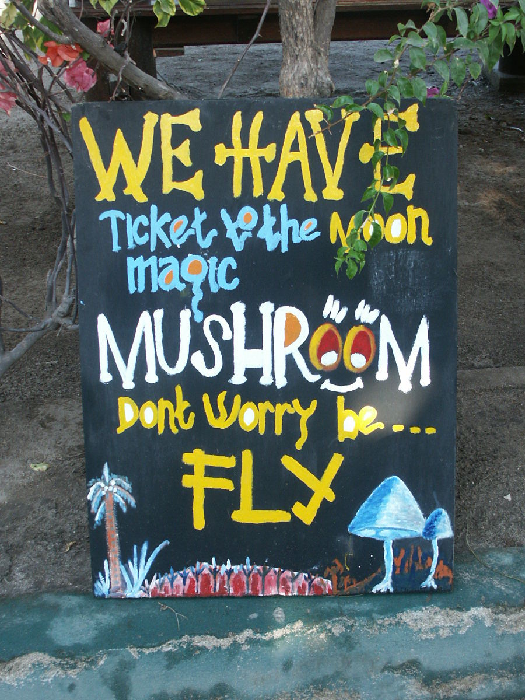
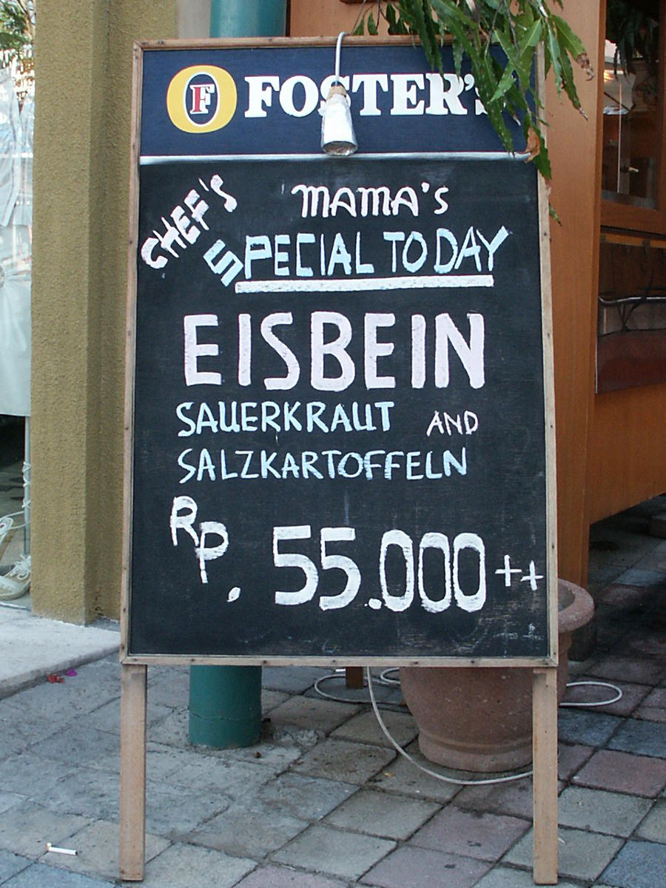
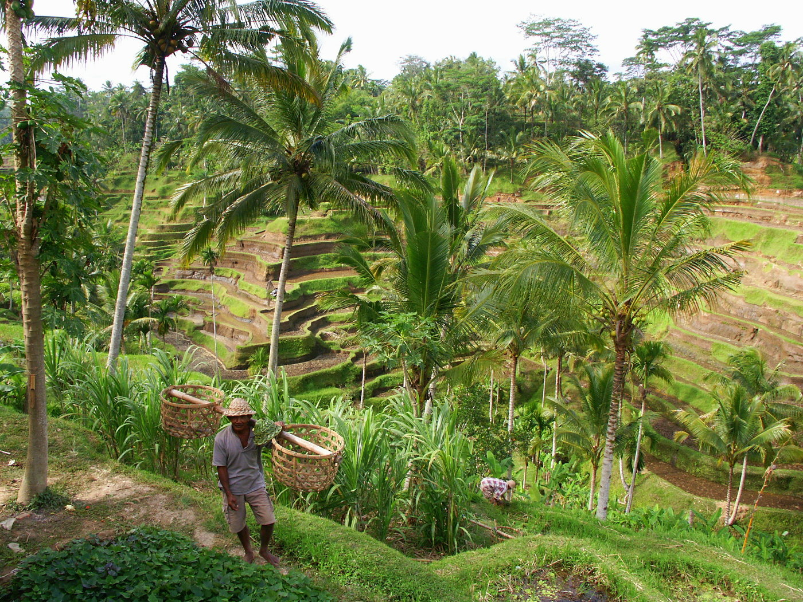

## 26. - 29. Juni 2003: Kuta, Bali, IND

Bali, 30 Grad, die Frisur ändert sich! Die Südostasiatische Hitze hat uns in
ihren Klauen, liebe Freunde des heißen Wetters und wir genießen es.
Sie lässt aber auch uns völlig verrückte Dinge tun, wie z.B. Albrecht,
der sich von einer wesentlich kleineren Person sein Essen klauen liess und zu
viel Angst hatte, es zurückzuholen!

Wir sind gestern nacht um 1 Uhr in Denpasar, Bali gelandet und dieser Flug
geht in meine Erinnerung als derjenige mit den schlechtesten Stoßdämpfern
eines Flugzeuges ein, so holperte es, sobald wir festen Boden unter den Füßen
hatten!

Jedenfalls hatten wir ja schon vor unserem Abflug eine Unterkunft in Kuta
arrangiert sowie den Transport dahin, beides via eMail. Aber wie das Leben so
spielt, als wir aus dem Flughafenterminal traten, nirgends ein Schild in den
Händen eines Menschen zu sehen, wo mein Name oder unser Hotel zu lesen war.
Ich wollte schon Richtung TaxiStand gehen, als Albrecht sagte, er hätte nur
ein Schild mit dem Namen gesehen, auf dem zumindest als Vorname Michael stand.
Es war den Versuch wert, nachzufragen, von welchem Hotel der junge Mann kam,
der einen “Michael Koehvenhar” abholen sollte. BINGO! Wie nun mein Name auf
dem Schriftweg so absurd verdreht werden konnte, sei mal dahingestellt, aber
wir kamen doch noch um 2 Uhr ins komfortable Hotelbett (inklusive Klimaanlage,
Minibar, ein TV mit 5 rein indonesischen Kanälen und Tausenden von Stechmücken!)

In weniger als 48 Stunden Bali konnten wir schon folgendes erleben:

- Ich habe für 2 Kunstdrucke wohl mehr als 10mal soviel bezahlt wie in
  billigeren Läden und selbst da sind die wohl 10fach überteuert, aber wie Teyna
  mir sagte, habe ich damit der Konjunktur im Lande einen Dienst erwiesen!
- Ich (und ich denke ich bin nicht ganz alleine) kann meine Vorliebe für eine
  Erdnußsoße hier billigst ausleben, da GatoGato (Gemüse mit besagter Soße)
  sehr billig ist. Wie insgesamt die alltäglichen Preise:
- So kostete der Eintritt zum Affentempel nur 3000 Rupien (30 Cent), sowie
  die Tüte Erdnüsse nur 5000 Rupien, mit denen man die Affen, die um den
  Tempel im Wald herumstreunen, gefüttert werden.
- Es wird aber extra mehrmals hingewiesen, dass die Affen etwas zu frech
  werden können und alles stibitzen, was sie kriegen können (Sonnenbrillen, Erdnüsse
  oder gleich die ganze Erdnußtüte etc..). Deshalb ist auch immer ein Mann mit Steinschleuder
  dabei, vor dem die Affenbanden wirklich Schiss haben!
- Die Erdnüsse schmeckten jedenfalls sowohl den Affen als auch uns, aber
  Albrecht ließ sich gegen Ende der Tour durch den Wald von einem Affen die Tüte
  aus der Hand reißen und, eingeschüchtert von einem gefletschten Mund und
  bedrohlichen Geräuschen aus selbigem, ließ er dem siegreichen Affen sein
  Trophäe.
- Die Hitze hat mich und Albrecht wohl auch dazu ermuntert, unsere
  Brüderlichkeit zu entdecken, was das Aussehen betrifft, schaut euch dazu das
  angehängte Bild an. Wie Brüder, oder?

Für alle, die meine beruflichen Werdegang verfolgen wollen (oder wie mein
Vater mich endlich von ihrer Gehaltsliste haben wollen :-) ), sei gesagt, dass
ich ab Oktober (oder schon September) für die Uni Freiburg 6 Monate
arbeiten werde. Ich bleibe also Freiburg etwas länger erhalten und hab mehr Zeit
mir einen Job dort zu suchen! Teyna freut sich schon wie eine Schneekönigin!
Morgen geht’s ab übers Meer nach Lombok zum Schnorcheln und Schwimmen und
eventuell sogar bis nach Komodo, wo riesige Viecher ihr UrUnwesen betreiben!
Seid also gespannt auf meine Rückkehr nach Bali!

Grüße, Veeck

## 30. Juni - 2. Juli 2003: Sengigi, Lombok, IND

Mount Rinjani, 2000 Meter, 38.5 Grad! Jawohl, liebe Freunde des unpassenden
Krankwerdens, auf einer 3TagesTour in 2000 Meter Höhe an einem
halberloschenen Vulkan im indonesischen Urwald werde ich fiebrig!

Nachdem wir nämlich aus Kuta, Bali, dem Mallorca für Australier raus sind,
haben wir uns nach Lombok übersetzen lassen, wo es ohne Dauerhektik in den
Straßen auch schön sein soll. Leider hat die Region um Sengigi auch schwer
unter dem BaliBombing und auch SARS (obwohl es keinen Toten hier im Land
gab, so blöd sind die Leute) gelitten und somit herrscht dort tote Hose. Wir
haben dort in einem Bungalow übernachtet, der im Reiseführer noch als **DER**
Place-To-Be angeschrieben war und mittlerweile bankrott geht (dennoch eine sehr
schöne Anlage, wenn man von dem verschlammten SwimmingPool absieht!)

Und jeder am Straßenrand fragt dich, ob du einen Transport brauchst, Drogen
werden einem angeboten, dauernd kriegst du irgendwelchen Kleinkram wie Uhren
etc am Tisch offeriert.... Die Leute trifft es echt schwer. Wir wollten
jedenfalls so schnell wie möglichst was erleben und haben für 500000 Rupien pro Person (55
Euro) einen 3TagesTrip auf einen erloschen Vulkan inklusive Kratersee, heiße
Quellen, Verpflegung und Transport bezahlt und ab ging es im 5 Uhr montags morgens
im Minijeep Richtung Dorf am Fuße des Vulkans. Ein Trip, der schon
am Anfang abenteuerlich wurde:

Man wird ja immer vor Räubern und so gewarnt und dass man nicht irgendwo
einfach mitfahren soll, aber als wir gerade eine Hügelkette hochfahren, fängt
der Motor unsere OldtimerJeeps an zu stottern, bis wir sogar stehenbleiben.
Toll, dachte ich, der alte DasBenzinIstAlleTrick und gleich kommen die Räuber aus dem Gebüsch
(welches auch sehr exotisch wirkt, wenn es nicht in einer Touristenanlage wächst).
War aber nur ein verdreckter Benzinfilter und mit Wasser oder öl gepanschtes
Benzin vom Straßenhändler, welches dafür verantwortlich war, dass das Auto viel
länger und holpriger brauchte als vorgesehen. Auf jeden Fall hat jedes Dorf
unsere Durchfahrt mitbekommen.

Angekommen wurden wir unserem Guide vorgestellt, Godong, 40 Jahre, der schon
über 150 mal den Kraterrand erklommen hat. Der erste Tag sollte uns auch
nur von den momentan 600 HöhenMetern auf 2000 Meter hochbringen, wo wir noch
in Baumgebiet übernachten sollten, um dann am nächsten Morgen über die
Baumgrenze hinaus auf 2600 Meter zum Kraterrand zu gehen und hinunter zum See im
Krater und den heißen Quellen, wo die 2 übernachtung stattfindet. Tag 3
wäre dann Heimmarsch.

Wir mussten nur unsere Klamotten bzw. was wir an persönlichen brauchten
mitschleppen, Essen und Zelte trugen Godong und zwei 20-jährige, die nicht wie wir
mit festem Schuhwerk, sondern nur mit FlipFlop-Badeschlappen da hochgetrabt
sind, wohlgemerkt in unserem Tempo und mit gepäckbehangenem Bambusrohr auf dem
Rücken! Und das demütigendste: Während wir in einer Pause immer Wasser
konsumierten wie nix gutes und versuchten zu Kräften zu kommen, haben die einfach
eine Kippe nach der anderen geraucht!

Nun setzt der Fehler ein, der mich ins Fieber trieb: Wir Deutsche versuchten
mit dem Tempo der drei Lokalen Schritt zu halten, während diese nicht ihr
Tempo an unseres angepasst haben. So brauchten wir für die erste Etappe statt der
angegebenen 3 Stunden nur knapp über 2 und waren dementsprechend schon ziemlich
angeschlagen. Zum Glück hat Teyna in der zweiten Hälfte des zweiten
Abschnitts dann das Ruder in die Hand und das Tempo rausgenommen, aber ich war zu
dem Zeitpunkt schon so fertig, dass ich nur noch am Keuchen war, als
wir nach einer statt der geplanten 2 Stunden am Nachtlager ankamen (viel
früher als notwendig). Zwar sind wir die ganze Zeit durch Waldgebiet gelaufen,
aber es war dermaßen steil und heiß, dass ich nur am schwitzen war. Oben
angekommen hab ich mich nur noch hingelegt und sobald Godong die Zelte
aufgebaut hatte in ein selbiges hinein.

Was kam? Fieber, Schüttelfrost, keinerlei Appetit! Und der Knüller:
Fieberthermometer und unseren gesamten Notfallkoffer hatten wir im Tal gelassen!
Die anderen beiden hatten den Aufstieg besser verkraftet, aber ich war auch
noch am nächsten Tag so geschwächt (bzw wir wollten kein Risiko einer Malaria
eingehen), dass Teyna und Al noch den Aufstieg zum Kraterrand mit Godong gemacht
haben (geiler Ausblick mit über 200 km Sicht!) und wir dann den einfacheren
Abstieg und somit vorzeitigen Abbruch der Tour hinter uns gebracht haben
(Minusrekord laut Bergführer waren zwei Engländerinnen mit 25 Minuten bis zu
ihrer Umkehr! Eat that, Churchill!).

Mittlerweile sind wir seit Mittwoch abend auf Gili Trawangan, einer kleinen
Paradiesinsel und erholen uns von den Strapazen! Geiles Essen, Blaues Meer,
Tauchen und Schnorcheln entschädigen für die Hektik und den Stress, den wir
bisher in Indonesien hatten! Da will ich euch aber jetzt nicht zu viel von
schwärmen, ich hab gehört das Wetter in Freiburg ist momentan nicht so toll,
hehehe?

Malaria habe ich wohl keine, auch wenn der Doktor, den ich noch
vorsichtshalber konsultierte es auch nicht ausschließen wollte, aber dafür gab er mir n
paar ProphylaxeTabletten (Papa, Rechnungsbeleg für die KK hab ich dabei!).
Das einzige, was noch gesundheitstechnisch vom Trip übrig ist, ist nicht
appetitlich genug, um es zu beschreiben, also lass ich es besser in der Kloschüssel.
Wir denken aber es lag an dem Quellwasser auf dem Vulkan, was eigentlich rein sein sollte.
Haben wohl die verdammten Affen heimlich nachts reingepisst!

Wiedergenesene Grüsse, Veeck

PS: Meine Diplomurkunde ist fertig, hätte sie sogar auf dem Fakultätsfest
vorgestern mir überreichen lassen können. Hab abgelehnt, hab besseres zu
tun! Bloss konnte mir noch keiner meine Note sagen! Nachtrag: 1.2!
PPS: Albrecht bleibt auch erstmal in Freiburg. Hat auch ne Stelle an der Uni bekommen!
PPPS: Wollt ihr wissen wie ich an meinen Job kam? Vitamin B: Ich hab ihn
über nen Typen bekommen, der mit der Assistentin des Professors schläft! (Sorry, C&amp;M,
aber der Gag war einfach zu gut!)

## 2. - 11. Juli 2003: Gili Travangan, Lombok, IND

Hach, liebe Freunde des Ausdauerurlaubs, es ist schon hart und verdammt
anstrengend, 10 Tage auf einer Insel nur mit Faulenzen und Essen und ab und zu
etwas Schnorcheln zu verbringen, aber wir haben es geschafft! Hartes Training und
eiserner Willen haben uns ermöglicht, diese herkulös zu nennende Aufgabe zu
meistern!

Ort der Handlung war Gili Trawangan, wo ich mich von den Strapazen des
Fiebers erholt habe, Teyna hin und weg von den Tauchgebieten war (und die Größe
ihres Tauchanzugs von den gebräunten Umrissen auf ihrem Körper abzulesen
ist) und Albrecht konnte sich ganz den kulinarischen Delikatessen der Insel
hingeben.

Aber auch auf dieser Insel war sozusagen “die Ruhe nach den BaliBomben”, wie
uns einer erzählen konnte, der vor einem Jahr schon einmal dort war. Früher
drängelten sich auf der Straße (es hat dort quasi nur eine einzige am
Strand entlang, und keine Autos oder Mopeds. Welch angenehme Ruhe sag ich euch!)
die Massen, heuer war es abends angenehm leer. Schlecht für die Leute, die
von den Touristen leben müssen, für uns ein Segen!

Und nicht alles in diesen 10 Tagen war harmlos, das sag ich euch! Bei einem
meiner Schnorchelgänge bin ich auf einen Fisch gestoßen, der in
abgestorbenen Korallenbänken wühlte und sich mit dem Staub quasi aufmerksam machte.
Wie sich später herausstellte, war es ein Giant Triggerfish.

Sehr bunt und mir schon vorher aufgefallen, als er an mir vorbeizischte und ich ihn aufgrund seiner
Geschwindigkeit nicht einholen konnte. Jedenfalls war er nun sagen wir mal 5 Meter von mir entfernt und ich
beobachtete ihn einfach, da er so hübsch gemustert und gross war (seht dazu [dieses Bild](http://home.swipnet.se/~w-42581/pics/trigger.jpg).
Dann schien ein kleinerer Fisch in anzupissen, da er ihm nachschwamm und verscheuchte. Dann sah er mich und fing an,
direkt auf mich zuzuschwimmen und zu drohen, der Drecksack. Und wenn man mal einen größeren Fisch von Profil- auf
Frontal-Ansicht wechseln sieht, denkt man recht schnell über einen präventiven Rückzug nach. Gedacht, getan
und weg war ich! Zum Glück konnte er mich auch nicht einholen, so wie ich ihn vorher nicht einholen konnte.

Wie mir dann daheim von den Tauchlehrern gesagt wurde, geht dieser Fisch
echt grundlos auf Taucher los und beißt einem dann in die Flosse oder sogar ins
Ohr! Unangenehm! Und auch Albrecht musste einen Schreck erleben, als seine
Hängematte, die auf der Terrasse vor seinem Bungalow hing, unter seinem
kulinarischen Gewicht riss. Nur Teyna blieb, glaube ich, von Blessuren verschont,
dafür muss sie sich gerade zusammenreissen, um nicht die ganzen
Souvenirläden leerzukaufen.

Jetzt sind wir wieder in Kuta/Bali und kaufen wie gesagt noch n bisschen
ein, bevor es morgen ab nach Singapur und von dort direkt mit der Bahn nach
Krabi/Thailand geht. Vielleicht schaffen wir es noch nach Angkor Watt in Kambodscha
aber dazu müssen wir erstmal Verbindungen und Preise checken!

Haltet die Ohren steif, in 3 Wochen bin ich wieder bei euch!

Grüße, SchnorchelVeeck

## 12. - 16. Juli 2003: Kuta, Bali, IND

555: The Number of The Dumb! Nun liebe Kinder, gebt fein acht, ich hab euch etwas mitgebracht:
Ein Geschichte von blindem Vertrauen unter 3 Freunden wie es größer nicht
sein könnte, von fast epischen Ausmaßen, die man seinen Enkelkindern noch
erzählen wird.

Wir landen also vor einiger Zeit in Indonesien und haben vor 17 Tage zu
bleiben. Dieses Datum ist fest in unseren Köpfen und wir vergessen es die ganze
Zeit auch nicht. Wir erleben die ganzen Abenteuer, die ich euch schon in
vorherigen eMails erzählt habe, und kommen wieder in Kuta an, an einem Freitag
und Sonntags geht unser Flug. Wir haben also noch genug Zeit, um zu shoppen,
und auch der Flug geht erst nachmittags, verschlafen sollte also auch
unmöglich sein. Vor allem, da Albrecht und ich am nachmittag vor dem Abflug nochmal
auf das Ticket geschaut haben, wo auf einem blauen Aufkleber, der irgendwo
zwischen LA und Indonesien von einem Schalterbeamten eingeklebt wurde, eine
andere Uhrzeit zum Abflug stand als wir im Kopf hatten: 14:15 statt 15:10. Hui,
Glück gehabt, rechtzeitig gemerkt!

**ABER**, und so muss es in so einer Geschichte ja immer weiter gehen, etwas läuft
anders, eventuell schon vor Wochen, und erst jetzt sind die Auswirkungen davon
zu spüren, und man kann nichts mehr ändern.

Also, aber als ich am Abend vor dem Abflug auf der Webseite von Quantas
nachchecken wollte, ob der Flug wirklich geht, muss ich feststellen, dass für den
morgigen Tag kein Flug von Denpasar/Bali nach Singapur angezeigt wird. Also
nochmal nach Hause ins Hotel und auf die Tickets geschaut, der Flug ging unserer
Meinung nach doch am Sonntag dem 13ten?!

**DENKSTE**, der vorhin schon erwähnte Aufkleber auf unseren Tickets änderte nicht nur
die Uhrzeit, sondern auch den Tag, und zwar vom 13. auf den 10.! Unser Flug
war also schon abgeflogen, als wir noch auf den Gili-Inseln weilten!
Und erst jetzt machte einiges Sinn bzw Unsinn:

Jeder von uns war immer wieder vom 13ten als Abflugtermin ausgegangen, 17 Tage
auf Bali war die Dauer unseres Aufenthaltes, basta! So stand es ja am Anfang
auch auf unseren Tickets, wobei wir aber vergessen haben (und es erst jetzt
wieder langsam ins Gedächtnis zurückkam), dass das Reisebüro bei uns anrief
mit der Info, dass der Sonntagsflug gestrichen wurde und wir Donnerstags
oder Montags fliegen könnte, und wir uns für den Donnerstag entschieden
hatten.

Weder Teyna noch ich schauten während des ganzen Aufenthaltes in Indonesien
jemals auf unsere Tickets, obwohl wir in allen anderen Ländern zuvor
dauernd uns nochmal anschauten, wann wir genau fliegen würden! Bloss hier nie!
Nur Albrecht warf öfters einen Blick auf sein Ticket, fand den blauen
Aufkleber aber störend, da er das Datum des Abfluges verdeckte und schaute
deshalb immer auf den Durchschlag, der natürlich das falsche Datum noch zeigte!
Was auf dem blauen Aufkleber stand, wurde dabei von Albrechts Gehirn völlig
ausgeblendet! Und selbst an dem Nachmittag, als ich auf den Aufkleber schaute
und realisierte, dass die Zeit eine andere ist, merkte ich nicht, dass auch
das Datum ein anderes ist (Albrecht auch nicht!)

So vertrauten wir uns alle 3 untereinander blind, was den Abflug betraf.
Murphys Gesetz bewirkte dann auch noch, dass wir das Ganze Samstag Nacht
bemerkten und wir somit dazu verdonnert waren, bis Montag zu warten, um jemanden bei
STA Travel hier in Bali zu erreichen.

Mittlerweile sind wir aber wieder “On-Track” (Tausend Dank an Wolfgang K.,
der für uns die Kommunikation mit STA Travel in Freiburg erledigte), und
fliegen nun diesen Donnerstag weiter nach Singapur, um dann hoch zu hetzen nach
Bangkok, da wir quasi ne ganze Woche verloren haben und Albrecht schon am 23.
wieder nach Hause fliegen muss. Teyna und ich können uns noch kurz an nen
Strand in Thailand legen, aber Angkor Wat ist wohl Geschichte!

Tja, so gehts also, wenn man sich auf sein Gedächtnis verlässt, deshalb
nochmal schnell die Frage an dich, Frauke, wann genau deine Hochzeit nochmal
ist, damit wir die auch nicht verpassen. Wann sollen wir wo überhaupt sein und
was für nen Dresscode gibt es? Shorts haben wir genug!

Also, bis wir hoffentlich die angekündigte Zugreise nach Thailand hinter
uns gebracht haben, verbleibe ich Tickets genau lesend, Veeck
