import Link from '@material-ui/core/Link';
import Image from '../../../src/components/Image';

## 25. September 2004: Freiburg

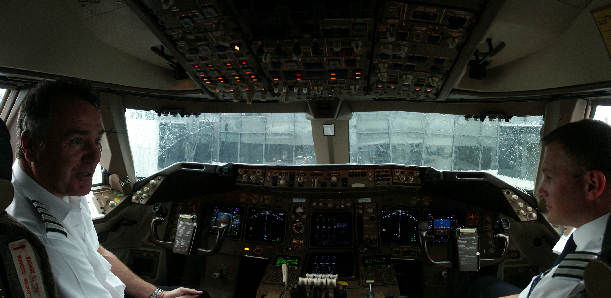

Heathrow, alternder Moloch des westlichen Flugverkehrs, du hast mich wieder.

Freunde und alle, die ihr es werden wollt, ich melde mich vor meinem 12 Stunden Flug noch einmal, um euch zu
warnen: Wer nicht schnell genug NEIN ruft oder dessen eMail-Account voll ist, der erhält ab Morgen für zwei Wochen
Kunde aus einem Land, das nach den USA uns wohl am fremdesten seit dem zweiten Weltkrieg geworden ist:

Japan!

Genauer gesagt die Städte Tokio, Sendai und Kyoto! Eine Woche Konferenz (eine genauere Beschreibung des
Vortrags, den ich zu halten hab, findet ihr auf <Link href="personal_research.html#iros">dieser Seite hier</Link>.
Achtung aber, englisch ist Voraussetzung) sowie fünf Tage Sightseeing in den
genannten Städten. Nur noch 12 Stunden Flug sowie das Kinoprogramm an Bord stehen dazwischen. Oh und mein
Hals kratzt. Verdammte Klimaanlagen!

Seid also gespannt und neidisch, Grüße, Veeck

## 27. - 29. September 2004: Sendai

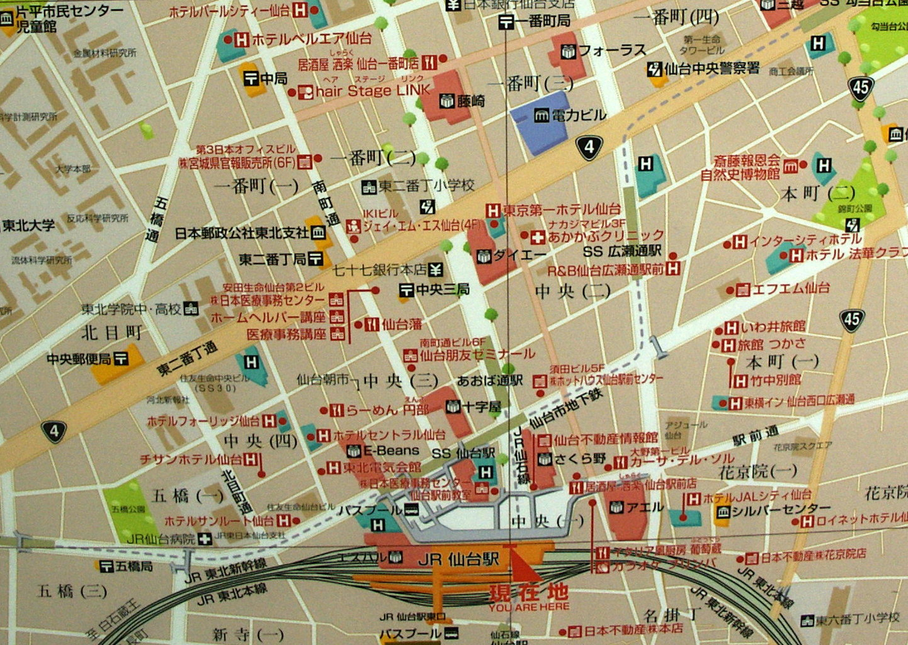

Sushi, Suppen, Sayonara, Freunde, aus Sendai, einer Millionenstadt im Norden Japans!

Wir sind also ohne Abstürze nach Japan gekommen. Der einzige Absturz war
Cyrills, der hat am Abend vor unserer Abreise einen zu viel in der Strauße
getrunken und war entsprechend fertig war auf der Reise.
Aber zurück zum Thema: Der Flug war nicht wirklich aufregend, keine
Turbulenzen, keine Verspätungen, das einzig nennenswerte war, dass schräg
hinter uns eine arme Frau kurz nach dem Start von oben vollgetropft wurde. Der
Stewart kam auch, nachdem sie sich mit einer Plastiktüte bewaffnet hat und die
Tropfen auffing, um nachzuschauen was da war. Es hätte ja Benzin, Bremsflüssigkeit,
Kerosin sein können, aber dann stellte sich heraus, dass ein Mitreisender im Gepäckfach
seine Tasche mit einer Wasserflasche verstaut hatte und die aufgegangen war.
Die arme Sau konnte dann erstmal sein Handgepäck trocknen, inklusive seiner
Kamera, die aber anscheinend nichts abbekommen hatte. Wie kann man auch so blöd
sein.

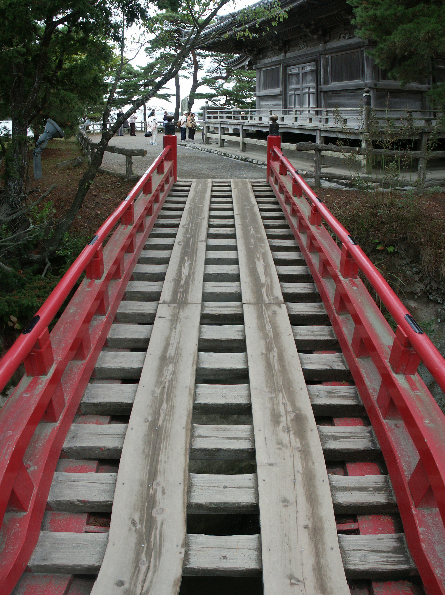

Ok, jetzt zum eigentlichen Thema: Klischees. Die werden voll erfüllt, denn hier
laufen alle Europäer mit Kamera rum und machen dauernd Fotos von stinknormalen
Sachen. Wir gehören natürlich auch dazu.

Die Japaner, um sie kurz zu beschreiben, sind superfreundlich (sogar der
Schaffner im Zug zieht vor den Reisenden den Hut, stellt sich vor, verbeugt
sich und kontrolliert erst dann die Karten), reden andauernd auf Japanisch auf
einen ein, stellen sich strikter als die Engländer vor der Bushaltestelle in
Reihe auf und haben tolles Haar.

Und das Essen, super! Gerade eben haben wir typisch Japanisch vom Laufband gegessen,
wo vor einem kleine Teller vorbeifahren, auf denen verschiedene Kleinigkeiten
liegen. Da man nichts versteht, bzw. keiner hier Englisch kann, kommt man damit
am weitesten. Oder sie legen einem Bilder hin, so wie in der Suppenküche
gestern Abend.

So, gleich ist die Internetzeit vorbei, ich muss Schluss machen. Grüße an alle
frischen Väter (Christian Schmidt, du bist gemeint, aber Ole?) und alle
schwangeren Cousinen,

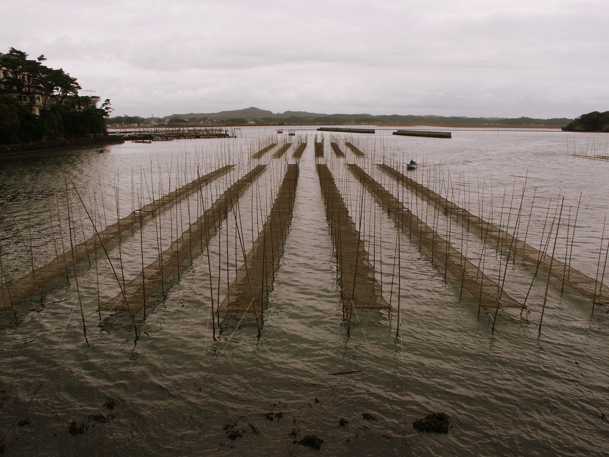

Konischiwa, Veeck

PS: Der Tourist mit der Wasserflasche war auch so blöd und hat seine Jacke im
Flugzeug vergessen, weil er es so eilig hat, nach der Landung ins Cockpit zu
gehen, weil er vom Piloten die Erlaubnis bekam, darin Fotos zu schießen.

PS: Der blöde Tourist mit der Wasserflasche, der Jacke und dem Cockpit hat auch
bei seiner vorherigen Mail die falsche Internetadresse angegeben: Geht auf
www.veeck.de und alles wird gut.

## 30. September 2004: IROS 2004

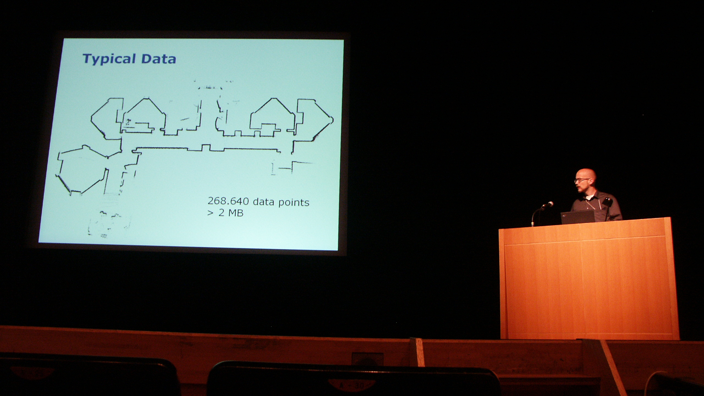

Geschafft, es ist vorbei, das Spiel ist aus, die Würfel gefallen, ich habe meinen Vortrag auf der
IROS hinter mich gebracht. Ich war nervös, keine Frage, das ist aber auch kein Wunder, wenn man morgens
auf die Konferenz geht und feststellt, dass man seinen Vortrag im größten Saal
des Hauses halten muss, der 1000 Plätze aufweist!!!

Zum Glück werden Besucherzahlen in dieser Größenordnung nur erreicht, wenn man
schon 250 Veröffentlichungen hat und Sebastian Thrun heißt, bei mir waren zum Glück
nur ca. 30 Leute da. Es gab noch zwei Kommentare von anderen Wissenschaftlern
zu meinem Thema, die wir, Wolfram, nochmal durchgehen sollten, aber im großen
und ganzen war ich unzufrieden mit meinem Vortragsstil (nicht mit dem Vortrag
an sich, der war gut), aber Cyrill überredet mich gerade zu einer anderen
Meinung.

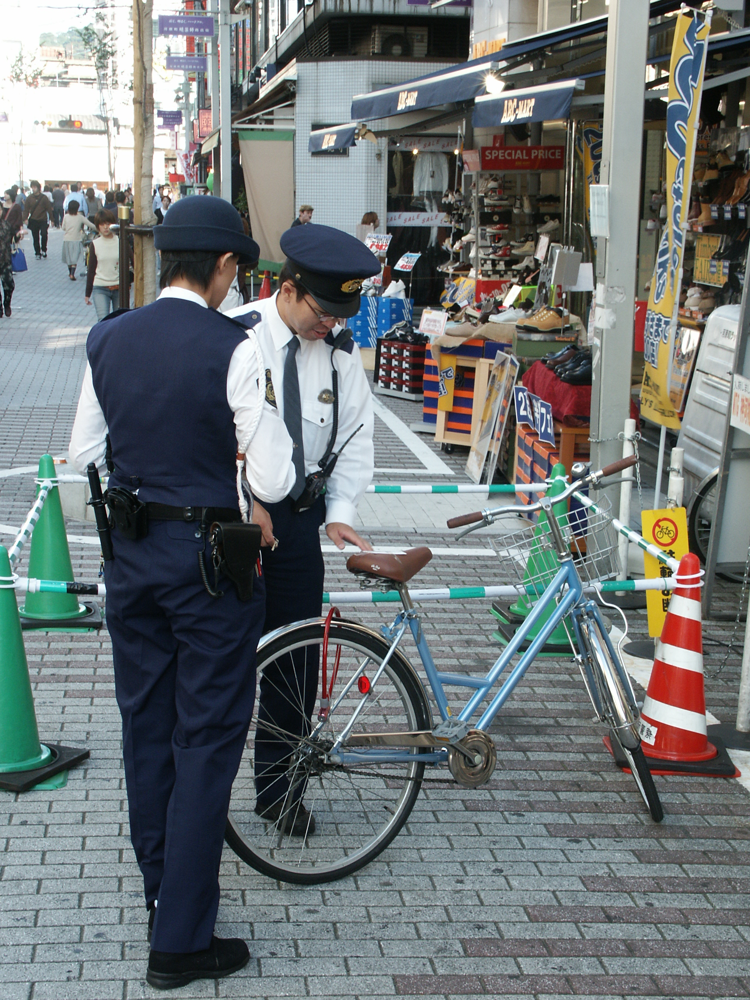

So, der harte Teil ist jetzt für mich vorbei. Ok, es gibt natürlich noch die
Schlachten ums kalte Buffet, und das ist wirklich kalt: Sushi, Sushi, Sushi.
Man könnte denken, die haben eine Ölkrise hier und feuern ihre Herde niemals
an. Egal, schmecken tut’s trotzdem (noch).

Anbei Bilder von mir während der Präsentation und ein Bild von einem
rollerblade-fahrenden Roboters. Ich werde später noch die passenden Filme auf
meine Webseite stellen, dann könnt ihr auch 4 von diesen Robotern in Aktion
sehen, wie sie tanzen und skaten.

Und nun noch kurz zu einer Neuerung in meinem Mails, eine neue Rubrik -&gt; Japan-Facts
Japan-Fact: Alle Handys in Japan sind Aufklapphandys.

So das war’s schon, ich geh wieder japanisches Bier trinken. Wenn ihr das in
den nächsten 1,5 Stunden lest, drückt Teyna die Daumen, die gerade in ihrer
Klausur hockt und wohl viel lieber hier bei mir wäre (was ich auch gerne hätte).

Bis die Tage, Veeck

## 31. September - 3. Oktober 2004: Sendai

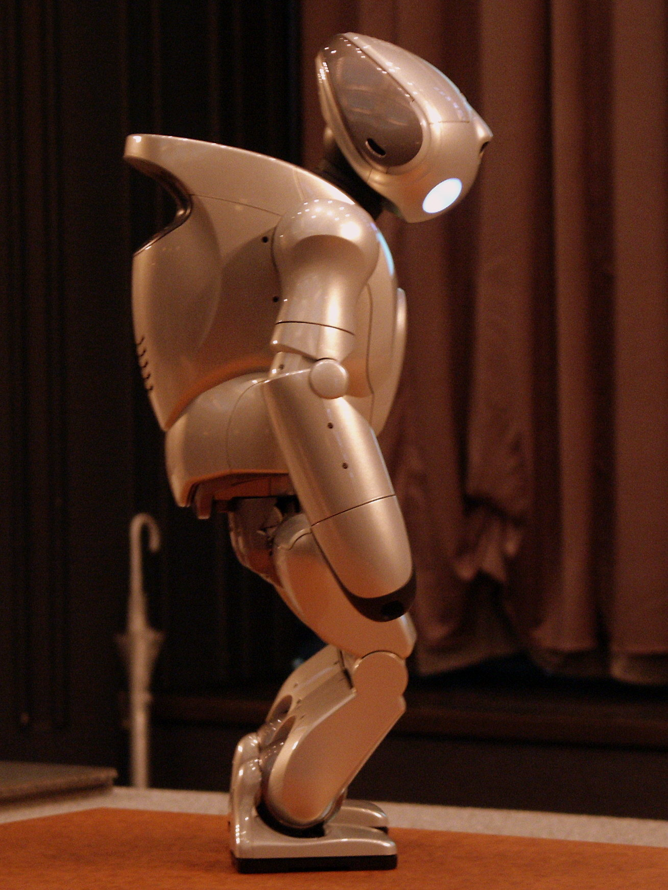

Grüße vom letzten Tag der IROS-Konferenz bevor es Morgen ab nach Tokio geht.

Die IROS war sicherlich interessant, wenn ich auch von einem wissenschaftlichen Standpunkt aus gesehen nicht
viel lernen konnte. Zu unterschiedlich die Themen und zu wenig überblick besaß ich dafür.
Von einem unterhaltungstechnischen Standpunkt aus waren die QRIOS das Highlight: Wer sie nicht kennt, das
sind kleine Roboter von Sony, die nicht käuflich zu erwerben sind (und selbst dann den Wert eines
Eigenheims hätten) und süße Dinge machen können wie zum Beispiel tanzen, Toasts aussprechen und skaten. Ich
habe da mal was vorbereitet, was ihr <Link href="https://www.youtube.com/watch?v=-_GxmkWc7WU">hier auf YouTube</Link> anschauen könnt.
Dann fand gestern Abend auch noch das Festbankett statt, was ein gediegenes
Mahl und freie Getränke beinhaltet, sowie viele Dankesreden von leicht
angetrunkenen Japanern, deren Akzent nicht zu überhören war, um es mal etwas
freundlicher auszudrücken. Oh, und die nächste IROS in Edmonton/Kanada wurde
vorgestellt, wo auch gleichzeitig das IROS-Golfturnier stattfinden wird. Ich
sollte wohl doch nochmal versuchen, einen Job an der Uni zu finden...

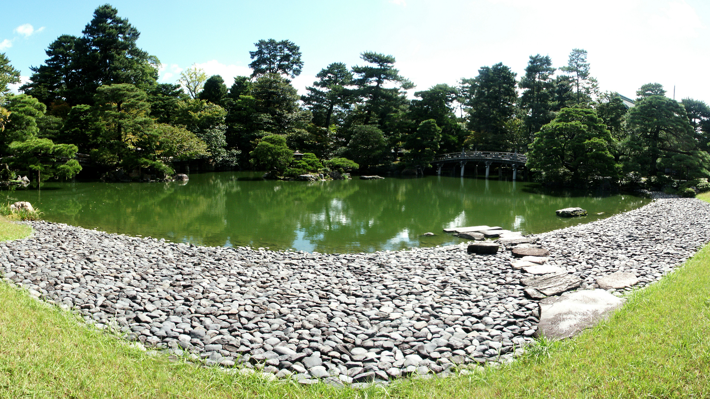

Egal, richtig witzig wurde es, nachdem schon um halb 10 das Bankett beendet
wurde: Unsere Gruppe, multikulti bestehend aus verschiedenen Nationalitäten, Europäer
vereint mit Amerikanern, beschloss ein Pub aufzusuchen, um noch ein zwei Bier
zu sich zu nehmen.

Problem: Das Konzept einer Kneipe, wie wir sie daheim haben, gibt es hier
nicht. So sind die meisten Läden hier Restaurants und die typischen japanischen
Kneipen sind versteckt hinter diesen unverständlichen Schriftzeichen. Ok,
trotzdem finden wir ein Schild im Entertainment-Viertel wo zumindest das erste
Wort &quot;Pub&quot; ist (gefolgt von einem unverständlichem Kauderwelsch). Also
7 Mann ab nach oben in den dritten Stock (jep, hier wird jedes Stockwerk
ausgenutzt) und die Tür zum Pub wird aufgestoßen, nur um einen Raum
vorzufinden, der kleiner als mein Zimmer (20 qm) ist, und nur ein Pärchen an
einem der 4 winzigen Tische hockt, während der Mann und die zwei Frauen hinter
der Theke völlig aus dem Häuschen sind aufgrund der unglaublichen Anzahl von Gästen,
die auf einmal in ihr Etablissement einströmen.

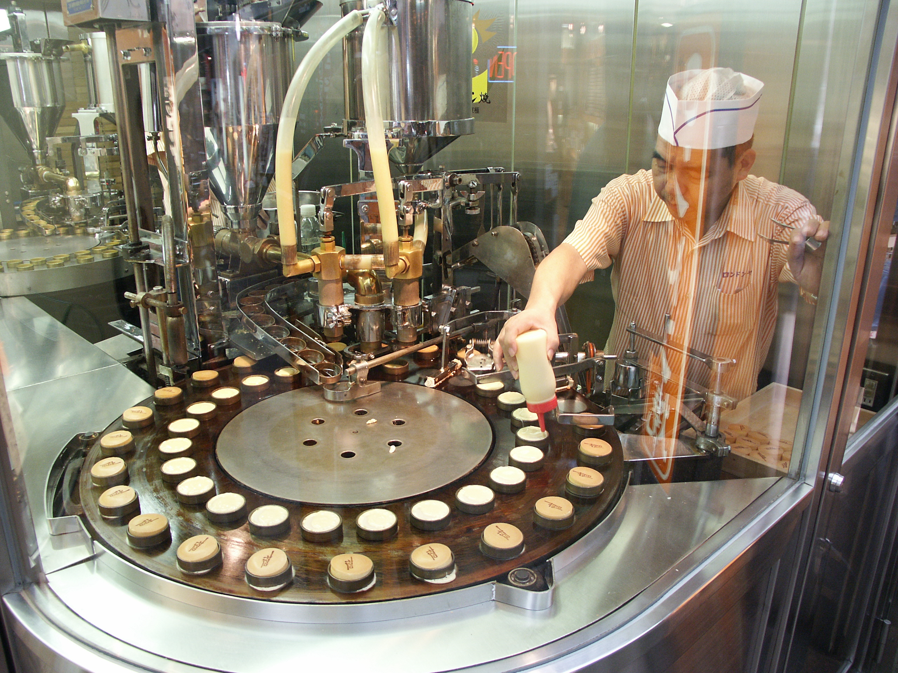

Und mich wunderte schon, was sie für Preise haben bei so einer kleinen Ladenfläche,
aber wir bestellten trotzdem Bier und wurden überraschend freundlich bewirtet.
Alle drei, die vorher noch hinter der Theke standen, setzten sich zu uns und versuchten
Konversation zu betreiben, obwohl sie nicht ein Wort Englisch konnte. Dazu kam
noch, dass sie sofort, wen einer kein Bier mehr hatte, nachschenkten und dies
in einer Art, als ob sie noch nie Bier ausgeschenkt haben (was auch von der
unglaublichen Anzahl an Whiskeys in der Bar untermauert wurde). Und als Krönung
fuhren sie auch noch keine Essensportionen auf (eingelegte Bohnen oder sowas),
aber Hunger hatten wir keinen und bestellt sowas erst recht nicht.

Da wurde es uns zu unheimlich und wir fragten nach, was wir zu zahlen hätten.
Wohlgemerkt: zu sechst hatten wir 4 oder 5 Flaschen Bier getrunken. Nach langer
überlegung seitens des Wirtes kam dann für alles die Zahl 15000 Yen auf den
Tisch, was sich in 120 Euro übersetzen lässt. Exquisit, sag ich mal, aber zum Glück
hatten wir genug Geld dabei und waren um besagten Betrag ärmer aber um eine
Erfahrung reicher: &quot;Pub&quot; bedeutet, dass es ein Hostessenclub ist, wo
man die Frauen, die deine Mutter sein könnten (ich erwähnte noch nicht, dass es
nicht die jüngsten Damen waren) für ihre Aufmerksamkeit bezahlt.

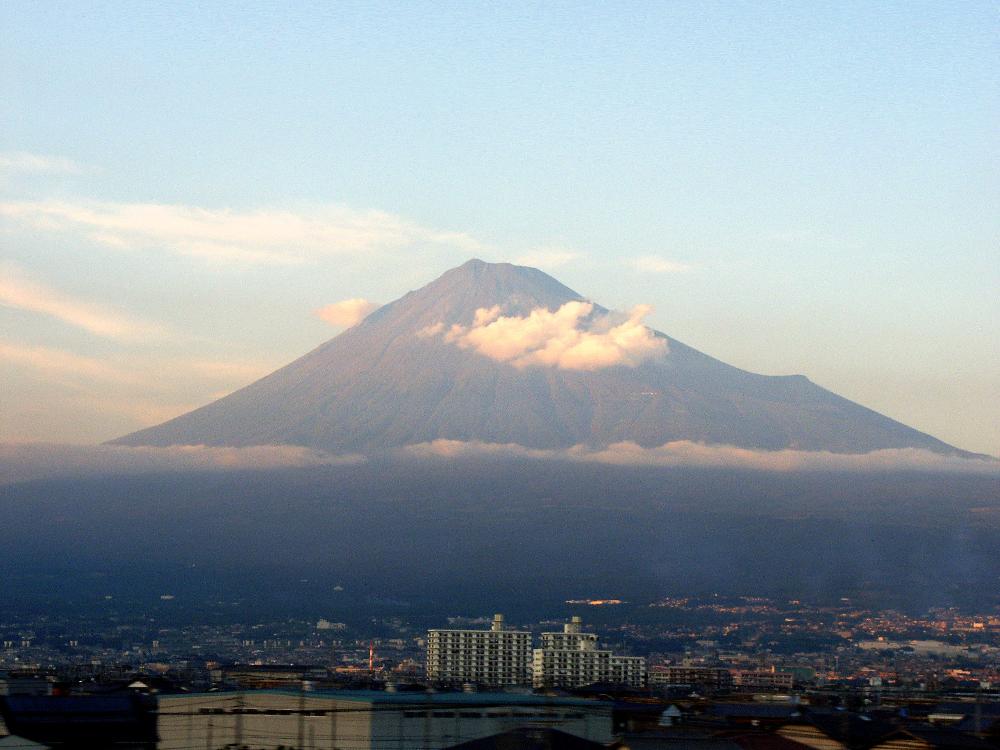

Egal, man kann ja Geld sparen, indem man zum Beispiel bei Touristen-Attraktionen,
die normalerweise Eintritt verlangen, durch den ungesicherten Seiteneingang hinein
wandert (was uns natürlich unabsichtlicher weise passiert ist). Und sonst wird
man auf der IROS auch gut versorgt, so dass man für Essen und Alkohol auch kaum
noch etwas ausgeben muss: Dauernd Wasser, Kaffee und Gebäck, mittags Lunchbox,
abends am 1.Tag Welcome-Reception, 2.Tag Opening-Reception, 3.Tag Bankett,
4.Tag Farewell-Reception, alles immer mit Sushi und Sake satt.

OK, ab geht’s zur Lunchbox, ich krieg Hunger. Gratuliert aber alle noch Teyna,
sie hat wohl ihre Klausur bestanden, jetzt muss sie nur noch 3 mündliche Prüfungen
bestehen, dann ist sie frei!

Bis die Tage, es geht wie gesagt für eine Nacht nach Tokio und dann drei Tage nach Kyoto, Veeck

## 4. - 6. Oktober 2004: Kyoto

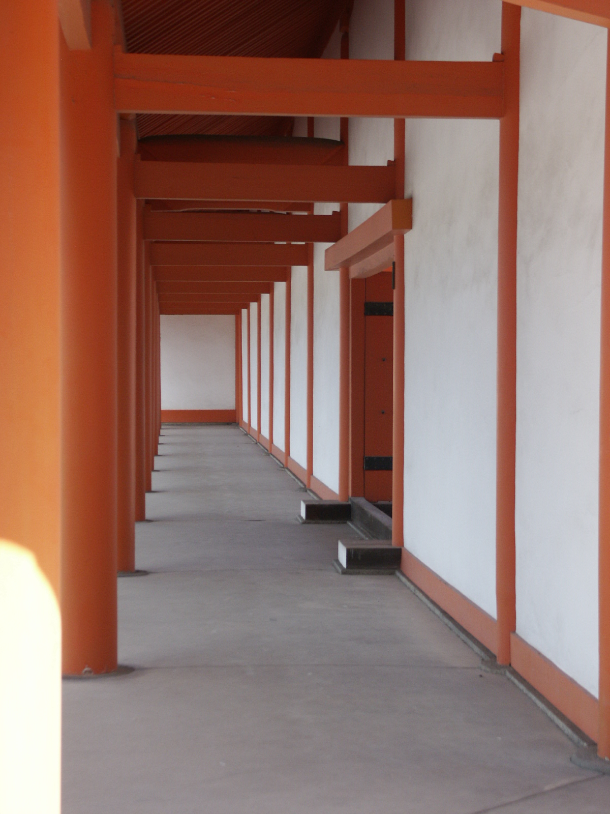

Wenn man eins kann hier in Japan, dann essen, Freunde der Macht!
Ich weiß, dass es nicht besonders japanisch war, aber sogar die Pizza im
AllYouCanEat hier ist abwechslungsreich und lecker. Ok, um das gesundheitlich
auszugleichen, kommt das ganze Sushi dazu, ich denke also ich nehme hier insgesamt
ab.

Aber es sind vor allem die Variationen, die man findet: Gestern in Tokyo
wandern wir in ElektronikCity (nicht wirklich günstig für Schnäppchen) und
finden diesen kleinen Laden, in dem das Fleisch einem noch auf einer Seite roh
an den Tisch gebracht wird. Das ganze aber in einer noch so heißen Pfanne, dass
es zischt und dampft und man das Fleisch nur noch umzudrehen braucht, um es
nach eigenem Gusto durchzubraten. Superlecker (und bei mir war ein Hackfleischkügelchen
mit Käse überbacken auch noch mit dabei) und auf jeden Fall japanisch, nicht so
wie die AllYouCanEat-Pizza heute Mittag, die aber beim Japaner dennoch Meilen
besser schmeckt als bei Pizza-Hut.

Ok, wie sonst ist Tokyo? Gross, riesig, massig. Wir sahen jetzt nur einen
kleinen Teil, aber wäre ich nicht schon vorher in Bangkok und wäre das Wetter
dort nicht so regnerisch gewesen, dann hätten mich die Menschenmenge wohl
umgehauen. Dennoch faszinierend, vor allem:

Japan-Fakten: Es gibt wirklich gebrauchte Damenunterwäsche dort zu kaufen.
Abgepackt und mit Foto und Tragedatum versehen. Wer will eine?

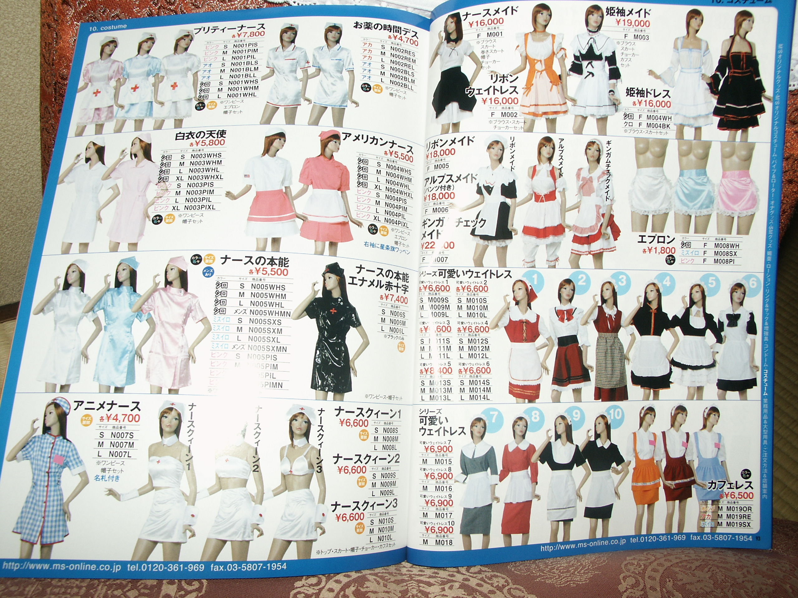

Ok, momentan bin ich in Kyoto und surfe über das Wireless-LAN eines
freundlichen Koyoteken, der weder sein Netz verschlüsselt noch sein
Standardpasswort des Routers verändert hat. Keine Angst, wir verändern seine
Einstellungen nicht (nicht bevor wir abreisen). Lasst euch das ne Lehre sein.
Wir, das sind übrigens ich und Studenten von Ben Kuipers aus Austin, Texas, die
ich auf der IROS kennenlernte.

Karten sind für dich und euch unterwegs, Geschenke kaufte ich auch für dich, euch und dich.
Seid gespannt wer was kriegt :-)

Also, mehr die Tage mit mehr aus Kyoto, heute Abend wir Fleisch am Spießchen gegessen.
Schmatz an alle meine Freundinnen (oder nur an eine wenn ich nur eine kleine habe), M

## 7. - 9. Oktober 2004: Tokio

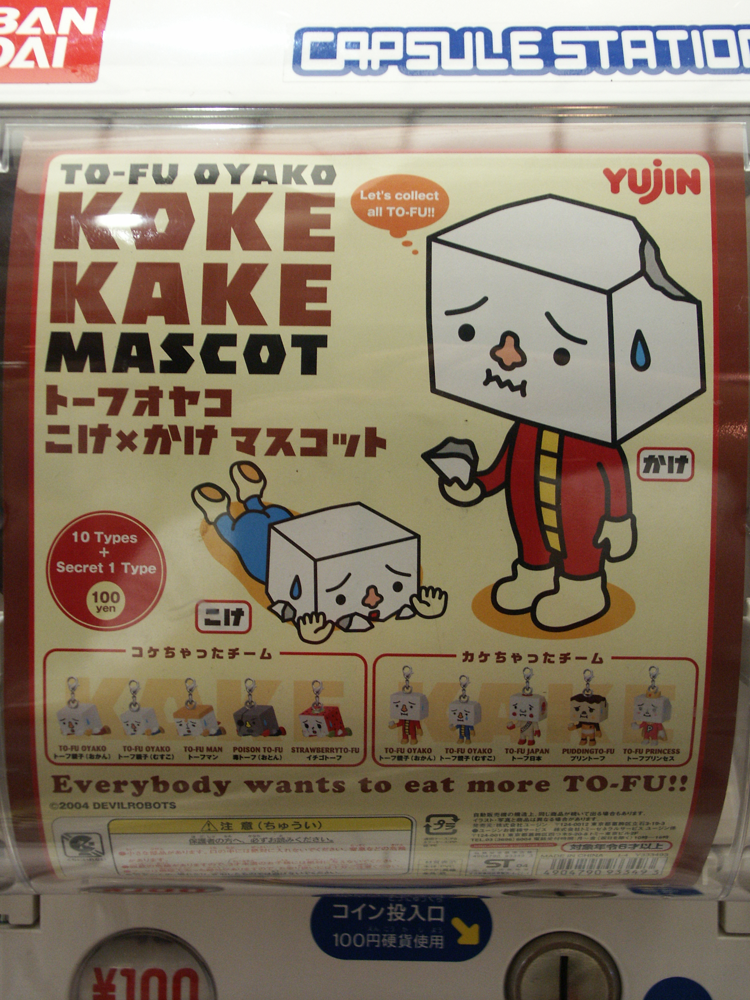

Guten Morgen, Freunde, aus dem abendlichen Tokio.

Nach 3 Tagen voller Schreine, Schreine, Tempel, Schreine, Tempel, Pagoden, Tempel,
Schreine, Pagoden, Schweine, Schreine und wieder Tempel bin ich zurück in
Tokio.

Und obwohl ich nur kurz in diesem Land verweilen konnte, so weiß ich doch
zumindest eins: Warum Japaner in Europa alles fotografieren! Wenn sie eine Fußgängerampel
fotografieren, dann weil sie sich denken: &quot;Wow, die Ampeln in Deutschland
sprechen einen nicht an, wenn sie grün werden und wünschen einem einen Guten
Tag&quot; (grob aus dem japanischen von mir übersetzt).

Wenn sie den Bürgersteig fotografieren, dann weil wir in Deutschland keine
Blindenwegweisersteine einzementiert haben, die quer durch alle Wege führen.
Sogar als Sehender könnte man so Zeitung lesen und instinktiv vor Straßenübergangen
stehenbleiben.

Wenn sie Bahnsteige fotografieren, dann damit sie daheim zeigen können wie unpünktlich
die Züge sind und wie ungeordnet die Leute dafür auch noch anstehen.
Aus den gleichen Gründen fotografieren wir Europäer natürlich das alles in
Japan, darüber hinaus den Fujiyama (entspricht der Zugspitze in Deutschland)
sowie die Schreine und Tempel in Kyoto (was dem Hofbräuhaus in München
gleichkommt). Wenn ich daheim bin, werde ich hoffentlich einen größeren
Webspace für meine Bilder finden, dann werden endlich mal alle über das Netz zugänglich
gemacht.

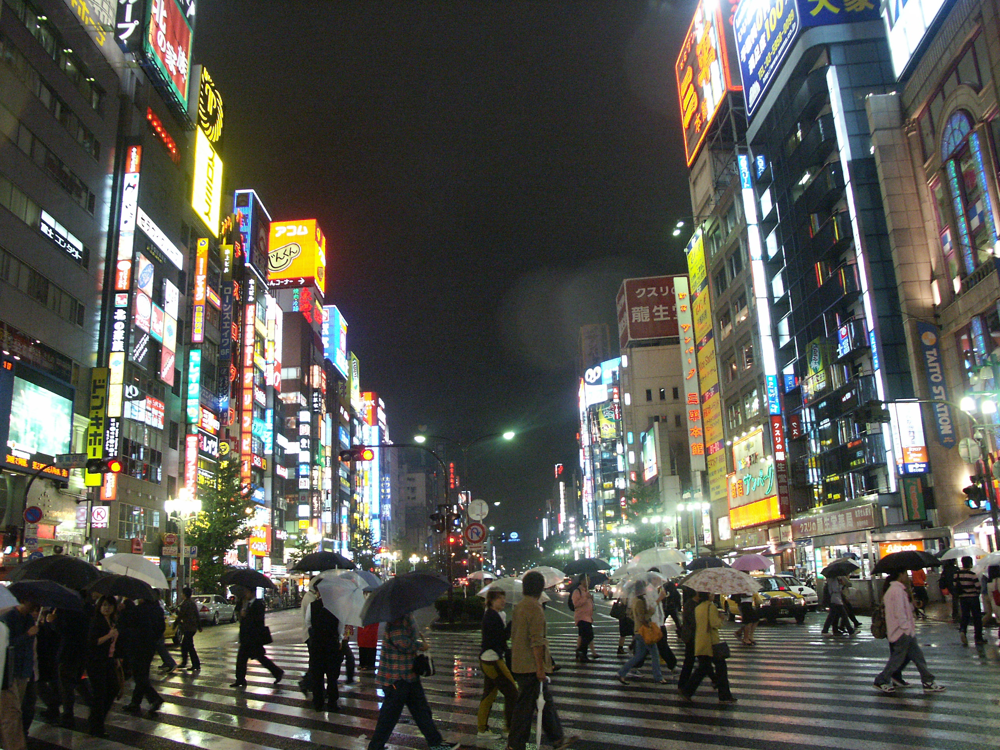

Ich melde mich wieder evtl. aus Heathrow, aber spätestens aus Deutschland zur Nachbetrachtung dieses
Spiels.

Danke an Matthias Nilges, der sich nach langer Zeit gestern meldete, wobei er
es ist, der Japanisch studierte und ich hoffte, er könnte mir Tipps für die
Reise geben. Tolles Timing!

Schmatz an Teyna, die sich für mich aufgespart hat und mich Sonntag wieder in
die Arme schließen kann. (ich hab mich natürlich auch aufgespart, was denkt ihr denn?)

Ok, das war’s, Sayonara, Veeck

PS: Wer aufmerksam liest, hat im zweiten Satz den Tippfehler entdeckt! Wer nicht, der sollte sich
schämen!
