## Prolog, Irgendwo zwischen Bielefeld und Hamm

Es ist meine feste Überzeugung geworden, dass es Schlimmeres in Zügen der Deutschen Bahn gibt als
telefonierende Geschäftsleute oder herumnörgelnde Kinder oder irgendeine Kombination dieser beiden Spezies.
Ein Großraumabteil, endlich gut versorgt mit Wlan, somit ein jeder ruhig und vertieft in seine
elektronische Lektüre, kann einen effektiver martern. Denn wer sein Immunsystem kennt und Grippemeldungen
in den Nachrichten verfolgt wird auch als Nicht-Hypochonder auf dem Rail&amp;Fly-Weg in die lang ersehnten
Ferien paranoid und realisiert erschreckt beim dösenden Dahingleiten durch mitteldeutsche Landschaften
wie häufig sich geräuspert, gehustet, geniest, die Nase in Taschentücher befreit, der Rotz hochgezogen,
generell die menschlichen Sekrete mit verschämter Vehemenz von Punkt A nach B im Körper
befördert werden. Was bleibt einem übrig, außer dass man sich mit einer umfunktionierten Tshirt-Kanone,
gefüllt mit aseptischen Chirurgenmasken auf den Sitz stellen und aufschreien will: "Haltet euren
virenverseuchten Scheiss gefälligst bei euch, ich bin im Urlaub."
In diesem Sinne: Bis bald mit mehr Nachrichten aus Kuba

## 5. - 7. März 2018: Varadero

Keine 3 Tage sind vergangen und schon weiß ich, dass zwei Wochen selbst nur für den Nordteil Kubas nicht
ausreichen werden. Dann wiederum bin ich mir nicht sicher, ob unser Mietwagen selbst diese kurz bemessene
Zeit ohne Probleme überstehen wird. Aber der Reihe nach:

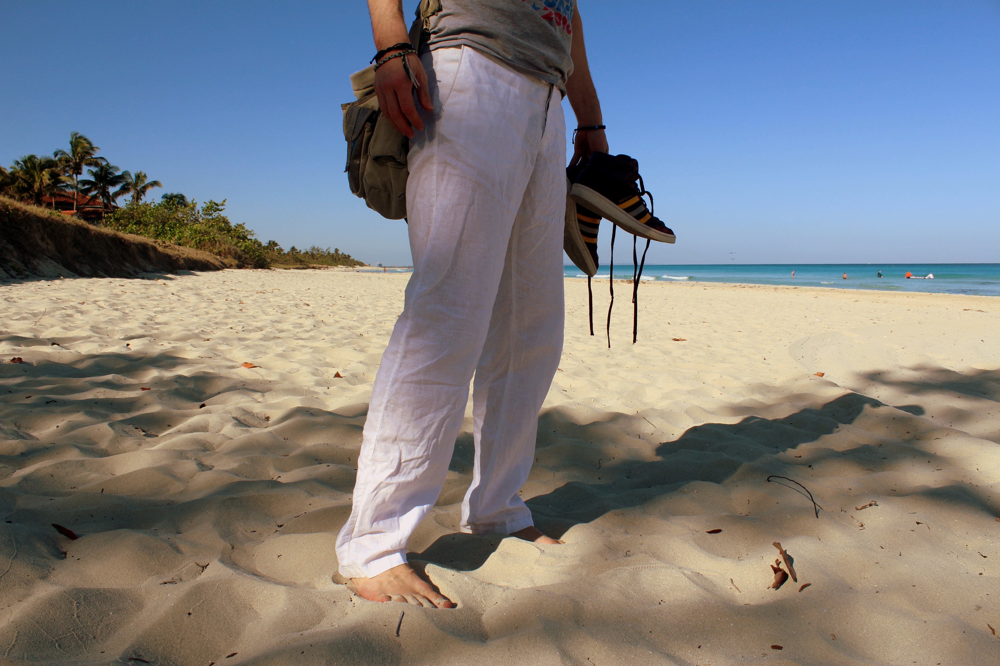

Flug: Eurowings, wenn ihr das lest, seid gefälligst so ehrlich und schreibt bei euren Preisen auch noch
hinzu, dass das Entertainment Programm an Bord des 10-Stunden-Fluges auch nochmal 10 Euro extra kostet. Den
Aufpreis für einen mittelmässigen Snack und aufzugebendes Gepäck hattet ihr mir ja schon angedreht, damit
hab ich kein Problem, stand ja so auf der Webseite im Gegensatz zu dem 10er hier. So fühle ich mich dann
aber doch abgezockt, was auch dran lag, dass a) in den Spielfilmen Vin Diesel über- (und somit die
Qualität unter-) proportional vertreten war und b) die Serien nur die ersten 4 Folgen aufzuweisen hatten.
Ich will wissen, wie Westworld weitergeht, hoffentlich gibt es den Rest auf dem Rückflug zu sehen!

Ankunft: in Varadero, langgezogene Landzungenstadt mit genauso laaaaaangem weißen Strand, in deren Osten
sich die All-Inklusive-Pauschal-Touristen in ihren strandbestuhlten Hotelhochburgen so breit gemacht haben,
dass der Teil der Stadt einen eignene Namen bekommen hat: Varadero Hotel Zone. Die Stadt an sich schafft es
aber sich nicht ganz vereinnahmen zu lassen: es gibt nur ein, zwei Musikbars mit Coverbands
in der Nacht, ein paar wenige Souvenirgeschäfte und Restaurants, direkt dahinter dann aber die zwar vom
Tourismus abhängige, doch ihr eigenes Leben führende Bevölkerung. So verbrachten wir dann die
ersten zwei Nächte in einem Hinterhof Appartement unter einem Dach mit den Vermietern, getrennt durch eine
Wand, die aber nicht ganz bis unter die Decke reichte. Spräche ich richtig Spanisch hätte ich ihren
Problemen und Alltäglichkeiten zuhören können, so konnte ich nur den amerikanischen TV Serien lauschen.
100 Meter waren es bis zum Strand, der dort noch keine Strandbars oder ähnlichen Kitsch hat.
Bis zum ersten Kaffee war es weiter :-)

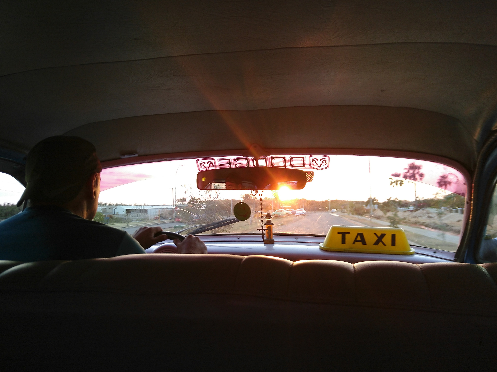

Die Dualität zeigt sich auch auf der Straße: Ja, es gibt Oldtimer aus einer anderen Zeit zuhauf, doch sowohl
strahlend polierte Cabrios Straight-Outta-Hollywood Filmen (für die zahlenden Touristen aus besagten
Burgen) als auch ihre gerade noch so am laufen gehaltenen Urväter, die dennoch als Taxis tagtäglich den
Lebensunterhalt für ihren Fahrer bestreiten müssen, auch wenn der erst Freunde nach dem Weg fragen muss.
Ihr wisst, in welchem wir meistens sassen, aber es war gut und die Bremsen funktionierten :-) Und ich
meinte, Elektroroller gesehen zu haben, ein gute Zeichen angesichts der rußhustender Trucks, die bei uns
Stuttgart und ganz BaWü direkt in die Fahrverbotszone katapultieren könnten.

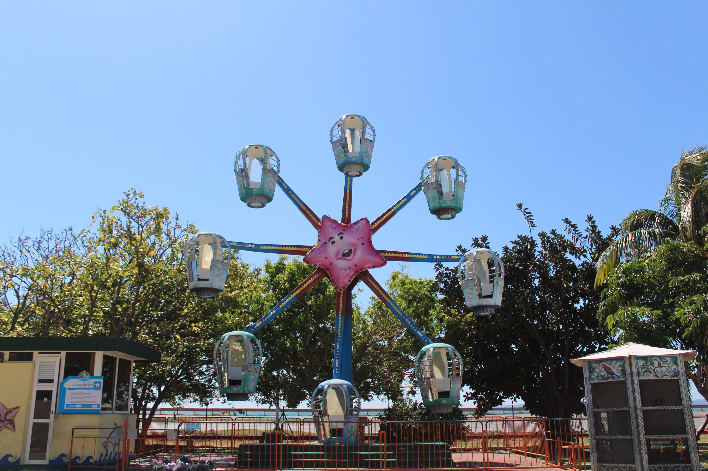

Doch ihr kennt mich, ich muss immer weiter. Also ab gen Süden, Cienfugeos, 200km weit weg, mit dem Mietauto
dann aber doch so 4 Stunden. Kurzzeitig über eine dreispurige Autobahn (mit wenig Markierung, Abfahrten
ohne Schilder so dass wir einfach mal über den Mittelstreifen wenden mussten, aber es war eh kaum wer
unterwegs), die meiste Zeit jedoch über Landstraßen durch Dörfer, Pferdekutschen überholend. Gottseidank
aber flach und gerade, so dass wir nicht wie in Costa Rica Lastwagen hinterherhecheln mussten. Insgesamt nur
drei mal wegen falscher oder fehlender Schilder verfahren, aber ein Smartphone mit Openstreetmap wirkt hier
Wunder, GPS sei dank.

Wieder in einem privaten Zimmer untergekommen schreibe ich diese Zeilen von einer Terasse mit Blick auf eine
kleine palmenumringte Laguna, in der lokale Fischer ihre Böötchen festgemacht haben. Unten telefoniert die
Mutter des Hauses, mit der ich mich nur sprachbrockend und händenutzend verständige, aber das wir Kaffee
brauchen morgens hat sie schnell verstanden. Dazu mümmelt ein Kaninchen im Vorgartenkäfig an seinen
Möörchen und die Hunde der Nachbarschaft tauschen ab und an auch die Neuigkeiten aus. Idyllisch...
So, das wars für erste, mehr wenn ich den Jetlag überwunden habe, immer so früh müde trotz nur 5 Stunden
Unterschied. V

## 8. - 11. März 2018: Cinfuegos und Trinidad

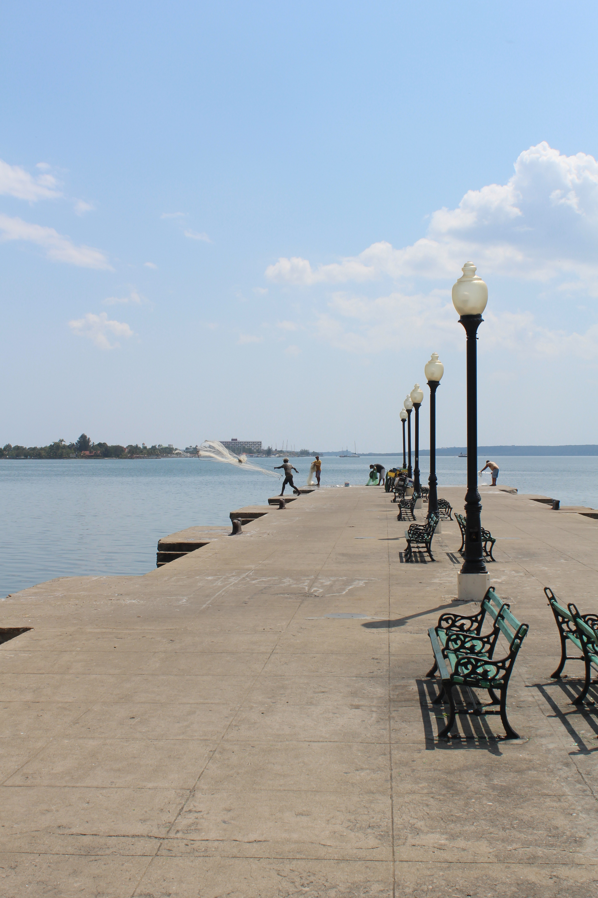

Zeit die Mietwagen Problematik zu beschreiben: Ist nicht gerade günstig gewesen aber bequemer als die
Pferdekutschen der Einheimischen und flexibler die Busse der Touristen. Keine Marke die ich kenne, aber auch
keine abstruse Ostblock Fabrikation a la Lada. Keine Klapperkiste, aber genug Jahre auf dem
Buckel und Schrammen im Lack um vom Sprung in der Frontscheibe nicht überascht zu sein. Aber wird der Motor
warm nach einer Weile fahren oder parken in der Sonne, dann geht er im ersten/zweiten Gang aus, wenn man
anhalten oder um die Kurve fahren will. An sich kein Ding, aber mulmig macht es einen schon, denn wie lange
mag die Batterie das gut finden?

So und nun versucht das mal einem Mechaniker zu erklären, der kein englisch kann während euer Sprachlevel
sich auf Höhe "motor frio bueno" (motor kalt gut) und "caliente pffffffttttt...." (warm geht er aus in der
Kurve im niedrigen Gang wenn ich nicht viel Gas gebe) bewegt. Natürlich bewies der Wagen auf dem
Reperaturhof den Vorführeffekt und schnurrte wie ein Kätzchen. Egal, der Mechaniker
fummelt ein Viertelstündchen unter der Motorhaube und kommt nickend daumenhochhaltend spanisch redend
zurück. Was genau er gemacht hat, wissen wir bis heute nicht, gebracht hat es wie wir später feststellen
auch nix.

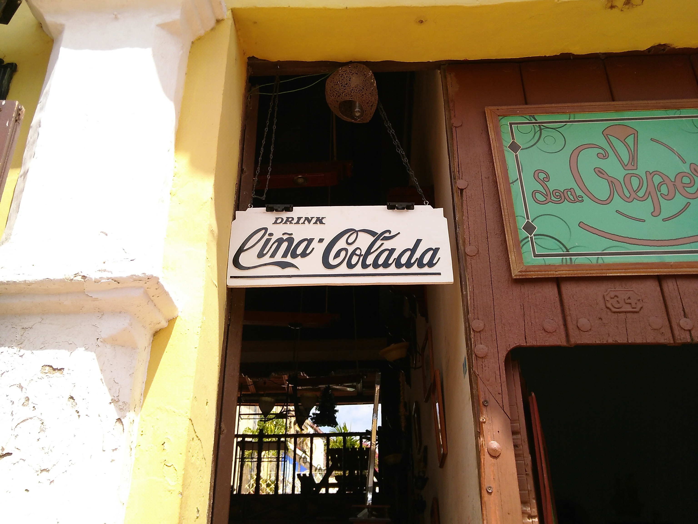

Egal, der Wagen brachte uns schon bis Cienfuegos, er bringt uns auch noch weiter. Zum Beispiel nach Trinidad,
Tagesauflug, Kolonialzeitstadt, Innendrin aufgehübscht für die Touristenladungen, die ein paar Stunden
drin verbringen, Häuser ankucken, Essen aufnehmen, Fotos schiessen und wohl gerne (nicht-sexuelle) Massagen
in Anspruch nehmen, wenn ich die vielen Salons sehe. Wir flüchten aber vor der Mittagshitze in Museen. Neben
solche um Architektur gibt es auch einige die sich um die Revolution drehen, nicht nur mit Bildern sondern
auch Waffen, Plänen, abgeschossenen oder erbeuteteten Teilen oder ganzes Gerät aus der Luft, Erde oder vom
Wasser. Passt zu den zahlreichen Revolutionsdenkmälern am Strassenrand.

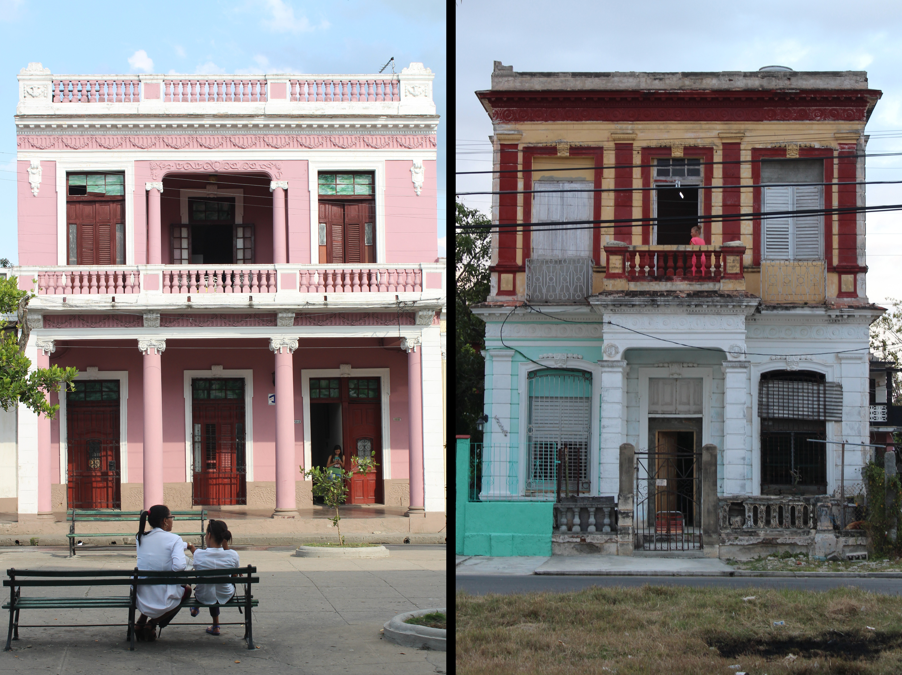

Natur muss auch mal sein, natürlich, also mal beim Stadtbummel durch Cienfuegos einen Ausflug zu "El Nicho"
gebucht, Wasserfälle und Pools zum drin plantschen in den Bergen umgeben von Urwäldern. Auch hier wie zuvor:
Vor den Touristenmengen da sein oder von Rrrrrramon, unserem Guide, die abgelegenen Ecken gezeigt zu
bekommen um nicht mit Dutzenden Italienern das Wasser zu teilen. Er war eh ein guter, viele Sachen wie Bäume
und Vögel gezeigt wie man es erwartet, aber auch mal in einem Dorf angehalten, die Rationenausgabestelle der
Regierung vorgestellt bekommen, wo die Nachbarn festgelegte Lebensmittel und anderes bekommen: wie ich mir
naiv den Sozialismus vorgestellt habe.

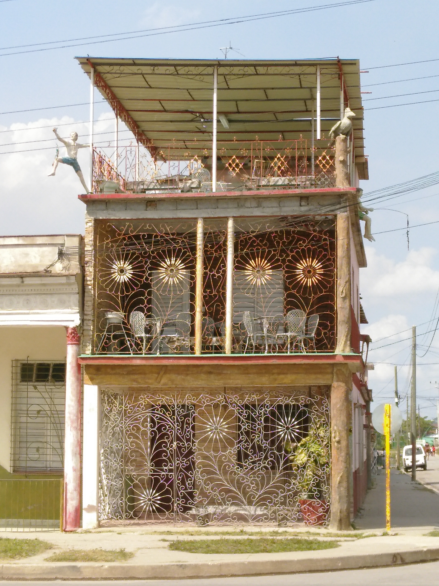

Aber Rrrramon erzählte auch aus dem eigenen Leben, wieviel seine Frau als studierte Lehrerin im Monat
verdient (25 EUR) und wie sie daneben noch Nachhilfe gibt, damit es reicht. Wie Mediziner ins Ausland
geschickt werden um Teile des Gehalts heim an den Staat zu überweisen. Wie Honecker damals die
riesige Zementfabrik am Horizont als Völkerverbindungszeichen hergeschickt hat. Wie man nach x jahren
Arbeit für den Staat eine Appartement-Wohnung bekommt etc. Freundlich, und hilfsbereit, so war nicht nur
Ramon, auch die anderen Kubaner, die wir trafen und mit uns händeringend sprachen. Aber über Politik oder
gar kritische Wörter über ihre Lebenssituation, die hörten wir nicht, genau wie die Revolution siegerüblich
in den Museen entsprechend geschrieben wurde. Wenn dann muss man wohl zwischen den Zeilen lesen, wobei ich
kein guter Zuhörer bin. Aber machen wir uns nichts vor: Es ist keine Demokratie trotz
Kommunalwahlaushängen.

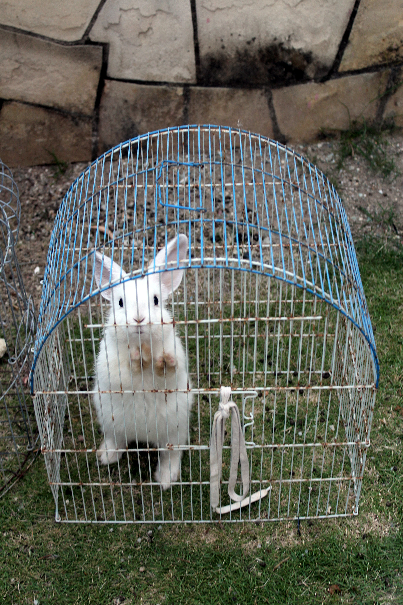

Von Musik und Party lassen sich die Kubaner aber nicht abhalten und abends folgten wir Rrramons Club-Tip ins
"Costa Sur". Von außen eher wie ein Gemeindezentrum erscheindend, war es das wohl auch, denn im Innenhof sah
es genauso aus, wo Bühne und Bar aufgebaut waren und uns beschallten und beschwingten. Ersteres mit
Coverbandsongs aus Aus- und Inland unterbrochen von einem kleinen aber feinen Karaokeintermezzo lokaler
Songs. Dazu genehmigten wir uns Cuba Libres, in denen der Rum sich und mich breit wie deine Mutter machte
und die Cola eher nur so als kleine Trübung darin zu erkennen war :-) Derweil die Kubaner an sich gleich
eine ganze Flasche Havanna Club kaufen und mittig auf ihren Tisch stellen. So macht man sich Freunde und
folgerichtig konnte auch ich mich dem Tanzen nicht ganz verschliessen. Neidisch bin ich aber bis heute auf
die Hüftschwünge der alten Männer dort. Wenn ich je eine künstliche bekomme, lass ich mir nen Schrittmacher
dazu einbauen!

Morgen ziehen wir dann weiter gen Schweinebucht, ein Name, den einige von euch vielleicht schon gehört haben. Ob er
hält was er verspricht erfahrt ihr demnächst.

Bis dahin, Veeck

## 11. - 14. März 2018: Intermezzo in der Schweinebucht

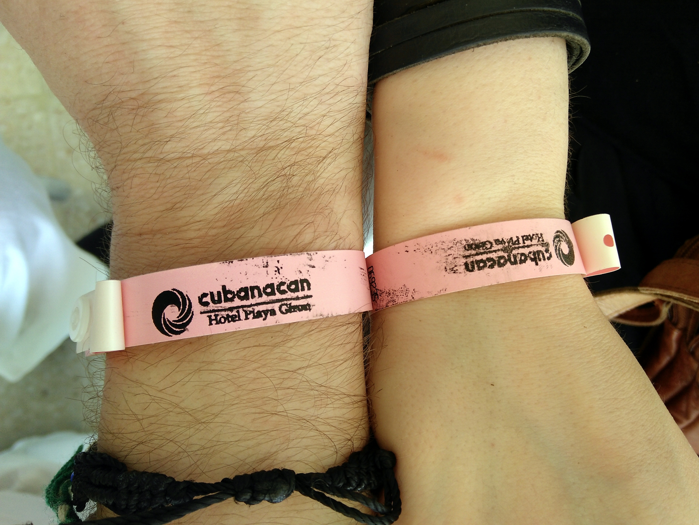

Zwölf Tage, liebe Leser, haben wir für unsere Rundreise leider nur einplanen können und schon müssen wir den
Wagen gen Nordwesten wieder lenken. Die ganze südostliche Hälfte dieser schönen Insel bleibt uns somit
diesmal inklusive ihrer noch schlechteren Straßen verwehrt. Doch apropos 'inklusive': Als wir in Playa Giron
ankamen, war die einzige Option mit Strandnähe eine laut LonelyPlanet einfache und laut meinem Augenschein
eher in die Jahre gekommene ehemals sozialistische Hotelanlage mit vielen kleinen Bungalows drumherum. Naja,
mal ankucken und an der Rezeption nach Preisen fragen schadet nichts. Ach, doch soviel, weil das hier nur
All-Inklusive möglich ist? Buffet und Alkoholika und Cocktails? Naja, eigentlich ist das ja nicht sooo
unser Ding, wie man auch anhand meiner Ausführungen zu den Touri-Bunkern in Varadero erahnen konnte. Doch
erst war da eine kleine Stimme in meinem Kopf, die die Idee doch mal ganz süss fände, dann eine Stimme auf
meiner linken Schulter, die ähnlich positives über den nicht hoch-glanz-polierten Charme der Anlage
flüsterte und schließlich drang von rechts ein "Komm ich lad dich ein" aus Stefs Mund in mein Ohr. Wieso
nicht mal echtes ausspannen und geniessen, ist ja auch keine ausländische Kette, die das Geld außer Landes
schafft, viele weitere gute Gründe folgten aus Stefs Mund. Und so trugen wir zum ersten Mal ein Bändchen um den
Arm.

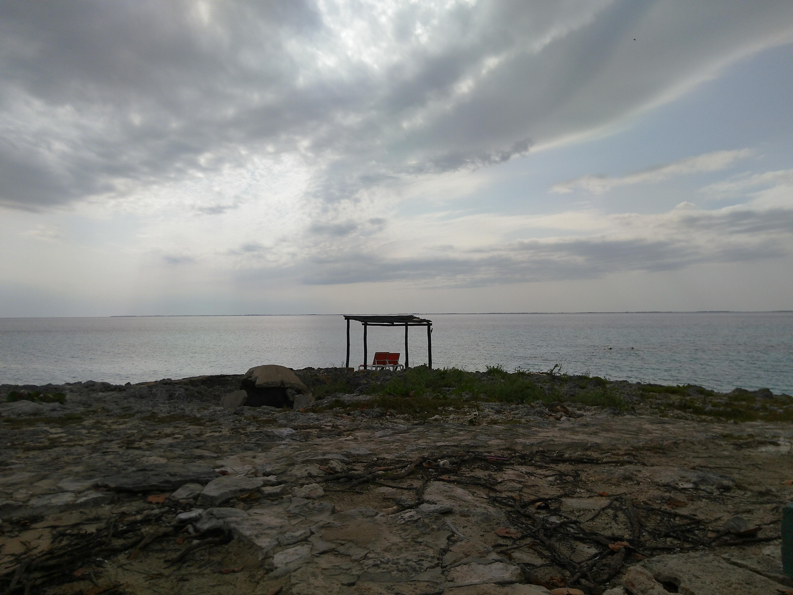

So, nun mal Rucksack abladen im Bungalow, Bett gross und bequem, auch eine Klimaanlage, die aber mit ihrem
Brummton sich eher dafür eignete dann zu kühlen, wenn man nicht schlafen will :-) Bei genauerem Hinsehen
(bzw nur schwer zu übersehen) war das die Anlage schon bessere Zeiten erlebt hat. Die Hälfte der Bungalows
nicht instandgesetzt, einige sogar schon verwildert, was aber dem ganzen diesen gewissen Charme gab. Ebenso
wie die stark durchspülte Kaimauer, die unachtsame Spaziergänger wie uns mit der Gericht der sich brechenden
Wellen überraschte. Die Kamera hat es überlebt. Was ihr jedoch buchstäblich den Saft abdrehte und uns zwang
hautptsächlich noch mit dem Smartphone Fotos zu schiessen mündet in folgendem Tip der Rubrik "Was die
Großmutter schon wusste": **Wenn ihr euch vorm Urlaub eine neue Kamera kauft, dann nehmt in diesen
auch das neue Akku-Ladegerät mit und nicht das alte.**

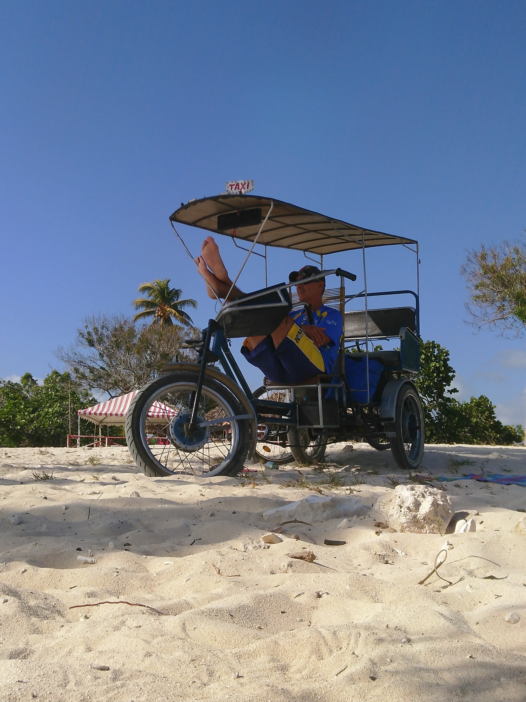

Ein paar (wirklich kleine) Mojitos und Pina Coladas später wars auch Zeit fürs Abendbuffet, klein aber fein,
und vor allem: Bohnen mit Reis! Aber nicht nur diese oder der Alkohol, sondern auch der Sternenhimmel
abseits aller Großstädte, der Tropenregen mit Wetterleuchten überm Horizont sowie der Strand ließen dann
mich am nächsten Morgen zu Stef sagen: "Komm, heute ich lad dich ein". Und so blieben wir noch einen Tag
und eine Nacht, freundeten uns an ersterem mit einem Hund, den wir Walter nannten an, und sahen in letzterer
zwei wilde Pferde durch die Anlage streifen während Walter brav auf unserer Terrasse Wache hielt.

Der nächste Ort auf unserem Plan, Playa Largo, war dann mit zwar nur einen Katzensprung entfernt, dazwischen
standen jedoch traurige Walter-Abschieds-Hundeaugen und eine Menge Krabben, die die Küstenstraße überqueren
und denen wir ausweichen mussten. Dazwischen gelegen war ein zwar steiniger aber schattiger Strand, der zu
meiner Überraschung auch All-Inklusive anbot: Also n leckeres Mittagessen und Cola für den Fahrer, Bierchen
für den Nicht-Fahrer. Falls ihr euch fragt ob ich der Geniesser war: Stef hatte ja mittlerweile schon fast
ein Jahr den Führerschein und freute sich über jeden Kilometer, den sie schrubben konnte, aber genau an dem
Tag war ihr Geburtstag. Während ich mich am nüchternen Schnorcheln erfreute, konnte Stef die Busgruppen
beobachten, die ebenfalls dort gerne Rast machten. Nicht zu viele, aber auch nicht total ruhig. Wie der
Cocktail in ihrer Hand war es eine gute Mischung zu nennen.

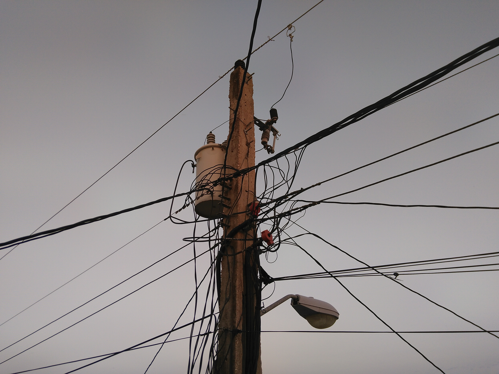

Angekommen in Playa Largo war die Unterkunft-Suche wieder gewohnt einfach: Es schien als ob jeder
Einwohner des Städtchens das Bed-And-Breakfast-Schild draußen hängen hatte. Und Enriques Hostel, wo wir
unterkamen, war dazu noch modern ausgestattet. Man konnte sich sogar ein Abendessen zubereiten lassen,
was jeden unserer Mägen sprengte und dabei den Blick aufs Meer aus zweiter Reihe auf der Terasse geniessen
ohne dass weit und breit ein Hochhauskomplex zu sehen wäre. Klar wurde auch gebaut, aber nur von
Einheimischen wie mir schien und die einzige Hotelanlage außerhalb bestand auch nur aus Flachbungalows.
Ich hoffe das hält dort an, denn der Strand war ebenso ruhig und idyllisch wie die Straßen am Abend. Keine
Partymeile, nur ein kleiner Dorfplatz, wo aber niemand namens Lutzi abging.

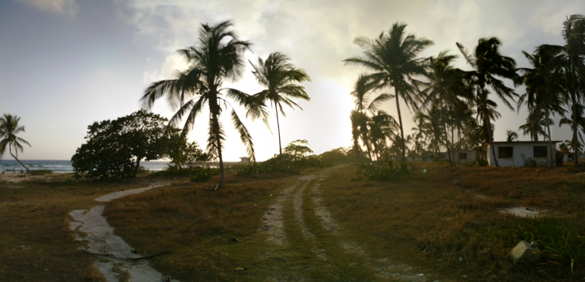

Schöne Tage waren es in der Schweinebucht, doch unsere letzte Station rief uns nun: Havanna, mystische
Hauptstadt im Norden, besungen und gelobt von vielen Stimmen. Wie empfängt sie uns? Lässt sie uns wieder
los? Das alles bald im letzten Teil unserer Reise. Bis dann, V

## 15. - 17. März 2018: Hallo Havanna

Es wird ja schon langweilig wie man hier in Kuba reist: Man gewöhnt sich an die Eigenheiten wie rumpelige
(dafür auch leere) Autobahnen und das man keine Probleme beim Unterkunft finden hat: Kannste nicht beim
LonelyPlanet-Empfohlenen-Hostel unterkommen, rufen Sie für dich beim Nachbarn einen Block weiter an und
schenken dir nen Kaffee ein während du auf ihn wartest das er dich abholt. Dann hat man zwar nicht das
Art-Deco-Zimmerchen des Originals sondern ein Zimmer mit Blick ins Treppenhaus, aber dafür ebenso direkt
neben dem Altstadtviertel "La Habana Vieja" gelegen, welches dekoriert als Unesco Kulturerbe herausgeputzt
und strahlend die Touristen empfängt.

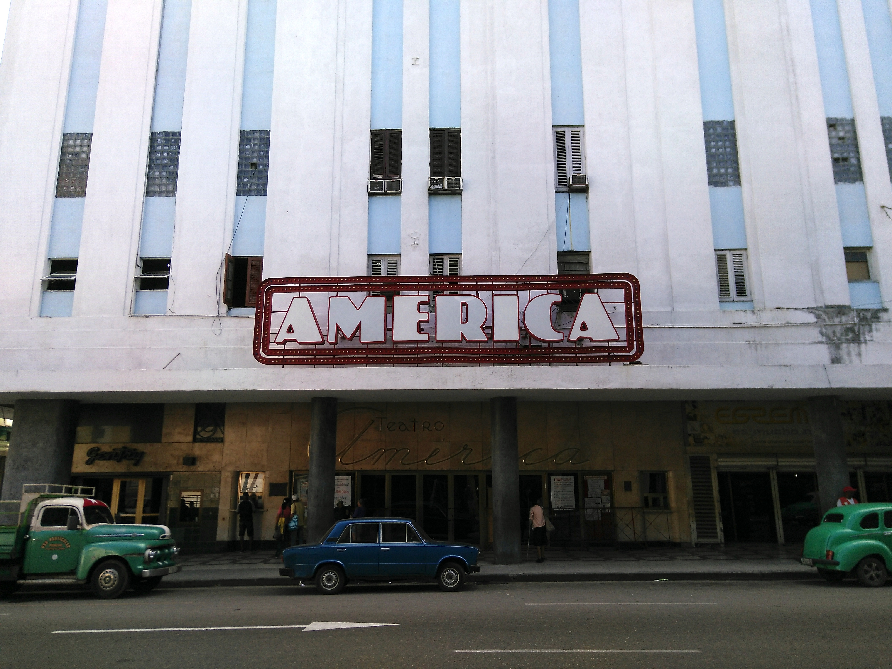

"Centro Habana" hingegen... Tja, in jedem anderen südamerikanischen Land würde ich nun schreiben: Da solltet
ihr euch besser nicht aufhalten, erst recht nicht wenn die Sonne untergeht. Jedoch, in Kuba ticken die Uhren
anders. Ja, wahrscheinlich gibt es mehr verfallene als renovierte Häuser dort. Ja, die Autos die dort fahren
sind nicht polierte Cadillacs, sondern Nutzfahrzeuge, die aus dem letzten Loch pfeifen. Und es sind keine
Salsabands, die dir an deinem Restauranttisch Unterhaltung bieten, sondern das Radio am Tisch der Domino
spielenden Männer auf der Straße. Und dennoch: selbst nachts, dunkel, angetrunken, mussten wir uns nie
Sorgen machen, ob wir in die falsche Straße abbiegen. Hätten eh kein Geld mehr gehabt an dem einen Abend.
Ich musste schon den Tischmagier um das opulente Trinkgeld zurückbitten, das ich ihm gab, um unsere Drinks
in der Bar bezahlen zu können. Jaja, der gute Rum, das schlechte Gedächtnis...

Wer einen aber verarschen will: Taxifahrer! Die scheinen auf der ganzen Welt gerne mal nur mein bestes zu
wollen, ob du selber willst oder nicht... Eines Abends waren wir in der "Fabrica de Arte Cubano",
einem ehemaligen Fabrikgebäude, nun zu einem Konzert/Ausstellungs/PlaceToBe umgebaut. Gelegen im sogenannten
Mobsterviertel "Vedado", wo früher Mafiagrößen sich ihre Luxusbleibe hinstellten, heutzutage aber diese
nur noch einen morbiden Charme vergangener Jahre mit verwachsenen Vorgärten und baumverwucherten
Säulenaufgängen verströmen. Und während der Hinweg stilecht mit einem alten VW Käfer vollzogen wurde, war
das einzige stilechte bei der Taxirückfahrt die Abzockmethode, von der ich aber glücklicherweise vorab las:

Ich bezahlte den fair verhandelten Preis am Ende unserer Fahrt, inkl. gutem Trinkgeld, 20 sogenannten
Peso convertible (CUC). Das ist die Währung für Touristen und ungefähr 25 mal mehr wert als die kubanischen
Peso (CUP), mit denen die Einheimischen hauptsächlich bezahlen. An CUP kommt man auch so gut wie nie ran als
Deviseneinführer, von daher war ich arg erstaunt als der Taxifahrer sich kurz darauf umdrehte und sagte:
"Sorry, you gave me the wrong money" und mit treudoofem Blick mir weismachen wollte, dass die 20 CUP in
seiner Hand von mir kamen und er sie nicht eben taschenspielermässig aus seiner Tasche geholt hat um noch
ein zweites Mal von mir abzukassieren. Deshalb wohl auch der faire Fahrpreis, er dachte er könnte
die angeschickterten Touris abzocken. Naja, außer einer lauten Belehrung und einer zugeknallten Tür hat er
nichts mehr bekommen....

Aber lasst uns davon nicht die Stimmung versauen, dieser eine soll nicht repräsentativ sein für Kuba. Am
anderen Ende des Spektrums stehen die vielen freundlichen Kubaner, wie die Jungs am letzten Strandabschnitt
vorm Flughafen. Bevor es heim ins kalte Nasse wieder gehen sollte, hielten wir in einer kleine Bucht an,
freundeten uns hände- und radebrechend mit dem dortigen Security Typen Marco an. Man erzählte sich so wo man
herkommt, sagt Namen und zeigt Tattoos (die seiner Kinder Stefanie und Jesus :-) hört die Probleme und am
Ende verschenkt man die Klamotten und Reiseutensilien die man nicht mehr braucht. Eben weil hinter dem
aufpolierten Cadillac nicht nur der halbverrostete Buick steht, sondern dahinter nochmal der Mann kniet,
der nicht einmal Geld für ein zweites paar Hosen hat...

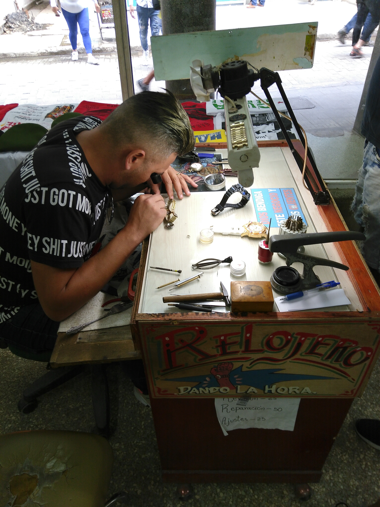

Die Mängelwirtschaft, sie fällt halt auf, sobald du außerhalb der Pfade dich bewegst, deinen Touribus oder
Anlage verlässt: Tank fast leer und keine Tankstelle auf der Hauptstraße hat Benzin gerade vorrätig?
Been there :-) Eeeewig lange Check-In Schlange und Verspätungen weil es nicht genug Gepäckcontainer am
Flughafen gibt? Gottseidank erst nachdem unsere Koffer schon eingeladen waren.

Tja, und das wäre es ja schon fast gewesen mit unserem Urlaub... Wenn, ja wenn nicht das letzte Essen vor
dem Flug nach Hause uns ein kleines Souvenir mitgegeben hätte... So zumindest meine Vermutung für die
Ursache unserer Unpässlichkeiten auf dem 10 Stunden Flug nach Hause. Und für die, die sich schon immer
fragten, ob diese Papiertüten wirklich etwas aushalten und wenn ja, wieviel:

Ja und sehr viel!

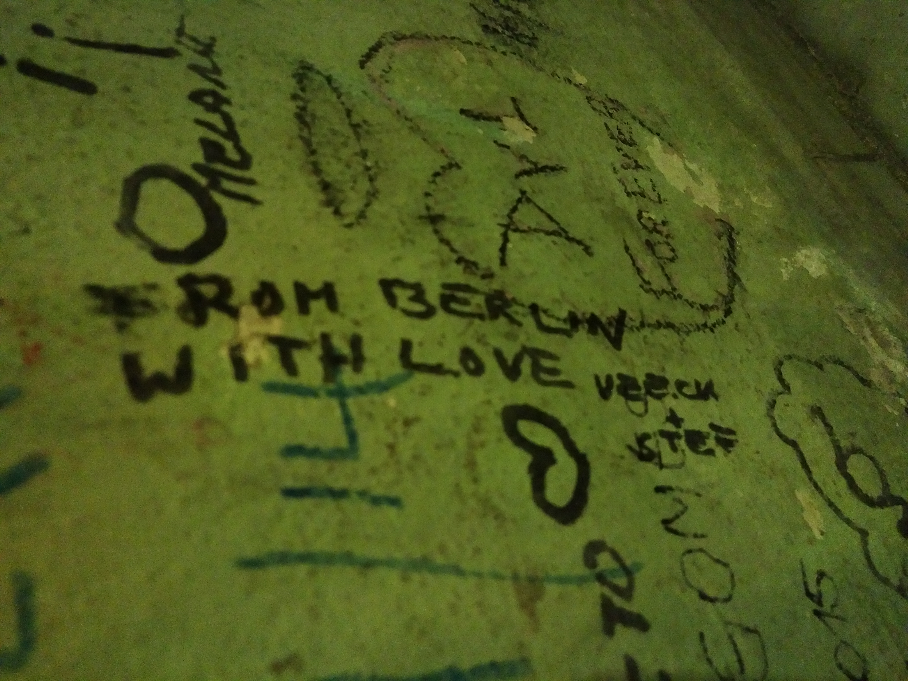

Details erspar ich euch, wir waren jedenfalls froh wieder festen Boden und Tage später wieder festes Essen
spüren zu dürfen. Vorteil: Wir durften mit netten Rot-Kreuz-Sanitätern an unserer Seite an den normalen
Einreisekontrollen vorbei direkt zum Taxistand gehen :-) Ein Bett bei Stefs Familie und lockere 14 Stunden
Schlaf halfen das gröbste aus unseren Organismen herauszuholen. Hach ja, was wäre ein Urlaub mit mir auch
ohne Krankheitsgeschichte?

Aber, lasst euch von diesem kleine Virus oder den anderen Eselsohren in diesem Tagebuch nicht davon
abbringen, auch mal Kuba einen Besuch abzustatten. Es ist eine Reise wert; zumindest solange es noch steht
bzw CocaCola, MacDonalds und Konsorten ihre Klauen noch nicht hineingegraben habe.

In diesem Sinne verabschiede ich mich mit einem lauten: Viva la revolución! Auf ein wildes 2019!
