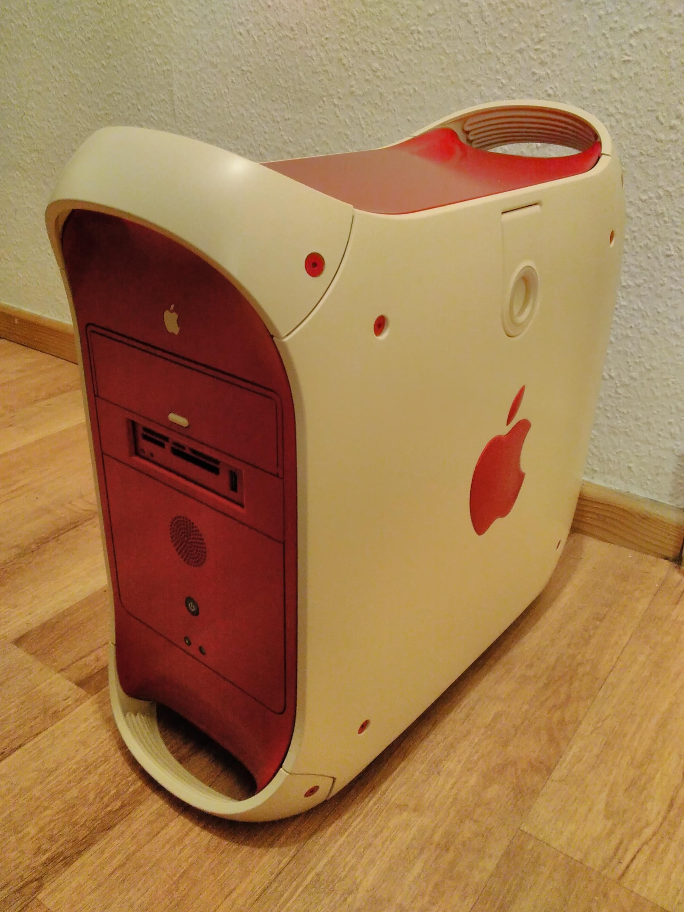
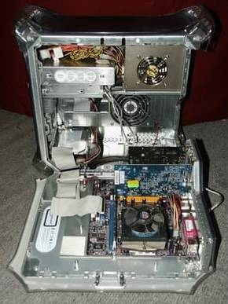
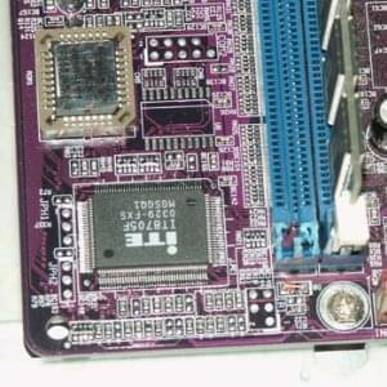
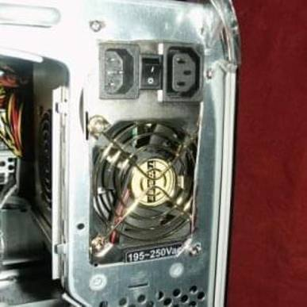
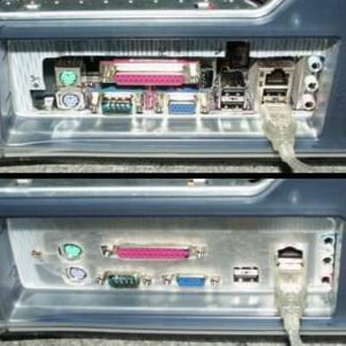
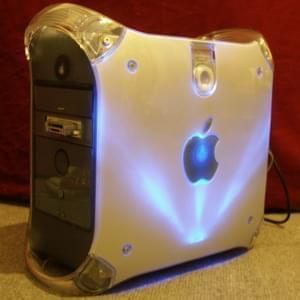
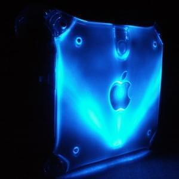
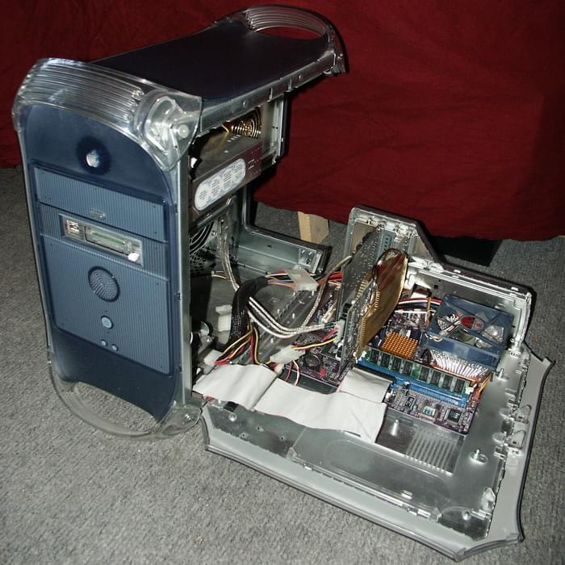

## my g4pc

Tired of the same old boring computer cases everywhere I decided in 2006 to build my own pc case. Inspiration came from
mods around the web like
[this modification on HardOCP](https://web.archive.org/web/20181212102818/https://www.hardocp.com/article/2002/09/13/rotten_apple/)
or [this one](https://web.archive.org/web/20201025081316/http://s155158671.websitehome.co.uk/winmacpcinaapple.html). I
knew that I also wanted an Apple G4 case fitted to accommodate standard x86 PC components. Another good source for
information was
[this modification](https://web.archive.org/web/20210127124842/http://www.slcentral.com/articles/01/8/g4pc/). Some
expensive auctioning at eBay and a lot of drilling later I had such a special PC myself. Groovy, baby!

Later the project was disassembled and I moved on to a "normal" laptop. But in 2014 I came across a second g4 case I
could use for spare parts. So I wanted to do it right this time and also get a nice paint job done. Here are the current
specififacations and look:

## Specs 2k18 Version (updated in 2024)

- CPU: [AMD Ryzen™ 5 3600 Processor](https://www.amd.com/en/product/8456) / was:
  [AMD Ryzen™ 5 2600 Processor](https://www.amd.com/de/products/cpu/amd-ryzen-5-2600)
- Mainboard: [Asus ROG STRIX B550-I GAMING](https://rog.asus.com/motherboards/rog-strix/rog-strix-b550-i-gaming-model/)
  / was: [ASRock Fatal1ty B450 Gaming-ITX/AC](https://www.asrock.com/MB/AMD/Fatal1ty%20B450%20Gaming-ITXac/index.asp)
- Cooler / Fans: [NH-L9a-AM4](https://noctua.at/de/nh-l9a-am4) [NF-S12A PWM](https://noctua.at/de/nf-s12a-pwm)
- RAM:
  [16 GB G.Skill Flare X schwarz DDR4-3200 DIMM CL14-14-14-34 Dual Kit](https://gskill.com/en/product/f4-3200c14d-16gfx)
- Graphics:
  [ZOTAC GeForce GTX 1060 AMP! Edition 6GB](https://www.zotac.com/de/product/graphics_card/zotac-geforce-gtx-1060-amp-edition)
- Harddrive: [Samsung 970 EVO 500GB M.2](https://www.samsung.com/de/memory-storage/970-evo-nvme-m-2-ssd/MZ-V7E500BW/),
  [Samsung 850 EVO 250GB SSD](https://www.samsung.com/de/memory-storage/850-evo-sata-3-2-5-inch-ssd/MZ-75E250BEU/)
- Optical Drive: LG BH16NS40
- PSU: be quiet! Straight Power E9 580W
- Monitor: [Samsung TV+Monitor T27A550](https://www.samsung.com/de/support/model/LT27A550EW/EN/)
- OS: Windows 11 (64bit)

## How it was build

I have seen modifications to G4 cases which just stuck everything into the case without keeping the old layout. Those
are of course not able to open the PC while running, which is the coolest effect of the G4 case.

Only very flat components like these chips wont touch the optical drive cage or otherwise the side-door won’t close due
to the large optical drive taking much space. I was lucky to find this board where only one of the RAM-holders had to
go, leaving me with 'only' 1 GigaByte of RAM.

If I installed my PSU the way Apple intented it with the power connectors beneath the fan outlet, one of them would suck
the air from the wrong side of the case. So I had to do some more cutting to make room for the fan outlet and install
the PSU upside-down.

Another incompatible component was the IO-shield of the G4-case. I once again had to use my old companion, the dremel,
to cut out a good piece of the backplate. Later I used some spare plastic piece to model a new back-plate for my PC. If
I find the time, I will color it to match the rest of the case.

And no case-mod is finished without some lighting inside. So I put three blue leds into the G4 case which shine from
behind the apple logo to show who really makes the most stylish computer cases. Move the cursor over the picture to see
how it shines in the dark.

## Specs 2006 Version

- CPU: AMD AthlonXP 2600+
- Cooler: [Swiftech MCX 462-V](https://www.silentpcreview.com/article130-page1.html)
- RAM: 1 GB MTD PC400
- Mainboard: ECS Elitegroup KM400-M
- Graphics: [Gigabyte GV-N68128DH Geforce 6800](https://www.gigabyte.com/Graphics-Card/GV-N68128DH#ov)
- Harddrive: Seagate 120GB ST3120026A
- Sound: CreativeLabs Soundblaster Audigy 4
- Optical Drive: [LG GSA-4167B DVD-Writer](https://www.lg.com/de/service-produkt/lg-GSA-4167B)
- PSU: TSP 420 P4 Ultra Silent TripleFan
- Monitor: Iiyama ProLite E431S-B 17'' TFT
- Cardreader: Cooltek 7-in-1 with 2 Front-USB-ports
- OS: [Gentoo Linux](https://www.gentoo.org)

