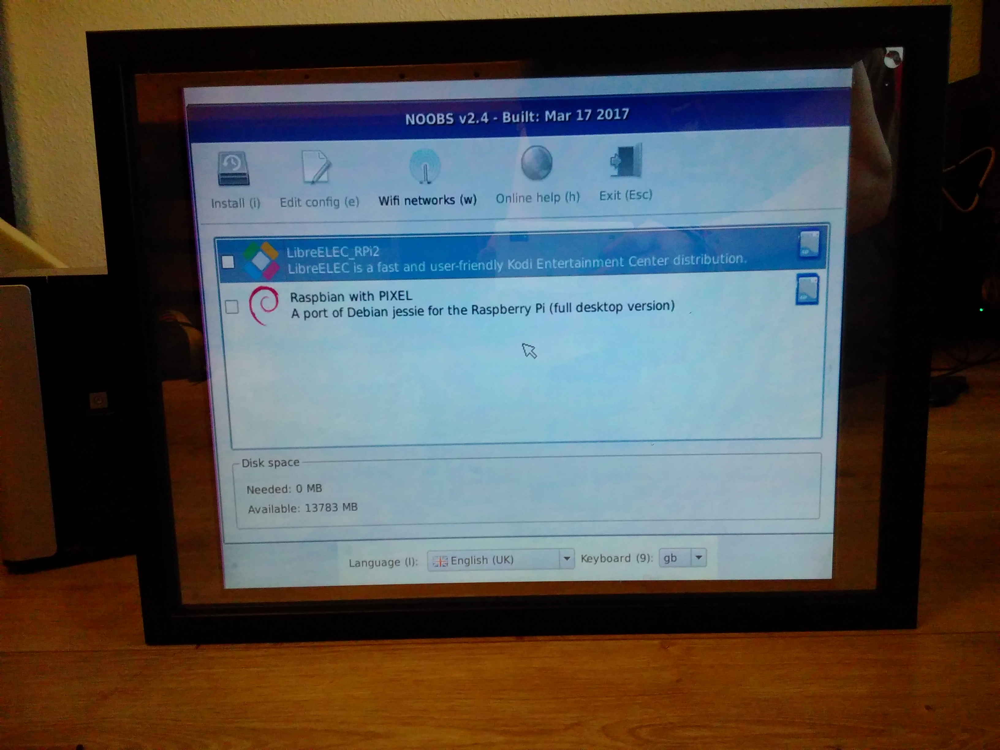
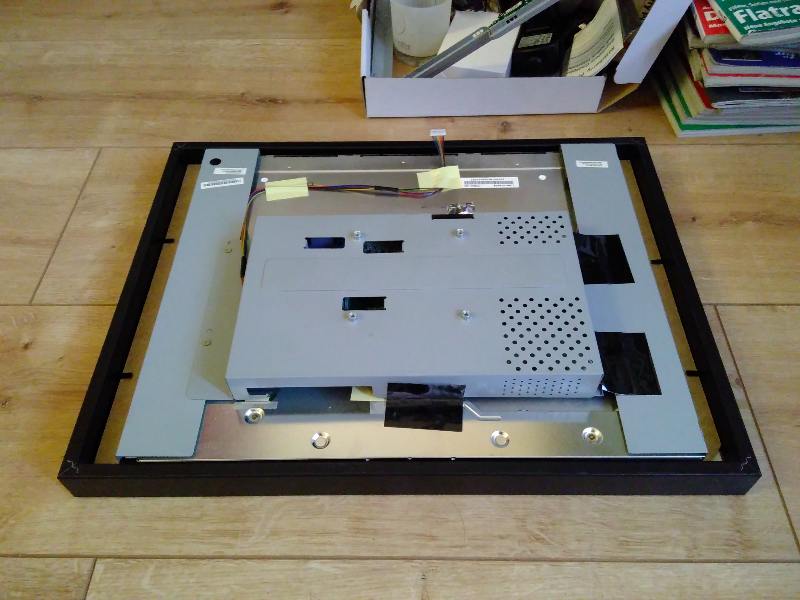
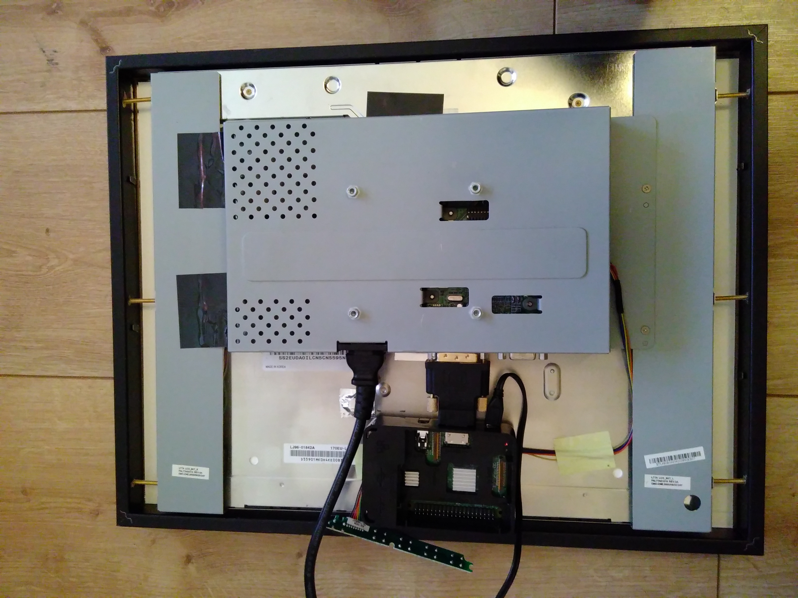
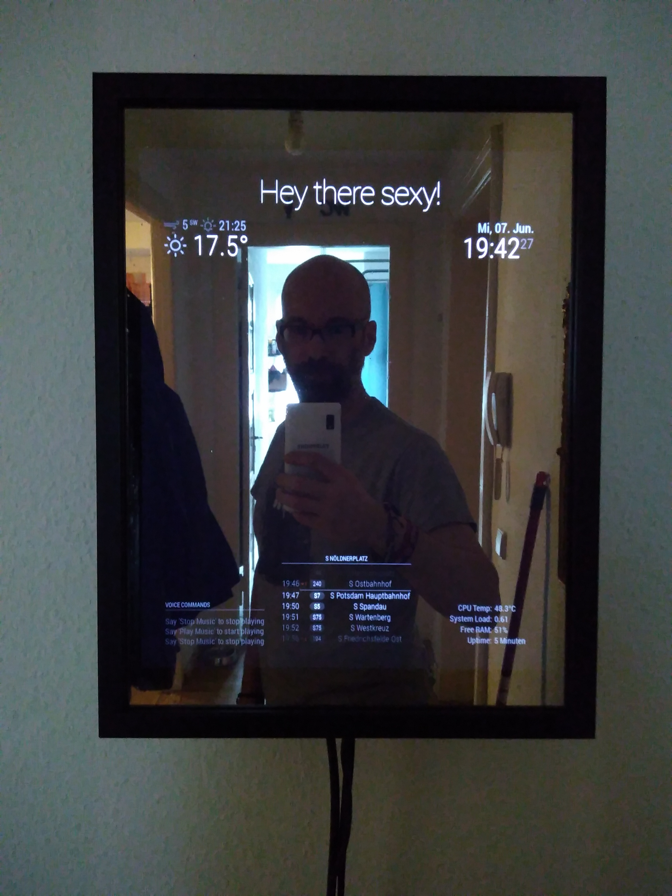

## the problem

### Day 1 - Look what the cat dragged in from the street

Found an old monitor from Acer (Model AL1716) in the streets for free. A backup monitor is always welcome so I took him
home with me.

### Day 2 - Again?

Girlfriend asks me in the morning when she is getting ready to work while I can stay in bed for another hour what time
it is and when the next tram will leave from the nearest station...

### Day 3 - Is this groundhog day?

Girlfriend asks me again in the morning what time it is and when the next tram will leave from the nearest station.
Twice this time because she is in such a hurry...

### Day 99 - Enough is Enough!

Girlfriend asks me like everyday in the morning several time what time it is and when the next tram will leave from the
nearest station...

## the solution

### Day 100 - Help is on the way

I open my regular computer magazine the
[c't](https://www.heise.de/ct/ausgabe/2017-6-Raspberry-beschreibt-Spiegel-3636486.html) and find an article about on how
you can build yourself a magic mirror that is both mirror and display. Powered by a RaspberryPI you can show all kinds
of information on it like the weather, a clock and even other modules since it is open-source. Is there a module for
displaying the local transportation system? Yes, there is and there is still this old monitor somewhere around here so
let's get started.

Neat, I still have a RaspberryPI Model 1 too so lets format the sd card, install the standard OS and follow the
instruction on the [projects homepage](https://magicmirror.builders/).

Another good resource for setting up and installing your raspberry is written by
[Dave Johnson](https://thisdavej.com/beginners-guide-to-installing-node-js-on-a-raspberry-pi/).

Damn, the installation process won't finish, since the minimum version due to performance reasons is a Model 2. The
MagicMirror-software is written in javascript and bundled via the Electron-app. While this makes it easier for me to
hack on it myself, it takes it toll on the processing power of the PI.

But that isn't a crisis but merely an opportunity to buy a brand-new Model 3. So a few days later I have a package in
the mailbox and the installation process works flawlessly. In the meantime I started to assemble...



### Day 101 - A trip to the hardware store

Okay, so first I get rid of all the plastic covers of the display. What do I need now...

- Simple image frame just large enough for the display to fit into
- Some semi-transparent, half-reflecting sheet to put on the frame glass
- A HDMI-DVI converter since the display is so old that it only has VGA or DVI inputs
- A VESA wall mount
- Screws and cables



A quick trip to the local hardware store yields a nearly perfectly fitting frame. The sheet is ordered on the internet.
While I wait for it to arrive, I already start to assemble the display into the frame.



### Day 102 - Do it yourself

The semi-transparent sheet arrives but damn, attaching it to the glas is mighty difficult and doesn't yield the best
results if you are living together with cats :-) Put it on my list of "Things to later improve": Buy something finished
from the shop. Like the paintwork of [my g4pc](personal_g4pc.html) a craftsman can do it a thousand times better in his
shop than me in my home.

### Day 103 - Don't move!

Time to check how expensive this thing will be if I run it 24h nonstop for a year.... Let's see, the pi takes around 4W,
the monitor 25W, round it up to 30, multiply it with a lot of zeros to get the per year amount. Multiply by 0.28cents
per kwh... 70 EUR??? Nope, too much, the monitor has to be put in standby if noone is near...

Good thing there is a module for that, the [motiondetector](https://github.com/alexyak/motiondetector). The
documentation is non-existing but the biggest problem: What camera should I use? Should I buy one especially for the pi
and which one is working out of the box with this software? Let's google for it... Wait, what... the ps3 move camera is
working with the pi too and can be plugged just into the usb ports? Good thing I have one of these lying around too,
this sounds way to good to be true (and I didn't play those ps3 move games anyway :-)

Aaaaand it works right out of the box! Well, if you are not using an old linux kernel where support for it was
temporarily broken. But with the latest OS and drivers it's not a problem.

As for the motiondetector, since it is open source, not very well documented and I had the urge to add a threshold to
the detection, I forked it and made [my own Motion Detection module](https://github.com/rejas/MMM-MotionDetector) using
this config:

```javascript
config: {
    captureIntervalTime: 1000,
    scoreThreshold: 100,
    timeout: 120000
}
```

```bash
config: {
    captureIntervalTime: 1000,
    scoreThreshold: 100,
    timeout: 120000
}
```

So now the monitor gets suspended if no motion is detected for a minute. That puts the energy consumption down to less
than 1W for the display, leaving a total at 5W. Now the costs of running the mirror are at a reasonable level.

### Day 104 - Hanging around

So this is how it currently looks like:



### Days to come - Listen to me!

With the ps3 doing the motion detection, I now turn my eye to voice recognition. How cool would it be if I could tell my
magicmirror to turn on the music? So, lets see if the ps3 microphone is also working outofthebox. Plug it in and...

Well, it does show up using this command:

```bash
cat /proc/asound/cards
0 [ALSA]: bcm2835 - bcm2835 ALSA
    bcm2835 ALSA
1 [CameraB409241]: USB-Audio - USB Camera-B4.09.24.1
    OmniVision Technologies, Inc. USB Camera-B4.09.24.1 at usb-3f980000.usb-1.3, hi
```

But how do I find out if it actually records?
[NielsMayer](https://www.raspberrypi.org/forums/viewtopic.php?f=38&t=15851#p180474) has some good tips on how to get
your mic configured and also wrote this command:

```bash
arecord -vv /dev/null -r 16000 -f S16_LE -c 4 -D iec958:CARD=CameraB409241,DEV=0 /dev/null &lt; /dev/null
Aufnahme: WAVE '/dev/null' : Signed 16 bit Little Endian, Rate: 16000 Hz, 4 Kanäle
Hardware PCM card 1 'USB Camera-B4.09.24.1' device 0 subdevice 0
Its setup is:
stream       : CAPTURE
access       : RW_INTERLEAVED
format       : S16_LE
subformat    : STD
channels     : 4
rate         : 16000
exact rate   : 16000 (16000/1)
msbits       : 16
buffer_size  : 8000
period_size  : 2000
period_time  : 125000
tstamp_mode  : NONE
period_step  : 1
avail_min    : 2000
period_event : 0
start_threshold  : 1
stop_threshold   : 8000
silence_threshold: 0
silence_size : 0
boundary     : 2097152000
appl_ptr     : 0
hw_ptr       : 0
#+                                                 | 01%
```

See that 01% at the end? Yeah, background noise that gets detected! Awesome! With this out of the way the next step is
to install some modules for the mirror to read and process the voice commands... To be continued...

### Year 2 - Intermediate

Unrelated to the mirror one thing always bothered me in my current flat: the wifi reception is only good in one half of
it. With the mirror hanging right in the middle of the whole place, why not use it as a repeater so that I can finally
work on the balcony?

Luckily I found [this forum thread](https://www.raspberrypi.org/forums/viewtopic.php?t=215581) that covers the latest
stretch release of raspbian and got me second wifi in no time.
