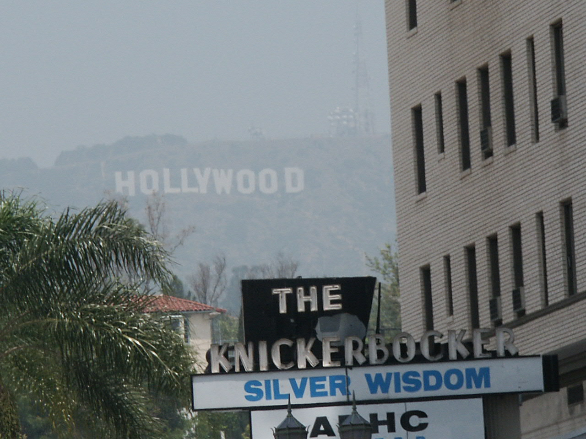
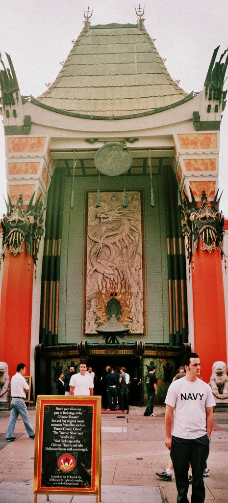

## 20. - 23. Mai 2003: Los Angeles

Willkommen bei der Zusammenfassung der ersten 4 Tage meiner kleinen Weltreise.

Zuerst musste ich meinen allerersten Alleinflug hinter mich bringen, was dank des guten Bordkinoprogramms (da in dieser
Boeing jeder seinen eigenen kleinen Monitor hatte) kein Problem war. Und wer immer noch nicht den Film “Daredevil”
gesehen hat, sollte dies auch unter keinen Umständen ändern. Diejenigen von euch, die Teynas Emails bekommen und von
ihren kleinen Pannen in Mexiko gehört haben, werden ebenso wie ich überrascht sein, dass ich es ohne irgendwelche
Komplikationen bis in [unser Hostel](http://www.usahostels.com/hollywood/index.html?lang=10) schaffte, wo ich meine
kleine Freundin und ihren großen rothaarigen Beschützer wieder in die Arme schließen konnte (jedenfalls erstgenannte).
Letztgenannter war jedenfalls heilfroh, dass ich da war, um ihn beim Tragen von Teynas Sachen und Macken zu entlasten.
Seiner Aussage nach war Teyna “etwas”aufgeregter beim Starten und Landen als man von so einer alten Flugfüchsin hätte
erwarten sollen.

Was wir die Tage in LA taten? Zuerst einmal sind wir in den
[Themepark der Universal-Studios](https://www.universalstudioshollywood.com/). Dabei darf man bei einem Eintrittspreis
von 40 Dollar aber nicht davon ausgehen, so was wie den Europapark vorgesetzt zu bekommen. Nein, der hier ist kleiner
(und teurer). Weniger Achterbahnen, dafür mehr Mechandising und Shops!

Cool waren dennoch die 3D Kinos mit dem Terminator und Shrek. Vor allem letzterer, welcher noch nicht offiziell
eröffnet, aber dennoch schon vorgeführt wurde. Dann noch eine Jurassic Park Wasserbahn, welche noch die einzige
Achterbahn und nur auf dem letzten Stück sehr steil und sehr schnell war, sowie der ZurückInDieZukunft-Show, wo man in
einem Auto hockte und auf eine riesige Leinwand schaute, während das Auto minutenlang hin und hergeschleudert wurde.
Gut, Teyna konnte davon nicht genug bekommen und hat auch nach der Fahrt immer noch hin und her geschaukelt. Dabei hatte
sie doch die ganze Zeit während der Show die Augen zugehabt. Diese Frau ist schlicht phantastisch! Dann waren wir an
einem Abend im [Manns Chinese Theater](http://www.manntheaters.com/) und haben uns die “Matrix Reloaded” angeschaut.
Noch mehr Brüller als der Film ist das Kino. Wenn einer von euch mal in LA ist und dort ein guter Film läuft, geht da
rein: Ein riesiger Kinosaal, geile Plätze, stilvolle Inneneinrichtung und ein fetter Sound machen sogar enttäuschende
Filme wie die Matrix2 zu einem tollen Erlebnis. In jenem war für unsere Geschmäcker etwas zu viel Action um der Action
willen, da hätte man etwas kürzen können.

Was ich nicht wußte, ist: Dass auf dem Walk-Of-Fame auch eine Menge Namen stehen, von denen man noch nie etwas gehört
hat, Dass das Hollywood Sign nachts nicht beleuchtet ist und man es vom Flieger auch nicht sehen kann, Dass LA groß aber
nicht hoch ist und mehr Parkplätze als Häuser hat, und Dass “Kostenlose Pfannkuchen” in der HostelWerbung bedeutet, dass
man den Teig und den Ofen gestellt bekommt, aber die Pfannkuchen selber machen muss.

Der nun folgende Flug nach Auckland, Neuseeland ging über meinen Geburtstag und die Datumsgrenze hinweg. Wir flogen
am 23. um 21:35 Uhr ab und somit über die Datumsgrenze nach hinten und landeten am 25. morgens. Der 24. wurde also nur
von uns kurz gestreift. Damals dachte ich noch, dass ich deshalb bei den Stewardessen eine First-Class-Bedienung
abstauben könne.

Mehr wenn wir uns wiederhören, ihr müsst unbedingt lesen wie es weitergeht!

Grüße, Big M
