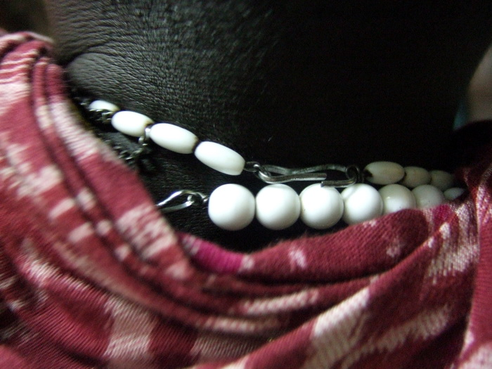

## Prolog

Was drei Wochen in der winzigen [ELU-Schule](https://maps.app.goo.gl/6RGXMPoxwYDE3t4J8) in der kleinen Stadt Morogoro in
dem unbekannten Land Tansania auf dem riesigen Kontinent Afrika verändern würden, konnte ich nicht ahnen und habe ich
bis heute noch nicht verstanden. Aber seht selbst in unserem Video oder lest meinen Bericht darunter:

<iframe
	src="https://player.vimeo.com/video/22691607"
	width="640"
	height="492"
	frameborder="0"
	class="article__video"
	webkitallowfullscreen
	mozallowfullscreen
	allowfullscreen
></iframe>

## Einleitung


Wenn man Grimms und anderen Märchen glauben darf, so stehen am Anfang jeder guten Geschichte mit Happy End zwei
gegensätzliche Dinge, die am Ende trotz aller Widrigkeiten in Form von Schwiegermüttern, mutierten Tieren oder einfach
entgegen jeglichem guten Geschmack zusammen finden. Auch diese Geschichte, die ich euch erzählen will, hat zwei
verschiedene Komponenten, die nicht jedermann Geschmack sind, aber schon damals auf Wibkes Party, wo das folgende
Geschehen seinen Ursprung fand, konnte ich ungeduldiger Mensch es nicht erwarten, diese zwei erst am Ende der Party
zusammenzubringen. Ihre Namen waren Wodka und Tonic, und als sich diese beiden Stoffe vereint in meinem Glas
wiederfanden begann zufällig auch die Party an Fahrt aufzunehmen und die folgende Geschichte ins Schlepptau zu nehmen.


Jene nicht nur wegen meines Alkoholkonsums an diesem Abend denkwürdige Party wurde, wie schon am Rande erwähnt, von
Wibke veranstaltet, ebenso wie ich Mitglied im [Hospitality-Club](http://www.hospitalityclub.org/), kurz HC. Der HC ist
eins dieser Netzwerke in den Weiten des Internets, in dem sich Leute finden und treffen können, die das gleiche Ziel
haben, in diesem Fall reisen und neue Leute kennen lernen. Deshalb lud Wibke auf ihre Party nicht nur Freunde und
Verwandte ein, sondern auch alle HC-Mitglieder, egal ob sie aus Freiburg stammten oder gerade zufällig in der Stadt
waren. Der HC verbietet sich nebenbei, als Dating-Webseite angesehen zu werden, was aber von den darüber entstandenen
Beziehungen oft und somit eindrucksvoll widerlegt wird und intern deshalb als der beste HC-Witz überhaupt angesehen
wird.


Nun traf ich also, mittlerweile mit meinem zweiten Wodka-Tonic in der Hand, auf [Julianna](/photos/people?name=julianna)
mit der ich ins Gespräch kam, zuerst über das übliche, was man denn gerade so tut, dann über das zweitübliche, wo man
denn schon überall in der Welt war, dann das drittübliche, was man denn so als nächstes vorhat. Und da erzählte sie mir
über ein Workcamp, welches die von ihr mitgegründete Organisation [IDEM](http://www.idem-network.org/) auf die Beine
stellen und im März in Tansania stattfinden würde, wo sie vorhatten ein Schulgebäude zu errichten. Mit nicht mehr als
diesen wenigen Informationen versehen war ich dennoch angefixt von der Idee und da ich schon damals wusste, dass ich zu
diesem Zeitpunkt auf keine Fall etwas besseren mit meiner Zeit anstellen könnte, gab ich ihr meine email-Adresse und war
gespannt, was da auf mich zukommen würde. Folgt mir also auf dem Weg von diesem Happy Start zu dem Happy End jener
Geschichte, welche mir das Schicksal an besagtem Abend zusammen mit den Drinks bescherte, und auch wenn ich euch keine
Heirat am Ende bieten kann, so doch wenigstens ein paar kitschig-sentimentale Worte, die ihr mir verzeihen mögt.

## Das Workcamp


Es begab sich somit am 30. März im Jahre 2007, dass eine Gruppe von Leuten ausging, in Tansania ein Schulgebäude zu
errichten. Die meisten von uns hatten sich schon bei einem Vorbereitungswochenende in der Schweiz, wo IDEM seinen Sitz
hat, zum ersten mal getroffen und beschnuppert, und dort erfuhr ich auch zum ersten Mal etwas mehr über das Projekt. Der
Ort unseres Einsatzes war Morogoro, eine Regionshauptstadt 200 Kilometer im Landesinneren von der Hauptstadt Tansanias,
Daressalam, gelegen. Dort gibt es seit dem Jahre 1997 eine Grundschule, die von
[Erasto Luanda](/photos/people?name=erasto) eigenfinanziert gegründet worden war. Damals startete er mit drei Schülern,
denen er im Gegensatz zu den staatlichen Schulen auch Englisch beibrachte und das ebenfalls entgegen den Gepflogenheiten
ohne den Einsatz von Stock und Stab. Mittlerweile sind es jedoch mehr als 300 Schüler geworden, die Erasto mit seinen
Lehrern unterrichtet, und so platzt der momentane Speisesaal der Schule aus allen Nähten. Die momentane Lösung für das
Platzproblem besteht darin, in Schichten das Frühstück und Mittagessen zu sich zu nehmen, zuerst isst die erste Klasse
in 5 Minuten, danach die zweite und so weiter. Ziel war es nun das Fundament für einen größeren Speisesaal zu legen,
denn mehr konnte man realistisch betrachtet mit bloßer Muskelkraft in den drei Wochen, die wir dort verbringen wollten,
nicht erschaffen.


Ihr stellt euch nun vielleicht die Frage, wieso es dann unbedingt Leute aus Europa braucht, um dort unten ein Haus zu
bauen, schließlich gibt es in Tansania genug Arbeitskräfte. Stimmt, es braucht uns nicht, und es wäre vielleicht
finanziell effizienter, das Geld, das wir für die Flüge ausgaben, besser direkt an die Schule zu geben. Doch würde damit
nicht der Eindruck entstehen, der weiße Mann würde das Geld spenden und sich nicht weiter darum kümmern? Ist es nicht
auf einer sozialen Ebene wirkungsvoller, wenn wir sehen wie das Geld verwendet wird und die Tansanesen sehen, dass wir
auch schuften können? Ist es nicht ökonomisch sinnvoller das Geld für das Baumaterial hier in Europa zu sammeln und dort
unten in den Wirtschaftskreislauf zu geben anstatt hier Maschinen zu kaufen, die dort unten keiner bedienen kann?
Schließlich will IDEM nicht Workcamps auf Teufel komm raus organisieren, sondern an erster Stelle steht das Ziel, jungen
Menschen Impulse zu geben und sie Eigeninitiative entwickeln zu lassen. Und dies bezieht sich nicht nur auf uns
Workcampteilnehmer, sondern auch auf all die, denen wir dort unten begegnet sind und denen wir von unserer Arbeit
berichteten.


Nach diesem kleinen Ausflug ins ideologische zurück zu den echten Flügen: Es trafen sich somit Ende März um die 20 mehr
oder wenige junge Leute in aller Herrgotts frühe am Frankfurter Flughafen um nach Daressalam zu fliegen, wo uns neben
Julianna auch Fiorina erwartete, die die eigentliche Organisatorin des Workcamps war.Neben mir altem Sack waren in der
Gruppe noch eine Dame namens Ingeborg, die meiner Altersklasse angehörte (wenn diese denn die Jahre 30 - 42 umfasst),
ebenfalls per Zufall dazu kam und genauso ihren Jahresurlaub dafür opferte, dem deutschen Alltagstrott zu entkommen.
Dazu kamen noch einige Studenten und Studentinnen und solche, die es bald werden wollen, und ein paar Schüler, von mir
liebevoll "Die Jungs” genannt. Wie man sich denken kann, waren das allesamt Leute, die keinerlei Ahnung vom Häuser bauen
hatten, diejenigen, die noch am ehesten Erfahrung in der Richtung hatten waren der Schweizer Schreiner Raffael und
[Lukas](/photos/people?name=lukas), der ähnliches schon in seinem FSJ in Palästina tat, aber mittlerweile
Sozialwissenschaft studiert. Großartige Aussichten, nicht wahr? Internationaler wurde die Truppe durch
[Nami](/photos/people?name=nami), eine wahrhaft zauberhafte Japanerin, die extra für diesen Trip englisch gelernt hatte,
aber immer noch dankbar über jede Nachhilfestunde darin war. Des weiteren waren da noch Teddy, Tansanesin und später
meine Tochter-Ehrenhalber, sowie vier Kenianer, die im Verlauf der zweiten Woche zu uns dazustiessen.

Und es begab sich danach, dass die Gruppe durch Städte und Dörfer zog, denn es war kein Direktflug von Frankfurt aus
nach Morogoro, sondern wir mussten zuerst in Amsterdam umsteigen und noch eine Zwischenlandung am Kilimandscharo machen,
wo einige zum ersten Mal afrikanische Luft schnuppern durften, als sich dort die Flugzeugtüren öffneten, bevor es in die
Hauptstadt Daressalam weiterging. Und wie ich es schon in Asien so oft erleben durfte, zeichnete sich auch die Luft
dieses Landes durch eine hohe Luftfeuchtigkeit aus, gepaart mit ebensolch hohen Temperaturen und nur dem Versprechen,
dass irgendwann auch mal Filter in die Industrieanlagen eingebaut und der Müll nicht einfach auf der Straße verbrannt
wird.


Unsere erste Nacht verbrachten wir dann im Walddorfkindergarten von Daressalam, wo wir nicht nur von Julianna, die ich
wohl aufgrund meines damaligen Wodka-Tonic-Nebels nicht sofort wieder erkannte, sondern gleich auch von den ersten
Moskitos begrüßt wurden. Gegen letztere setzten wir uns tapfer mit Spray und Netzen zur Wehr, bei Julianna und ihren
morgendlichen Weckappellen mit Gesang und Gitarre in den nächsten Wochen mussten wir uns jedoch immer wieder geschlagen
geben. Ausgeruht vom Flug gab es am nächsten Morgen das erste Frühstück mit einer lokalen Spezialität: Chapatis, die
fettigsten Pfannkuchen, die man sich vorstellen kann, die zwar lecker aber sehr schnell an der Hüfte abzulesen sind.
Erste Kontakte mit der lokalen Bevölkerung knüpften wir am Strand, als wir auf eine Gruppe von Kindern trafen, die wir
schnell zu Wettkämpfen und Schwimmunterricht überreden konnten, den dort ist es keineswegs selbstverständlich letzteres
beigebracht zu bekommen. Nach dem obligatorischen Gruppenfoto am Strand machten wir uns auf den Weg nach Morogoro, wo
wir im alten Wohnheim der Schule für die Dauer unseres Aufenthalts unter kommen sollten.

Diese und alle weiteren Fahrten bewältigten wir mit dem Schulbus von Erasto, da die Kinder der Schule zu der Zeit Ferien
hatten. Jedoch war der Bus zwar für 35 Leute ausgelegt, aber nicht für das Gepäck von 35 Leuten, so dass die hinteren
beiden Sitzreihen komplett mit unserem Gepäck ausgefüllt wurden. Als wir nach zwei Stunden Fahrt auf dem Hof unserer
Unterkunft ankamen, war insbesondere [Lea](/photos/people?name=lea) überglücklich, da die Arme aufgrund des entstandenen
Sitzplatzmangels es sich während der gesamten Fahrt oben auf dem Gepäck mehr oder wenig bequem machen musste. Begrüßt
wurden wir unter anderem von [Jose](/photos/people?name=jose), der Masai des Hauses, der in meinen Augen der tödlichste
Hausmeister der Welt ist, schließlich ist diese Kriegerkaste nicht nur berüchtigt für ihren Überlebensinstinkt in der
Savanne, dieser hier konnte auch Glühbirnen und Abflüsse reparieren.

## Bauarbeiten


Wie schon erwähnt, waren bis auf eine Ausnahme nur Hausbaulegastheniker mit nach Tansania gekommen, so dass wir auf die
lokale Wissensresourcen zurückgreifen mussten, als wir montags zum ersten mal die Baustelle betraten bzw. den Ort, der
einmal die Baustelle werden sollte. Denn wie wir feststellen mussten, war zwar ein Grundriss des neuen Speisesaals, aber
wo denn letztendlich der Grundriss vom Papier in der realen Welt landen sollte, war zu diesem Zeitpunkt noch nicht mal
dem Bauherren klar. Angeleitet wurden wir von Mr. Kinse, dem angeheuerten lokalen Baumeister, der unsere Legasthenie
zwar mit seinem großen Erfahrungsschatz über Hausbauen (afrikanischer Art) ausgleichen konnte, aber mit seinem nicht
vorhanden englischen Wortschatz das kommunizieren angesichts unserer nicht vorhanden Kisuaheli-Kenntnissen über solche
Themen wie Maurertechniken erschwerte.


Nachdem also geklärt war, wo genau das neue Gebäude hinkommen sollte, ging es mit dem los, was wir Deutschen am besten
können: Zerstören und Demolieren. Denn dort, wo im nächsten Jahr die Schüler ihre Mahlzeiten zu sich nehmen werden,
standen etliche Sachen im Weg, so das zuerst das Umpflanzen eines Blumenbeetes, das Umsetzen eines Wasserkrans und das
Abreißen eines Sonnendaches auf dem Plan standen. Letzteres war jedoch so locker im Erdreich verankert und das
Wellblechdach mit so wenig Nägeln befestigt, dass es uns kaum Schweißperlen auf die Stirn zauberte, ganz im Gegensatz zu
der brennenden Sonne. Einem deutschen Statiker vom Bauamt hätte es jedoch sicherlich Angstschweiß auf die Stirn
getrieben angesichts des anscheinend unerschütterlichen Gottvertrauens der Erbauer in das Ausbleiben von Windstärken
größer 5 in Tansania.

Diese Hindernisse aus dem Weg geräumt ging es nun daran, Pfosten zu setzen, um mit dazwischen gespannten Seilen die
auszuhebenden Gräben für das Fundament kenntlich zu machen. Und mit einer traumwandlerischen Sicherheit schaffte es
gleich einer der ersten Pfosten so in die Erde gesetzt zu werden, dass er das Leitungsrohr zu gerade erwähntem
Wasserhahn formidabel und absolut mittig traf. Der sich daraufhin bildende neue Gartenspringbrunnen war zwar nett
anzusehen, jedoch war er zu hinderlich für die folgenden Arbeiten als dass er hätte weiter bestehen dürfen. Eine Stunde
und verschiedene Flickversuche später war dieses Problem leidlich gelöst, nur ein ganz kleiner Sickerstrom begleitete
von nun an noch unsere Bautätigkeiten.


Insgesamt war das Bauen geprägt von Einfachheit und Improvisation. Zuallererst gab es keinerlei Maschinen, die uns zum
Beispiel das Grabenausheben oder Zementmischen hätten abnehmen können. So mussten wir selbst Hand anlegen und den trotz
Regenzeit trockenen (aber zum Glück steinarmen) Boden 60 Zentimeter tief, 30 Zentimeter breit und auf insgesamt 120
Meter Länge ausheben, was uns die ganze erste Woche beschäftigte. Es wäre wohl etwas schneller gegangen, hätten wir
nicht ein oder zwei (dutzend) der danach noch zu grabenden Löcher für die Eckpfeiler wieder zuschütten müssen, da ganz
nach Afrikanischer Art der Bauplan an manchen Stellen etwas ungenau beschriftet war und somit die Massangaben viel
Spielraum für Interpretationen ließen. Nur zu verständlich, dass wir nach dieser anstrengenden Arbeit in allen
Positionen und Orten unseren Mittagsschlaf halten konnten. Die Schaufeln wurden in der zweiten Woche dann von den
Eisenträgern abgelöst, die als Pfeiler in den Gräben das Fundament stärken sollen (denk ich mir so mal als blutiger
Anfänger). Was man hier wahrscheinlich fertig im Baumarkt kaufen kann, mussten wir aber mühsam selbst herstellen: Also
zuerst einen dicken Draht in vier Stücke sägen, einen mittleren Draht in sechs Stücke und einen dünnen Draht in viele
kleine. Die vier dicken Stäbe wurden dann mit aus den sechs Drähten mittlerer Dicke hergestellten Vierecke verbunden,
indem sie mit dem dünnen Draht daran befestigt wurden. Das ganze macht man dann nur 48 mal und fertig. Lasst euch nicht
täuschen: etliche Zwischenschritte hab ich bei dieser Beschreibung noch außen vor gelassen.


Kaum damit fertig wurden wir in unseres Annahme, dass das Graben am anstrengendsten ist, eines besseren belehrt. Denn
nun folgte des Auffüllen der erst gerade ausgehobenen Gräben mit frisch gemischten Zement. Dieser musste auch händisch
zusammengerührt werden aus zwei Säcken Zement, sechs Schubkarren Sand und zwölf Schubkarren Schotter, eine Arbeit für
echte Männer (und auch Frauen) aber eine Mischung, die in Deutschland wohl kein TüV-Zertifikat bekommen hätte. Dieser
Zement wurde dann in kleinen Schalen über eine Menschenketten zu den Gräben transportiert, wobei “klein” keineswegs mit
“leicht” gleichzusetzen ist, wohl mit einer der Gründe warum wir am Ende des Camps fitter als jemals zuvor nach Hause
kamen.

In der dritten Woche zogen wir die Grundmauern hoch, so dass am Ende unseres Workcamps eine schicke circa einen Meter
hohe Mauer den Grundriss des Gebäudes abzeichnete. Im Herbst wird wieder eine Gruppe hinfahren um zu mithelfen, das
Gebäude fertigzustellen, aber mehr zu den zukünftigen Arbeiten lest ihr aber im Epilog dieser Geschichte, deshalb nun
weiter zu den kleinen Besonderheiten, die ein Land wie Tansania so anders machen. Denn sollte es euch also aus welchen
Gründen auch immer einmal nach Tansania oder nach Afrika generell verschlagen, so solltet ihr euch auf jeden Fall auf
einiges einstellen, vor allem in Bezug auf die Lebensgewohnheiten und die vorhandene Infrastruktur.

## Infrastrukturelles


Wie in jedem Land, welches sich als Nicht-Westlich rühmen will, gibt es so gut wie keine öffentlichen Verkehrsmittel,
die ein Durchschnittseuropäer ohne Angst betreten würde. So auch in Tansania, wo die einzige Möglichkeit von A nach B zu
kommen entweder deine Füße (okay, die sind eine gute Fußpflege vorausgesetzt keinerlei Gefahr für einen), ein Taxi oder
ein Dalla-Dalla ist. Letztgenannte sind das äquivalent zu unseren Buslinien, privat betrieben und nach einem sehr
einfachen Prinzip aufgebaut: Es gibt ein paar Linien, die ziemlich alle in der Innenstadt an einem zentralen Platz
enden. Auf diesen Linien fahren nun Mini-Busse aber ohne dass es einen festen Fahrplan gibt. Entweder kommt also ein Bus
vorbei, auf den du aufspringen kannst oder halt erst später, was nebenbei ganz dem afrikanischen Leitspruch “No Hurry in
Africa” entspricht.


Die typische Besatzung eines Dalla-Dallas besteht dabei aus dem Fahrer und seinem Schaffner, der, wenn man einmal in dem
Dalla-Dalla sitzt, sich damit Aufmerksamkeit bei dir verschaffen wird, indem er mit dem bisher eingesammelten Fahrgeld
in seiner Hand klimpert. Dies ist dann das Zeichen für dich ihm ebenfalls 200 Tansanesische Schilling (umgerechnet zwölf
Cent und das ist der Preis für jede Fahrt, egal wie weit) zu geben. Wobei es nicht immer leicht ist, einen Platz im
Dalla-Dalla zu bekommen, denn eine Konsequenz dieser Fixpreise und der stetigen Konkurrenz ist, dass der Schaffner
versucht, soviel Passagiere wie möglich auf einmal in den Bus zu quetschen. Absoluter Rekord während meiner Fahrten
waren dabei 28 Passagiere in einem Bus, der in Deutschland wohl gerade mal für zehn zugelassen wäre. Fahrer und
Schaffner waren dabei noch nicht mitgezählt und der mir zugetragene Rekord liegt bei 35 Passagieren. Je nach Laune der
lokalen Gottheit könnt ihr dabei Schenkel an Schenkel mit einer afrikanischen Schönheit oder neben mit ihrer alten
Mutter sitzen, die doppelt so viel Platz braucht und bei der ihr merkwürdigerweise nicht Schenkel an Schenkel hockt.


Eine weitere Unsicherheit des Alltags ist die Elektrizität, die sich launischer verhält wie der Niederschlag in der
Regenzeit. Während letzterer die einigermaßen berechenbare tropentypische Dauer und Intensität hatte (sprich: kurz und
heftig). hatte erstgenannte manchmal ihre Aussetzer, in der dann eine Nacht lang nichts mehr ging (zumindest nicht
elektrisch betriebenes) und die Gruppe bei Kerzen- und Taschenlampenschein zusammen hocken durfte. Vom medizinischen
Standpunkt aus gesehen hatte die Gruppe mehr Glück, da wir keine schweren Ausfälle zu beklagen hatten. Die zwei
Malariafälle sind in diesen Breiten als alltäglich anzusehen, nur die Typhus, die sich [Anna](/photos/people?name=anna)
einfing, war etwas überraschend, da wie meine Tropenarzt mir auch erst nach meinem Trip mitteilte, die Impfung dagegen
nur prophylaktisch wirkt, das heißt die Symptome mildert. Mit den richtigen Medikamenten waren unsere Patienten wieder
schnell auf den Beinen, aber hier sei auf unsere herausgehobene Stellung hingewiesen: Für uns mögen fünf Euro für
Medikamente ein Klacks sein, das ganze sieht jedoch anders aus, wenn man weiß, dass zum Beispiel das monatliche
Einkommen eines tansanesischen Lehrers 75 Euro sind.

## Soziales


Diese herausgehobene Stellung zeigte sich auch in der Art, wie wir in unserem Vorort wohnten: Nicht wie die meisten
unserer Nachbarn mit der Tür direkt auf die nicht-asphaltierte Straße hinaus, sondern wir wohnten hinter einer Mauer mit
schwerem Schiebetor, unter anderem, um nicht mehr aufzufallen als unbedingt nötig. Denn trotz aller Gastfreundschaft
waren wir in manchen afrikanischen Augen wir immer noch die reichen Weißen, die man ausnehmen konnte, was nur bedingt
stimmte, aber zum Beispiel auf dem Markt immer wieder versucht wurde, indem horrende Preise verlangt wurden.

Nichtsdestotrotz kamen wir täglich mit der lokalen Bevölkerung in Kontakt. Nicht nur weil wir beim Nachbarkiosk unsere
Feierabendcola und bei der Milchmama nebenan unsere Frühstücksmilch für den Tee kaufen gingen sondern auch weil die
Lehrer der Schule ihre Ferien damit verbrachten, mit uns zu schuften. Genauer gesagt zeigten sie uns, dass sie mehr auf
ihre Schaufeln packen können als wir. Diese körperliche überlegenheit erstreckte sich sogar auf die Lehrerinnen, die an
Grazie unsere weiblichen und an Kraft uns männliche Teilnehmern locker überflügelten. Nie war dabei jedoch von einer
Seite ein Konkurrenzdenken oder Neid zu spüren, vielmehr tauschten wir uns aus über alle möglichen Grenzen (Europäer und
Afrikaner (und Asiaten), Männer und Frauen, Alt und Jung) hinweg aus, erlebten vieles gemeinsam und hatten insgesamt
viel Spaß miteinander.


So tanzten wir alle noch einmal zusammen an unserem vorletzten Abend in Morogoro, als wir mit allen Lehrern, Helfern und
Freunden des Workcamps unseren Abschied feierten. Erasto hatte extra dafür noch eine Musikkapelle organisiert, die mit
ihren lokalen Instrumenten wunderbar zu der Tanzgruppe passte, die Erasto auch mal noch so nebenbei aufgetrieben hatte.
Das ganze artete dann am Ende zu einem Massentanz in unserem Hof auf, in dem alle miteinander tanzten und die Musiker
sich in Ekstase spielten.


Apropos tanzen: An einem Freitagabend gingen wir mit den Lehren aus, die lokale Tanzszene mit europäischen Hüftschwüngen
aufzumischen. Jedoch stellten sich hier die Einheimischen besser an und stahlen mit ihren Bewegungen uns allen die
Schau, auch wenn wir uns vom Tanzfieber anstecken ließen und unser Bestes gaben. Und bevor ihr nachfragt: Die Fotos von
mir beim Tanzen sind schon alle verbrannt oder gelöscht, um die Nachwelt nach der Wiedervereinigung von Take That und
Modern Talking vor weiteren Katastrophen zu bewahren. Nicht zerstört sind jedoch die Bilder von den anderen bei der
Theaterimprovisation, zum Beispiel Agnes und Simon in:

```
<a
  class="article__link js-gallery__image"
  href="../../img/travel/tanzania/tz_show.medium.jpg"
  title="Vegetarier im Schlachthaus"
>
  "Vegetarier im Schlachthaus"
</a>!
```

Nur einmal verwandelte sich die Stimmung in einen verbissen geführten Kampf, als eine Gruppe von uns gegen eine Truppe
einheimischer Studenten ein Fußballmatch spielte und grandios 2:0 verlor. Dies lag hauptsächlich an der
unterdurchschnittlichen Qualität des Rasens und unseres Schuhwerks und in keiner Weise an unserer noch
unterdurchschnittlicher Spielweise, die wir direkt von der Deutschen Nationalmannschaft aus dem Jahre 1996 abgeschaut
hatten. Denn auch wenn wir am Spieltag zum ersten Mal in dieser Formation spielten, so floss doch in uns das gleiche
Blut wie in unseren Nationalhelden Schweinsteiger und Podolski. Die Niederlage war somit in meinen Augen ein von Mutter
Natur und FIFA abgekartetes Spiel, um dem Fußball in Afrika für die WM2010 Auftrieb zu geben.

## Flora und Fauna


Das wohl längste Kapitel hätte ich wohl über die Natur dieses Landes schreiben können, denn es gab so viel zu sehen und
zu bestaunen, dass selbst Darwin und Noah sich vor Freude nass gemacht hätten. Aber da Bilder mehr als tausend Worte
sagen, bleibt dieses Kapitel Recht kurz, dafür jedoch reichlich bebildert. Sowohl vom Alphabet als auch bei einer
Aufzählung von der kleinsten zur größten Kreatur vorne anzusiedeln wären die Amöben, welche mir nach Aussage meines
Tropenarztes bis nach Deutschland gefolgt sind. Das sind harmlose kleine Racker, die aber keine negativen Auswirkungen
auf mich haben. Die beiden Tiere auf der anderen Seite der Skalen, das Zebra und der Elefant, sind uns auch über den Weg
beziehungsweise über die staubige Straße des Mikumi- Nationalparks gelaufen, den wir an einem Wochenende besuchten.
Diese Safari unternahmen wir wieder einmal mit dem Schulbus als fahrbaren Untersatz, der angesichts dieser Aufgabe
heillos überfüllt war.


Denn wir fuhren nicht allein sondern luden auch ein paar der Lehrer und Nachbarn ein, die es sich sonst nie leisten
könnten, diesen Park zu besuchen. Man konnte schon ein wenig neidisch werden, wenn man die ganzen schicken 4-Rad-Jeeps
der anderen Touristengruppen sah, die wohl-klimatisiert an uns vorbeifuhren und in denen nur die vorschriftsmässig
ausgewiesenen Sitzplätze besetzt waren, aber mit der lokalen Bongo-Flavor-Musik aus dem alten Radiokassettenspieler des
Busses fühlten wir uns keineswegs schlechter dran, sondern hingen wie kleine Kinder aufgeregt an den Scheiben des
Busses, um keines der Tier zu verpassen. So sind mir noch folgende Tier vor die Kameraflinte gelaufen (und somit
bildlich hier vertreten):

```
- <a
    class="article__link js-gallery__image"
    href="../../img/travel/tanzania/tz_giraffe.medium.jpg"
    title="Traumhaft"
  >
    Giraffen
  </a> und
  <a
    class="article__link js-gallery__image"
    href="../../img/travel/tanzania/tz_ape.medium.jpg"
    title="Straight into the face"
  >
    Affen
  </a> (noch im Nationalpark)
- <a
    class="article__link js-gallery__image"
    href="../../img/travel/tanzania/tz_god.medium.jpg"
    title="Just a normal visitor at night"
  >
    Gottesanbeterinnen
  </a> und anderes Getier (bei uns daheim auf
  der Terrasse)
- <a
    class="article__link js-gallery__image"
    href="../../img/travel/tanzania/tz_cham.medium.jpg"
    title="Look what came from above"
  >
    ein Chamäleon
  </a> (auf Leas Kopf im Verlauf einer sonntäglichen
  Wanderung)
```

- Hühner (mehr dazu im nächsten Kapitel)
- Ratten (im Wäscheschrank der Mädels)

Ja, wir hatten Ratten und sie taten sich unter anderem gütlich in den, wohlgemerkt gebrauchten, Unterhosen der holden
Weiblichkeit. Sehr zum Unmut der geschädigten Damen war nur eine der Ratten so berauscht von ihrer Beute, dass sie sich
in eine der Mausefallen verlief. Das grausige Bild und Zeugnis der Effizienz dieser mit stinkendem Fisch bestückten
mechanischen Todesmaschine kann

```
<a
  class="article__link js-gallery__image"
  href="../../img/travel/tanzania/tz_rat.medium.jpg"
  title="One Dead Rat and A Shocked Girl"
>
  hier
</a>
```

angeschaut werden. Warum die Ratte den Fisch mit der Unterhose verwechselte, mag sich jeder selbst zusammenreimen, ich
versteh es jedenfalls nicht angesichts des durchschnittlichen Schweissausstosses während unserer Arbeit.


Doch was wäre dieses Kapitel ohne Wiederholung der Zeilen, die ich in das von den Workcamp-Teilnehmern geführte Tagebuch
geschrieben habe, in dem Tag für Tag jemand seine Gedanken schreiben konnte. Und dies schrieb ich nach einem
wunderschönen Tag auf der Baustelle: “Liebes Tagebuch, ich glaube, ich bin verliebt”. Ja, verliebt war ich, in das wohl
flauschigste, aber zugleich schreckhafteste Wesen. Nein, ich lüge, denn schreckhafter waren Anna und Tobias (die sich
vor besagtem Getier auf der Veranda fürchteten) und flauschiger war Agnes Haarpracht (die zum Abflug frisch vom Frisör
kam) und mit der ich mir wunderschöne Rededuelle lieferte, wenn sie denn einem die Zeit ließ, etwas zu sagen (ich meine
Agnes, nicht ihre Haarpracht). Jedoch an diesem Tag hätte ich mit ihren Haaren unterhalten können, denn beim Entrümpeln
des Werkzeugschuppens, der in typischer Afrika-Manier nur getrennt von einer oben offenen Mauer direkt an die Küche
grenzte, schreckte Agnes eine Ratte auf, die verstört von soviel Leben in ihrem kleinen Reich den Türrahmen hoch lief,
oben angekommen jedoch das Gleichgewicht verlor und in jene flauschige Haarpracht fiel. Der darauf folgende Schrei war
sicherlich noch in den Bergdörfern der angrenzenden Uruguru-Mountains zu hören. Zum Glück ist der Ratte nichts dabei
passiert und sie hat diesen Ausflug zumindest ohne körperlichen Schäden überstanden. über eventuell aufgetretene
traumatische psychische Schäden wissen wir jedoch leider nichts, da sie sich nach diesem Auftritt nie wieder hat blicken
lassen. Schade eigentlich, so ruhig wie an diesem Morgen war Agnes](/photos/people?name=agnes) danach nie mehr gewesen.

## Kulinarisches


Gleich eins vorweg: Die Küchenausstattung sowohl daheim im Hostel als auch in der Schule war genauso spartanisch wie die
Ausstattung der Baustelle mit Baugeräten. Kein Herd, sondern Holzkohle und viel Kerosin mussten wir verwenden, um abends
unser warmes Essen und morgens unseren heißen Kaffee zuzubereiten. Und ohne letzteren wäre die morgendliche
Selbstfindungsphase (mit Fragen wie: “Wieso mach ich das? Welcher Muskel tut mir heute ausnahmsweise nicht weh?”)
womöglich in einem Massaker der Koffeinjunkies unter uns gemündet. So produzierten wir vom ersten Tage an dank des von
[Raffael](/photos/people?name=raffael) mitgebrachten Kaffeepulvers einen dauerhaften, wenn auch mit müden Augen morgens
zubereiten Kaffeezufluss und erstanden sogar gegen Anfang der zweiten Woche einen Kerosinkocher, der die morgendliche
Prozedur beträchtlich verkürzte.

Ich gebe zu, an den veränderten Speiseplan musste ich mich erst gewöhnen. Dabei meine ich jedoch nicht den in Tansania,
sondern den, der mich nach meiner Rückkehr nach Deutschland erwartete. Ernährte ich mich drei Wochen gesund von Früchten
und Gemüse, so schlug das europäische Essen mir derbe auf den Magen, beispielhaft und nur ansatzweise sei hier das
Schnitzelbrötchen erwähnt, das nicht den normalen Weg durch meinen Verdauungstrakt ging. Zurück jedoch zu den
appetittlicheren lokalen Gepflogenheiten der tansanesischen Küche:


Zum Frühstück gab es meist Toastbrot, Erdnussbutter und Früchte allerlei Art, denn das war die günstigste und schnellste
Variante am Morgen Energie für den harten Tag zu tanken. Mittags wurde an der Baustelle gekocht, meistens Reis mit
Bohnen sowie Früchten und Gemüse, abends gab es in der Unterkunft vom tagsüber daheim gebliebenen Küchen- und Putzteam
meist später als geplant dann eine warme Mahlzeit nach Art des besagten Küchenteams. Diese fiel jedoch (für viele zu)
häufig vegetarisch aus, da Fleisch teuer und zumindest das Rindfleisch zu der Zeit von einem BSE-ähnlichen Erreger
heimgesucht wurde.

Ich als passionierter Hobbykoch hatte somit den Ehrgeiz, etwas besonderes abseits der Pasta und Reis-mit-Scheiß-Gerichte
zu kochen. Mein erster Einsatz endete mit einer Gemüsesuppe und der Erkenntnis, dass selbst eine Suppe für 25 Personen
durch Zugabe zweiter Pilli-Pillis, was die lokalen walnußgroßen Scharfmacherschoten sind, unerträglich scharf für 24 der
Essenden wird. Ihr könnt euch denken, wer sie als nicht scharf genug empfand.


So wurde bei meinem zweiten Gericht, einem Chilli-Con-Carne (und einem kleine Topf Chilli-Sin-Carne), jegliche
Pilli-Pilli außen vor gelassen und sich überlegt, welches Fleisch man denn nun verwenden sollte. Improvisation war
angesagt, denn Rind war wie gesagt ein Unding, und Hackfleisch im generellen nicht zu bekommen. Es blieb also nur
Hühnchen übrig, unkonventionell aber im Nachhinein ebenso lecker. Die einzige zu nehmende Hürde ergab sich durch den
Umstand, das vorgefertigtes Hühnchenfleisch im Supermarkt durch besagte BSE-Krankheit rar und sehr teuer war. Aber welch
bessere Legitimation gibt es für den eigenen Fleischkonsum als das verzehrte Fleisch selber zu schlachten? Keine, also
begaben Agnes, Raffael und ich uns auf den Markt und erstanden drei wohlgenährte Hühner mit dem guten Gewissen, dass
diese bis zum Tag ihres Todes frei über Mutter Erde laufen konnten ohne in einem Massenstall gehalten worden zu sein.
Eine Taxifahrt mit den Hühnern im Korb, drei Halsschlagadernschnitte und einiges an Rupfen und Ausnehmen später hatten
wir also unser Fleisch und die Legitimation Fleischesser zu sein. Dies jedoch sehr zum Entsetzen eines Teilnehmers, der
erschrocken über unsere Aktion war, sich aber schon Tage zuvor auf die Cheeseburger im heimischen McDonalds gefreut hat.
Ein Bild dieser Aktion und von Raffaels Arbeitseinsatz verbirgt sich hinter

```
<a
  class="article__link js-gallery__image"
  href="../../img/travel/tanzania/tz_chicken.medium.jpg"
  title="Man beachte die Machete"
>
  diesem Link
</a>,
```

aber seid gewarnt, wenn ihr schwache Nerven habt.

Ein weiteres Beispiel des African Way Of Living ist die Unmöglichkeit an einem Samstag Abend ein Restaurant zu finden,
welches mehr als zehn Leute gleichzeitig bewirten kann. Dies rührt daher, da aufgrund der generellen Infrastruktur
Kühlschränke und Tiefkühltruhen nicht vorhanden sind und somit nur das in der Küche vorhanden ist, was man für den
normalen Tagesbedarf braucht. Zwei Dutzend Weiße, die dann abends einfallen und Hunger haben, schmeißen den Plan somit
völlig über den Haufen. Dann kriegt man nur noch so, zumindest mir sehr suspekte, Spezialitäten wie rechts zu sehenden
Fischkopf, der der ebenfalls abgebildeten [Fiorina](/photos/people?name=fiorina) sehr gut schmeckte trotz des ersten
Eindrucks, den man von ihr haben könnte. Diese Speise wurde nur noch von der Fischsuppe übertroffen, die wir am letzten
Tag kredenzt bekamen und aus der einen die Fischköpfe noch anschauten, was Eva zu dem Spruch veranlasste, als sie auf
etwas hartes biss: "Das Auge isst man mit!”. Nach dieser Feststellung waren eine Dame, die ich aus Gründen der
Diskretion ungenannt lassen will, und ich froh, unsere gefüllten Teller Raffael in die Hände drücken zu können, der
einen größeren Appetit hatte (und wohl auch die besseren Zähne).

## Aufräumarbeiten


Die drei Wochen neigten sich langsam dem Ende zu und so auch unser Arbeitseinsatz, dessen letzten Teil, die Grundmauer
zu ziehen, am Mittwoch der dritten Woche statt fand. Und trotz eines allerletzten Kraftaktes bis weit in den
eigentlichen Feierabend hinein, um die Grundmauer zu komplettieren, langte es am Ende leider nicht ganz, so dass nun ein
ganz kleiner Teil davon fehlt. Dies tat unserer Freude über das miteinander erreichte keinen Abbruch und wir freuten uns
schon auf den nächsten Tag, an dem nicht weniger als eine Party mit den Schülern von Erasto an der Schule auf dem
Programm stand.

Und ihr hättet ihre Gesichter sehen sollen, die strahlten vor Glück, fingen gleich alle zu umarmen und wären am liebsten
nie wieder heim gegangen. Aber genug von unseren mitgereisten Damen, ich wollte ja von den Kindern erzählen. Die waren
natürlich begeistert uns zu sehen, diese merkwürdigen weißen Menschen, die extra hierher kamen um ihre Schule mit
aufzubauen. Wir teilten uns in Gruppen auf, die sich verschiedenen Aktivitäten hingaben: zum Beispiel Fußball spielen
mit <strong>einem</strong> Ball und

<strong>einhundert</strong> Kindern, Korbball spielen auf zwei Körbe von denen einer direkt an der Stelle steht wo der
ganze Müll einfach abgelegt wird, Malen oder Faules Ei. Dazwischen gab es immer mal wieder eine Darbietung von Tanz und
Musik von Seiten der Kinder, die uns leider wieder dazu zwang eine Demonstration eines deutschen Kirchenchorals zum
besten zu geben, die schon zweimal zuvor eine schlechte Botschaft für das deutsche Liedgut in Afrika war.


Doch auch dieser Nachmittag neigte sich einmal dem Ende entgegen und wir machten uns unter vielem Gewinke von den
Kindern ein letztes Mal zurück zu unserem Hostel. Dort ging es ans Aufräumen und Einpacken, denn schon am nächsten Tag
wollten wir uns für unsere letzten 36 Stunden an einen Strand vor den Toren Daressalams begeben. Erste Abschiedstränen
flossen an diesem Abend und manch einer schlief erst gar nicht. Und wenn ihr euch an meine Hinfahrtsbeschreibung
erinnert, in der die letzten zwei Sitzreihen mit Gepäck gefüllt waren und Lea quer darüber lag, so sei darauf
hingewiesen, dass wir bei dieser Fahrt nun ein paar Leute mehr waren, da Erasto und unsere kenianischen Freunde auch
mitfuhren. Ich kam mir aufgrund der Enge fast wie in einem Dalla-Dalla vor und als wir endlich am Strand ankamen, machte
es erst einmal PLOPP als die ganze Truppe sich aus dem Bus pellte. Zuerst dachte ich, dass wir irgendwo vom Weg
abgekommen, eine Schlucht herunter gestürzt, gestorben und gegen jede Vernunft im Himmel gelandet sei: weißer Strand,
Palmen, Kokosnüsse, Bambushütten, blauer Himmel und perfekt temperiertes Wasser begrüßten uns an einem perfekten
Nachmittag, der für alle Plackerei entlohnte.


Am Ende des Tages saßen wir ein letztes Mal am Strand zusammen um über das zu Reden, was uns in den letzten drei Wochen
alles begegnete und was man mit nach Hause an Eindrücken nehmen würde. Danach begann der langsam fortschreitende
Auflösungsprozess der Gruppe, die, kaum dass sie sich gefunden hat, schon wieder auseinander gehen musste, denn Fiorina
und [Luzius](/photos/people?name=luzius) mussten schon einen Tag vor uns fliegen. Manch einer konnte sie gar nicht gehen
lassen und folgte den beiden bis in den Flughafen hinein. Diesen Abschiedsschmerz wollte ich mir nich antun und so blieb
ich am Strand, wo trotz der einsetzenden Wehmut über das bevorstehende Ende des Urlaubs nun mit die schönsten 24 Stunden
meines Lebens begannen: Mit mehr oder weniger vollem Bauch (ich erinnere hier an die Fischkopf-Speise aus dem
kulinarischen Kapitel) aber ohne Stress saßen wir am Ende des Abends um das Lagerfeuer am Strand herum, erzählten uns
Geschichten, sangen Lieder oder trugen andere Sachen vor, von denen eine

```
<a class="extender" href="#poetry-extend">
  hier
</a>
```

abrufbar ist.

```
<p id="poetry-extend" class="article__extend">
```

## Epilog


Mittlerweile sind wir nun schon längere Zeit wieder daheim, alle wohlbehalten nebenbei, keiner der Kranken hatte
irgendwelche Nachwirkungen davongetragen. Nur manche hatten noch beim Umsteigen in Amsterdam den Afrikan Style so sehr
intus, dass sie den Flug nach Frankfurt verpassten, und ich verdanke nur meinen langen Beinen und den daraus
resultierenden großen Schritten, das sich erst eine Sekunde hinter mir die Tore des Abfluggates schlossen. Aber, um
wieder den auf uns übergegangenen Afrikan Style heranzuziehen, Lukas und ich entschlossen uns, Zeit Zeit sein zu lassen
und auf die Nachzügler in Frankfurt insgesamt zehn Stunden zu warten. Den Aufenthalt verkürzten wir, indem wir die
Eltern und Freunde der anderen mit unseren Bildern und Bildern unterhielten, so wie ich euch hoffentlich nicht
gelangweilt sondern mitgenommen habe auf meiner kleinen Reise ins Herz Afrikas.

Dabei habe ich hier nur einen Bruchteil dessen erzählen können, was uns passiert ist. Sachen wie das Eiermalen zu
Ostern, der Gospel-Gottesdienst, das Drama um den kleinen Hund und tausend andere Geschichten sind nur mehr Erinnerungen
in den Köpfen der Teilnehmer und verblassen vielleicht eines Tages wie die Bilder die wir in unseren Fotoalben haben.
Aber ich tröste mich damit, dass eine neue Generation von Leuten nach Tansania fahren wird, die ihre eigenen Geschichten
erleben und schreiben werden: denn das nächste Workcamp ist schon geplant und findet vom 22.September bis 14.Oktober
dieses Jahres statt. Falls ihr zu denen gehört, die weit weg von Pauschalurlaubsangeboten dieses Land hautnah erleben
wollen, findet ihr mehr Informationen dazu hier auf der [Homepage von IDEM](http://www.idem-network.org).



Ich ließ bis jetzt aber eine der Nachwirkungen dieses Camps aus zu erwähnen. Denn was manchem Mitreisendem passiert ist,
ist zu fallen. Genauer gesagt in ein Loch, das sich Kulturschock nennt, und wie es mir auch ergangen ist, wie man
vielleicht schon aus den Zeilen zuvor herauslesen konnte. Auf einmal machen die ganzen Menschen, der Lärm, die Technik,
die Eile der anderen einen wahnsinnig und man stellt die merkwürdigsten Dinge an. Wie zum Beispiel ich, der sich bereit
erklärt hat zusammen mit dem schon im Text erwähnten Luzius das nächste Camp dort unten zu organisieren. Wer sich also
anmelden will, schreibe mir eine Email, und diejenigen von euch, die zwar keine Zeit, aber Geld übrig haben und das
ganze für eine tolle und unterstützenswerte Idee halten, die mögen spenden, damit wir auch Baumaterial dort unten haben.
Denn schließlich wir zahlen zwar unsere Flüge und Unterkunft selber, aber das Geld für Steine und anderes müssen wir
anderweitig auftreiben. Also, wer will die Kontonummer von IDEM um etwas zu überweisen? Das ganze ist natürlich
steuerlich absetzbar.

Bis zum nächsten Mal, wo immer mich der Wind hintreiben mag.

```
<a
  class="article__link js-gallery__image"
  href="../../img/travel/tanzania/tz_veeck.medium.jpg"
  title="V"
>
  V
</a>
```
