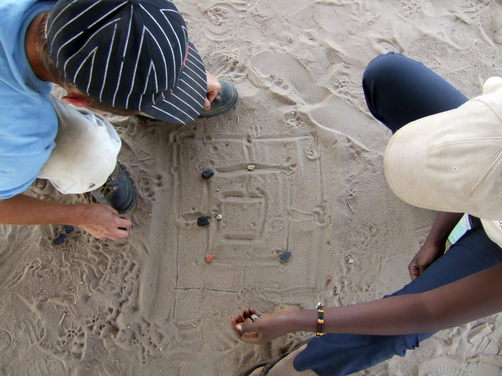

## Frankfurter Schule

<time datetime="2007-09-21">21. September, 2007</time>

Freunde, nun da ich auf einer Turnmatte in der Waldorfschule liege, wo wir uns am Tag vor unserem Abflug getroffen
haben, ist mir eine Idee gekommen: 95% meiner Reiseberichte waren in einem Wochenblatt-Stil geschrieben, das heißt
einmal die Woche kam eine lange Email, die bei manchem Unbehagen bezüglich ihrer Lesbarkeit auslösten. Die anderen 5%
war mein langer Reisebericht aus Tansania, der wohl von wenigen komplett und am Stück gelesen werden konnte.

Nun, da ich jedoch aufgrund meiner leitenden Tätigkeit mein Laptop dabei habe, kann ich wann immer ich will Emails
verfassen und sie bei einem Besuch in der Innenstadt Morogoros absenden. Sodenn werde ich versuchen, jeden Abend auf
unserer Veranda kurz und prägnant zu schreiben, was passiert ist, was gesehen, was gefühlt wurde, down under in Mama
Afrika. Ich bin gespannt, wie es nun dort aussieht, hinterlassen haben wir die Schule jedenfalls so:

Morgen Abend 22:20 Uhr geht es los mit dem Flieger über Dubai nach Daressalam. Was fühle ich nun? Aufregung und was
vielleicht schlimmer ist: ein Kratzen im Hals. Irgendwer von euch, der sich von mir persönlich verabschiedete, hat mich
angesteckt. Wehe ich kriege eine Erkältung oder raus, wer es war. In diesem Sinne, bis morgen!

## Gedankeneisberge

<time datetime="2007-09-22">22. September, 2007</time>

Frankfurt, Terminal, Boarden, erkältet, WikMediNight in mich reinkippen, einsteigen, abfliegen, Husten, EmirateAir,
gutes Essen, Lachs statt Hühnchen, nicht bereut, schlafen, versuchen, zudecken, hin und herrollen, WikMediNight wirkt
nicht, Kinofilme unerwartet mies, keine Ablenkung, endlich diesiger Nebel auf flachem Land, Dubai, Wolkenkratzer ragen
hervor, sanfte Landung, 30 Jahre Wachstum, erzählt die Deutsche neben mir, früher Dorf, jetzt Rushhour, auch morgens,
auch im Flughafen, unausgeschlafen, Hitzewand beim Aussteigen, mehr Schmelztiegel als Amerika, umsteigen, erstmal
Kaffetrinken, mit anderen auf dem Boden hocken und nen Wireless Lan suchen, wieso geht das Handy meines Bruders nicht,
kein Triband, Dreck, neues Handy nötig, zwei Stunden totschlagen, Rückflug wird 10 Stunden Aufenthalt beinhalten, sehe
Schild, dass ich dann das Anrecht auf ein kostenloses Essen habe, der Kaffee fängt an zu wirken, denn ich formuliere
längere Gedanken, der Tag könnte gut werden...

## Let me introduce ourselves

<time datetime="2007-09-23">23. September, 2007</time>

Unereignisreicher Flug von Dubai nach Daressalam, der trotz Turbulenzen kein Kribbeln in mir verursachte. Eine fast
genauso lange wie der Flug dauernde Fahrt nach Morogoro später sitze ich nun auf der Veranda, auf der im April das
andere Leben tobte. Damals 20 Grünschnäbel (ich inklusive), nun sind wir nur zu fünft: neben mir ist da Luzius (auch
schon damals dabei gewesen), Mauro (46 Jahre, Italiener, der in Deutschland lebt und in der Schweiz nochmal studiert),
Clemens, 16 Jahre, Corinna, 19 Jahre, die auf dem Weg zu einem Praktikum in Südafrika ist.

Also definitiv ruhiger als im Frühjahr sind doch die gleichen Riten vorhanden; Abends kalt duschen, um den Staub des
Tages loszuwerden und dann für wenige Minuten den frischen Körper genießen, bevor man ihn mit Mückenspray in eine
klebrige Masse wieder verwandelt.

## First Day

<time datetime="2007-09-24">24. September, 2007</time>

Den “Frischlingen” die Stadt und die Schule gezeigt. Jeder erkennt sofort in Clemens den Bruder von Lukas aus dem
letzten Workcamp wieder, so dass er auch auf der Straße in Morogoro schon angesprochen wurde und nicht nur von den
Kindern in der Schule, die auch Luzius als die Beatbox vom letzten Mal wiedererkennen.

Einiges hat sich verändert: Alles wird teurer dank des Ölpreises. Eine Dalla-Dalla-Fahrt kostet nun 250 statt 200
Schilling (und ich schnauzte den Schaffner an, weil ich dachte er wolle uns Weiße abzocken), das Internet-Café hat
umgebaut und aufgeräumt, was in einer konservativeren, das heißt ablehnenden Haltung gegenüber „Darf ich mal meinen
Laptop hier ins Netz einstecken?“ endete.

Einiges ist gleich geblieben: Dalla-Dallas werden immer noch voll gestopft bis zum Anschlag, Das Internet ist immer noch
sooo langsam wie früher. Aber die warme Milch am Abend von der Milk-Lady schmeckt immer noch genauso lecker. Ich freue
mich auf das erste Mal Reis mit Bohnen morgen Mittag in der Schule, an unserem ersten richtigen Arbeitstag.

Abends auf der Veranda scheint es kaum Moskitos zu geben, muss wohl an der momentanen Trockenzeit liegen, werde abwarten
mit dem Einsprühen.

## Back To Work

<time datetime="2007-09-25">25. September, 2007</time>

Erster richtig Arbeitstag, haben da angefangen wo wir letztes Mal aufgehört haben: Mauern. Dürfte also keinen
Muskelkater geben. In der Mittagspause von Kindern umringt, nein, belagert, nein, BESETZT wie einst Ost-Berlin von den
Russen oder die Plattenabteilung „Mieser Dreck“ von Modern Talking, so dass an ein Mittagsschläfchen nicht zu denken
war. Dennoch drollige Dinger. Einziger richtiger Wermutstropfen: Es gab keine Bohnen zum Reis :-(

Die Kenianer Jamal, Amira und Amira sowie Teddy aus Daressalam kamen heute Abend an. Frage mich, wie die erstgenannten
drei es schaffen werden, ihren Fastenmonat Ramadan auf der Baustelle einzuhalten, da sie nicht einmal Wasser trinken
dürfen. Hatte ja gehofft, es gäbe kaum Moskitos, Pustekuchen! Muss mich wieder einreiben gehen. Apropos Kuchen: Clemens
hatte heute Geburtstag, gab aber keinen Kuchen.

## Monetenmaleste

<time datetime="2007-09-26">26. September, 2007</time>

Hocke auf der Veranda unserer Unterkunft am Nachmittag, nachdem ich früher schon zurück bin um in der Stadt Geld für
Baumaterialien abzuheben. Renne von Bank zu Bank, um einen Automaten zu finden, der funktioniert bzw. sich mit dem
internationalen Bankennetz verständigen kann und dann gibt der mir maximal 300.000 TZSH, knapp 180 EUR, und das ganze
nur einmal am Tag. Bei insgesamt dreitausend Euro Baugeld was wir haben könnt ihr ja die Rechnung auftun, wie spät ich
erst hier raus komme. Ach, und mit Mastercard und meinem guten Namen zahlen kann ich hier auch nicht. Nächstes Mal
schmuggle ich das Geld bar hierher in meinem Hintern, das mag zwar schmerzhafter sein, aber dafür auch einfacher und
schneller vorbei. Immerhin kamen wir dazu, die Baustelle, die sich im übrigen keinen Deut seit unserer Abreise verändert
hat, aufzuräumen, die Grundmauern fertigzustellen und die Pfeiler zu zementieren. So sieht es also momentan aus:

Über das Rechtsverständnis der Kenianer den Kopf geschüttelt. Natürlich kann man das Recht in seine Hand nehmen, wenn
die Polizei so korrupt ist, dass Verbrecher sich ihren Weg aus dem Gefängnis kaufen können. Aber dennoch gleich Dieben
die Beine brechen, mit Benzin übergießen und anzünden, während man freudig um sie herum tanzt? Ich denke nicht...

## From bush to bank

<time datetime="2007-09-27">27. September, 2007</time>

Zum ersten Mal Regen, erst während der Nacht, dann wieder am Nachmittag. Hat uns aber nicht am Arbeiten gehindert, da es
kein Wolkenbruch sondern eher ein Wolkenriss war, der feinen Regen ausspieh. Das Land hat hat es im Nu aufgesogen und
nach einer Stunde sah es aus wie vorher: staubig, trocken, verdorrt, hart, karg. Kein Vergleich zum Frühjahr, als die
Regenzeit noch anhielt. Kleiner Vorteil der trockenen Landschaft: Man kriegt mehr Sonne auf der Veranda ab. Mit meinem
Bankbeamten in Freiburg telefoniert. Glaube nicht, dass er realisierte, dass ich in einem kleinen afrikanischen Kaff im
Busch tausende von Kilometer entfernt in ein Handy sprach und an das Geld für die Baukasse wollte. Glaube nicht, dass er
jemals mehr als 100 Kilometer entfernt von seiner Bank war. Dennoch sehr hilfsbereit, der Herr Kaltenbach, wollen wir
nur hoffen, dass das Geld möglichst schnell hier auf Erastos Konto transferiert wird.

## DrittelDepression

<time datetime="2007-09-28">28. September, 2007</time>
Eine Woche sind wir nun zusammen unterwegs, seitdem wir uns in Frankfurt trafen. Dank oder aufgrund der kleinen Gruppe
ist es bisher nicht zu den gruppendynamischen Spielchen gekommen. Oder sind diese nur nicht ganz so auffällig wie bei
einer größeren Anzahl Leute? Was wird nächste Woche sein?

Und wo wir schon bei Fragen sind: Denke ich an euch daheim? Auf jeden Fall! Manches Gesicht erscheint vor mir, nicht nur
wenn ich Postkarten an manchen verfasse. Doch meist nur des Abends denke ich an euch, denn tagsüber wird bestimmt von
schuften und sich fragen, wo denn der verdammte Lieferwagen mit der Erdlieferung bleibt (welche dann natürlich anders
ist, als das was wir bestellt haben). Vermisse ich euch daheim? Nicht wirklich, denn dafür ist die Zeit zu kurz, die ich
weg bin. Und ich weiß ja ebenso, dass ich euch wiedersehen werde, früher oder später.

## Stoff and Stuff

<time datetime="2007-09-29">29. September, 2007</time>

Während Corinna nach Daressalam gefahren ist, in der Hoffnung ein Flugticket nach Kapstadt zu ergattern, sind wir Männer
daheim geblieben, haben geputzt und waren auf dem Markt Stofftücher einkaufen. Nein, keiner hat was pink-tuntiges
gekauft, sondern nur elegante, aber dennoch afrikanische Stoffe. Manch einer hat diese Art Muster ja schon in meinem
neudekorierten Zimmer sehen dürfen. Denke drüber nach, einen Stoff-Import aufzumachen...

Mit Teddy mich unterhalten, die noch nie außerhalb Tansanias war, aber sehr gerne hier rauskäme, weil es hier nichts
gibt. Wenn man bedenkt, dass ich Unsummen zahle, um hier zu sein... Sie trägt gerade abends immer eine Jacke, weil ihr
so kalt ist, während ich neben ihr in Shorts und leichten Hemd hocke und ihr Bilder vom verschneiten Freiburg zeige...

So, jetzt aber genug von den dunklen Bildern, zurück zu Neuem vom Veranda-Sport, diesmal vom
Leere-Plastikwasserflaschen-mit-einem-Fußball-Schuss-Bowlen. Momentan ist ein Länderturnier Schweiz, Deutschland, Kenia,
Italien, Tansania am Laufen, hoffentlich sind die Nachbarn Lärm-resistent, die Flaschen hallen wir Weihnachtsböller
Grösse Doppel-D. Während ich dies tippe führt Italien...

## The old memory

<time datetime="2007-09-30">30. September, 2007</time>

Im Internetcafé meine Geduld auf die Probe gestellt und alle Einträge bis Freitag in das Blog eingespeist. Zu blöd nur,
dass ich ein altes Dokument auf meinem USB-Stick mitnahm und nicht die aktuellste Version von meinem Notebook, wo ich
entgegen den Prinzipien ein oder vielleicht zwei Anekdoten mehr eingebaut habe. Ihr solltet also vielleicht nochmal
alles lesen, sorry. Zum glück poste ich alles gerade neu, seitdem ich wieder in Deutschland bin, und ihr lest das
Tagebuch eh erst jetzt, wo ich es als Adventskalender propagiere ;-) Nun auf zum obligatorischen Bild, diesmal ein
kleines, eher schon künstlerisch zu nennendes Panorama:

Die erwähnte Dusseligkeit lag vielleicht ebenso wie die Erschöpfung, die ich den ganzen Tag über fühlte, vielleicht an
dem Malariamittel, was ich diesmal vielleicht nicht ganz so gut vertragen habe wie das letzte Mal. Ach ja, und ich
vergaß ebenso zu erwähnen, dass ich euch zwar mit meinem tansanischen Handy SMS schreiben, aber keine empfangen kann.
Wer mir also eine solche schrieb, sollte das vielleicht nochmal per Email tun, damit ich eure Nachricht auch erhalte.

Abends bei Erasto zum Essen eingeladen gewesen. Zum ersten Mal im Leben Kokosnuss geraspelt, danach mit Erasto über
seine Ideen von Lehrer/Schüler-Prinzipien geredet und das ganze auf eine höhere Ebene gehievt, denn nicht nur Lehrer
sollten sich dessen bewusst sein, dass sie noch etwas von ihren Schülern lernen können. Sehr inspirierend, wieder
einmal. Danach gab er eine seiner Geschichten zum besten, während seine Frau drinnen den Mädels ihr Hochzeitsvideo
zeigte. Die klassische Rollenverteilung gibt es also auch hier in Afrika noch.

## Dust in the wind

<time datetime="2007-10-01">01. Oktober, 2007</time>

Es ist windig auf der Veranda, was ich vielleicht wegen meines frisch rasierten Schädels eher merke. Habe mir heute
meine erste Blase beim Schaufeln geholt, als es darum ging, die angelieferte Erde zu verteilen. Staubige Angelegenheit,
vor allem wenn 10 Mann (und Frau) sich mit ihren Schaufeln auf einen Erdhaufen stürzen, was aufgrund der Beengtheit oft
in einer unbeabsichtigter Ladung Erde in manchem Rücken endete. Ständig entschuldigte sich somit jemand für den Dreck
(“Oh, I’m sorry”), den er einem anderen überschüttete, was aber unnötig war, da es von jedem verstanden wurde und was
schon nach wenigen Stunden zu dem Motto unseres Workcamps wurde: “No sorry, just do your work!”.

Aufregender war der Augenblick, in dem Erasto mich fragte, ob ich denn den Schulbus zum Zementladen fahren wolle. Keine
Sekunde zögernd musste ich somit mich auf Linksverkehr und ebensolches Schalten umstellen, was aber dank meiner
Neuseelanderfahrung nicht wirklich schwer war. Jedoch die Schlaglöcher und Sandkuhlen in den zu 95% ungeteerten Straßen
machten das ganze zu einer nicht sehr entspannenden Fahrt: Andauernd musste mich Erasto auf den dritten Gang hinweisen
und dass man auch hier mehr als 40 Stundenkilometer fahren könne.

## The Do-Nothing-Blues

<time datetime="2007-10-02">02. Oktober, 2007</time>

Heute war **DER** Frusttag für die Gruppe. Denn im Laufe das Tages kamen nur 4 Ladungen Erde zur Baustelle, was in
insgesamt 45 Minuten Arbeit auch schon wieder verbaut war. Somit blieb viel zeit zum Nichtstun: Denn wir unterschätzten
nicht unsere Arbeitskraft, sondern eher die lokalen Arbeitsprozesse. So gibt es hier in dem Sinne keine Firma, die sich
auf Erdanlieferungen spezialisiert hat, sondern nur einen Typen, der wiederum den Typen mit dem LKW und Jungs von der
Straße gegen Barzahlung für den Tag zum Erdaufschippen anheuert. Und wenn dann kein Bargeld da ist, wird es schwer diese
bei der Stange zu halten. Für morgen hat mir Erasto aber 1,5 Millionen Schilling versprochen, so dass wir alle Erde der
Welt uns kaufen können, oder zumindest dutzende Wagenladungen tansanesischer.

Der Tag hatte jedoch auch gute Seiten, wenn ich die Minestrone von Mauro erwähnen darf, die ein Gedicht war, was neben
meiner auch die Gruppenmoral hochgezogen hat. Dazu ein kleines Gruppenspielchen mit Ballwerfen und viel Gelächter und
der Abend war gar nicht so übel wie der Tag es hätte vermuten lassen...

## The Do-Nothing-Blues Part 2

<time datetime="2007-10-03">03. Oktober, 2007</time>

Unser dreizehnter Tag hier macht seinem Namen alle Ehre und wurde zu meinem persönlichen Frusttag. Erde kam zwar mehr
als gestern aber immer noch zu wenig und vor allem weniger als versprochen. Dann rammte der bescheuerte LKW-Fahrer auch
noch einen unserer Pfeiler, der sich somit in staubige Zementluft auflöst, und der Typ, der Steine liefern sollte, kam
auch nicht.

Hätte sie alle in der Luft zerreißen können oder anzünden oder zumindest anschreien können, aber letzteres hätte nichts
geholfen, da ja hier jeder nur Kisuaheli spricht. Hatte auch keine Freundschaft zur Hand, die ich hätte kündigen können,
um mich besser zu fühlen.

Die anderen zelebrierten den Tag der Deutschen Einheit und die unfreiwilligen ausgedehnten Ruhepausen wie man oben im
Bild sehen kann beim friedlichen Mühlespiel Schwarz gegen Weiß.

## Back To Work (Again)

<time datetime="2007-10-04">04. Oktober, 2007</time>

Ich bin fertig! Fix und fertig! Kann nicht mehr, da endlich Arbeit erledigt wurde heute morgen. Alle Erdlieferungen
kamen an sowie 6 Ladungen Steine, und zwar richtige Wackersteine, das heißt, 20 bis 30 Kilo schwer zum Fundament
beschweren. Die den ganzen Tag getragen und verlegt und jetzt bin ich sooo froh gleich im Bett liegen zu können, das
könnt ihr euch nicht vorstellen. Mit Mühe konnte ich mich heute Abend noch dazu aufraffen, unsere Straße lange zu gehen
und ein paar Bilder zu machen, ebenso wie dem lokalen Souvenierhändler was für Mama zu Weihnachten zu kaufen. Tja,
Mutter, da kannst du dich schon einmal auf was freuen....

Das Geld ist aus Deutschland immer noch nicht auf dem Konto hier, langsam denke ich, das wird nicht elektronisch sondern
materiell übermittelt, wahrscheinlich von einem armen Kerl, der es im Hintern schmuggeln muss...

## I’m ritch, bit...

<time datetime="2007-10-05">05. Oktober, 2007</time>

Endlich ist das Geld auf Erastos Konto gelandet und wir sind reich!!! Etwas mehr als 5 Millionen Tansanesische
Schillinge warten darauf, nun ausgegeben zu werden, was umgerechnet zwar nur knapp 3000 Euro sind und Erasto erstmal 1,5
Millionen erhält, die er uns vorgestreckt hat, und sowohl der Erd- als auch der Stein-Lieferant erhalten auch gleich
eine weitere Million davon, aber dennoch fühlt es sich gut an mit 5 dicken Bündeln Zehntausender Scheinen die Bank zu
verlassen. Gut getarnt in meinen staubigen und verdreckten Arbeitsklamotten würde auch keiner denken, dass sich soviel
Geld in meinem Rucksack befindet.

Monetär entsprechend gestärkt fühlten Luzius und ich uns berufen, abends eine Extraschicht auf der Baustelle einzulegen,
um mit den Söhnen des Bauleiters die vierte von elf Steinreihen zu vollenden, die wir als Ziel für das Workcamp uns
gesetzt haben. Nur als die Jungs, die besagte 20-Kilo-Steine anliefern, diese wie Kieselsteine auf den Schultern tragen
und nicht wie wir nur mit Mühe in zwei Händen halten können, fühlen wir uns wieder auf den Boden europäischer Kräfte
zurückgeholt.

Abends kommt Erasto vorbei, zeigt Bilder von den Anfangstagen der Schule und welche Philosophie dahinter steht. Ich hab
das schon zwar einmal gehört, aber jedesmal wieder ist es inspirierend, mit welchem Einsatz dieser Mann seine Idee
verwirklicht.

## Relax

<time datetime="2007-10-06">06. Oktober, 2007</time>

Der Tag war zur freien Verfügung für die Teilnehmer, was für mich bedeutete, einfach mal in den RockGarden gehen zu
können, einem kleinen Park durch den ein Fluss fließt, dessen Verlauf ich einfach eine Stunde nach oben in die
Uruguru-Berge hochwanderte ohne einer Menschenseele zu begegnen. Gemütentspannend und Seelebaumelnd stieg ich über Stock
und Stein ohne Ziel, sondern nur wegen des Weges.

Nachmittags Armin abgeholt, der von seinem vierwöchigen Arztpraktikum aus einem total entlegenen Teil des Landes
zurückkam und nun auf dem Heimweg bei uns Station macht. Und wenn ihr dachtet, das hier wäre schon ein einfaches Leben,
dann hättet ihr Armins Reaktion sehen sollen, der sich einfach nur darüber freute, eine richtige Stadt zu sehen, mit
einem Markt, wo es nicht nur Bananen sondern auch Ananas und anderes Obst gab.

Unser bisheriger Wachmann wurde abgelöst durch einen neuen. Lag wohl daran, dass er nach Alkohol gerochen hat und mehr
Schlaf- als Wachmann war.

## Safari!

<time datetime="2007-10-07">07. Oktober, 2007</time>

Wieder mal mit dem Schulbus in den Mikumi-Nationalpark gefahren. Trotz gedämpfter Erwartungen, die der Tourführer
aufgrund der Trockenheit ausgegeben hat, sahen wir so ziemlich alle Tier, teilweise in extremer Nähe wie die
Elefantenfamilie am Straßenrand.

Und im Gegensatz zum Frühjahr sahen wir auch unter einem Busch, ca. 100 Meter entfernt, zwei Löwen Siesta halten bzw.
wenn mich meine Augen nicht getäuscht haben, auch für Nachwuchs sorgen. Oder der Löwe hat einfach mal seinen Hüftschwung
aus Jugendtagen auffrischen wollen, wer weiß. Eins jedoch weiß ich sicher: Die nächste Safari bestreite ich mit ner
Kamera mit größerem Zoomobjektiv, damit ich Beweisbilder mitbringen kann.

Verliere das Vertrauen in die Einstellungsgespräche der lokalen Sicherheitsfirmen, jetzt da auch unser neuer Wachmann,
übrigens ein Albino, neben mir auf dem Sofa einschläft. Na denn, gute Nacht!

## Business as unusual

<time datetime="2007-10-08">08. Oktober, 2007</time>

Corinnas Geburtstag, der standesgemäß mit einem Ständchen der Kinder auf der Baustelle eröffnet wurde. Der weitere Tag
dort war relativ uninteressant, da wieder nur Steine zu schleppen und zu legen waren. Einziger Aufrüttler war eine
Szene, die ich nicht direkt beobachtet habe, aber von der mir erzählt wurde, wo ein Lehrer wohl systematisch die Schüler
mit dem Stock auf die Finger schlug. Abends darauf angesprochen erzählte Erasto, dass er sich dessen Problem wohl
bewusst ist, aber er nicht von heute auf morgen die Lehrer, die keine andere Erziehungsmethode als den Stock kennen
gelernt haben, ändern kann.

Nichtsdestotrotz versucht er es, und er redet sowohl mit den Lehrern als auch mit den Eltern (die sich teilweise
wundern, warum Stockhiebe schaden sollen) über seine Ideen und Vorstellungen.

## Looking ahead

<time datetime="2007-10-09">09. Oktober, 2007</time>

Die Muskeln werden müder und müder, dennoch versuchen wir das von uns gesteckte Ziel, den gesamten Grundriss mit Steinen
zu bedecken zu erreichen. Wird knapp werden, vor allem da die Kinder sich morgen an unserem letzten Arbeitstag von uns
verabschieden wollen mit Liedern und Tänzen. Schon die nächsten Bauschritte durch gerechnet mit Erasto und Mr. Kinze. Um
den Boden mit Zement zu bedecken wären ca. 6 Millionen Schilling nötig, jetzt nach unserem Camp haben wir noch ca 1.5
Millionen übrig. Da diese Zementarbeit auch nicht besonders gut geeignet für ein Workcamp ist, wäre es besser, das bis
zum nächsten Mal erledigt zu haben. Muss ich wohl Spenden sammeln gehen in Deutschland... Abends stellt Jamal seine
Hilfsorganisation in Kenia vor und Amina macht äthiopisches Essen. Lecker. Muss ich wohl mal in beide Länder mal fahren.
Und ein paar neue Wörter auf kisuaheli gelernt, aber da das auf der Baustelle war, sind diese nicht jugendfrei und somit
hier wiederholbar.

## Farewell

<time datetime="2007-10-10">10. Oktober, 2007</time>

Es heißt Abschied nehmen, zum einen von den Kindern, zum andern von unseren Kräften, die uns verlassen. Schafften wir an
bisherigen Vormittagen zwei Reihen Steine zu legen, so ist es heute nur eine gewesen. Aber das ist nicht schlimm, denn
an diesem Tag gibt es wichtigere Sachen wie zum Beispiel Schuhe verschenken. Und so gab ich meine bewährten
Wanderschuhe, die mich seit meiner ersten Reise 2001 nach Thailand begleitet haben, an Juma, den Sohn des Bauleiters.
Mir mögen sie langsam zu kaputt erscheinen, aber hier sind sie Gold wert und allemal besser als seine Flip-Flops mit
denen er bisher 30 Kilo Steine durch die Gegend trug.

Nach einem letzten Reis mit Bohnen Mittagsmahl haben dann die Kinder für uns Lieder gesungen und wir uns gegenseitig mit
kleinen Reden verabschiedet, bevor wir ihnen noch Fußbälle als Geschenk gaben und wir Abschiedsbilder mit ihnen gemacht
haben, wobei ich euch sagen kann, dass eine Meute von Grundschulkindern für ein Bild posieren zu lassen schwieriger ist
als eine Pockenepidemie zu bändigen. Wir sind nicht ganz mit dem Grundriss fertig geworden aber das ist auch nicht
weiter tragisch.

## To the beach

<time datetime="2007-10-11">11. Oktober, 2007</time>

Nun sitze ich am Strand von Daressalam und die Fahrt hierher hat drei der Lehren, die man hier in Afrika erhalten kann,
aufgezeigt:

1. Abfahrtszeiten sind nur grobe Angaben und man kann generell eine halbe Stunde draufschlagen ohne in Verzug zu
   geraten, aber das war ich schon gewohnt.
2. Geblitzt zu werden als Verkehrsteilnehmer, wie zum Beispiel der Fahrer unseres heutigen Überlandbusses, ist nicht
   weiter tragisch, da ganz unbürokratisch eine der unzähligen kreativen Möglichkeiten, Geld vor dem Polizisten zu
   verlieren, welches dieser zufällig finden kann, angewandt werden kann.
3. Niemals einem Mittelsmann zu vertrauen, der einem versichert, dass er das Hotel am Strand gebucht hat. Bei unserer
   ersten Wahl nämlich angekommen war es diesen peinlich erklären zu müssen, dass besagter Mittelsmann erst heute morgen
   bei ihnen auftauchte und sie nicht genug Betten hätten, uns zu beherbergen.

Glücklicherweise war danebenliegendes Bungalowdörfchen noch frei und unser Gruppenbudget noch nicht aufgebraucht. Selber
Strand, Selbe Sonne, Selber Spaß.

## BeachBoys and Girls

<time datetime="2007-10-12">12. Oktober, 2007</time>

Ein Tag der Überraschungen, denn während sich die Gruppe am Strand mehr oder weniger größere Sonnenbrände geholt hat,
bin ich mit den Kenianern und Helena nach Daressalam hinein gefahren um Besorgungen zu erledigen wie Geldumtauschen und
noch mehr Tücher einkaufen. Dabei sind mir unerwartet zwei Dinge zum ersten mal passiert:

Ich bin in einem Hummer mitgefahren, da Jamals Bruder bei der Einführung desselbigen in Tansania eine Rolle gespielt hat
und er uns ein Stück mitnahm, nachdem wir ihn in der Stadt für 5 Minuten getroffen haben. Fragt sich nur, ob der von ihm
gepriesene Spritverbrauch von 11 Litern pro 100 Kilometern auch wirklich stimmt. Der Preis von 108 Millionen Schilling
(umgerechnet ca. 62000 EUR) scheint gerechtfertigt, wenn man darin sitzt und endlich mal keins der Schlaglöcher in der
Straße direkt auf seinem Hintern aufschlagen fühlt, wie ich in der sich anschließenden Dalla-Dalla-Fahrt merkte.

Doch die größte Überraschung dabei war, dass ich nach dem Zahlen der 250 Schilling vom Schaffner ein Papierticket in die
Hand gedrückt bekam. Fassungslos starrte ich so lange auf diesen Zettel, das Helena nach einer Weile mich fragte ob
alles in Ordnung sei, aber selbst sie konnte mir nicht erklären, wie es zu diesem technologischen Sprung kommen konnte.

Der Abend klang mit leckerem Essen und Reden über das die letzten drei Wochen erlebte aus, bevor wir uns ein letztes Mal
unter dem Himmel Tansanias zum Schlafen legten.

## DubaiDibaDu

<time datetime="2007-10-13">13. Oktober, 2007</time>

Kaum denkt man, man hat schon alles erlebt, da passiert es und so sitze ich nun Backstage im Flughafen von Dubai während
ich dies schreibe, das erste Mal dass ich hinter die Kulissen eines solchen blicken kann. Warum, fragt ihr euch kommt
mir diese Ehre zuteil? Weil ein anderes erstes Mal mir widerfahren ist. Nein, nicht unabsichtlicher Drogenschmuggel im
mitgebrachten Souvenir aus fragwürdigem Handel, sondern mein erstes Mal Kotzen in einem Flugzeug. Da ich dazu noch
Kopfweh und Schwindelgefühl bekam, dachte ich es sei besser, die medizinische Versorgung des aufstrebendes arabischen
Emirats zu testen, die darüber hinaus noch kostenlos ist, Erdölmilliarden sei Dank. Das ich damit die über 9 Stunden
Aufenthalt hier auch etwas kurzweiliger gestalten kann ist nur ein kleiner Bonus dazu.

Bis dahin war der einzige Aufreger des Tages der Dalla-Dalla-Fahrer am Morgen, der es schaffte, als erster
Bustransporteur in meinen Afrikaerinnerungen pünktlich auf die Minute an unserer Strandherberge zu erscheinen, während
ich noch mitten im Zusammenpacken meines vor Souvenirs überquellenden Rucksacks war. Doch nicht nur dass er pünktlich
war, er hatte sogar die Unverfrorenheit, uns Europäer zur Eile zu ermahnen

Ups, ich muss los, der Doktor will mich sehen...

## Back to Complicated

<time datetime="2007-10-14">14. Oktober, 2007</time>

Frankfurt Flughafen, es ist kalt und laut. Alle sind verabschiedet und auf dem Weg nach Hause in ihren Zügen und Autos,
nur ich habe es mir noch für eine Weile hier gemütlich gemacht in den Abfertigungshallen neben den anscheinend einzigen
vorhandenen Steckdosen, die die Elektroautos des Bodenpersonals aufladen. Die Nacht habe ich noch gut überstanden, auch
wenn der indische Doktor mich kein einziges Mal angeschaut hat und nur die Dosierungsanleitungen der Medikamente, die
ich nehmen sollte, herunterratterte in einem indisch-englischen Akzent, der Apu aus den Simpsons zur Ehre gereicht
hätte. Schlimmes konnte er nicht feststellen, es war wohl irgendwas im Bordessen was ich nicht vertrug.

Nach 5 Stunden Schlaf auf einem Stuhl in Dubais Flughafen war ich auf dem Flug nach Frankfurt auch wieder einigermaßen
bei Kräften und hungrig, so dass die letzte Nacht nur mehr als kleiner Ausrutscher meines Verdauungstraktes zu
verzeichnen sein wird. Ach ja, bevor ich es wieder vergesse, hier ein Bild, wie die Baustelle bei unserer Abreise
aussah:

Doch was nun, da ich wieder hier bin? Ich habe keine Ahnung. Sicherlich wird es wieder ein Workcamp in Erastos Schule
geben, nur werde ich nicht dabei helfen; man muss auch mal jüngere ranlassen. Aber vielleicht helfe ich ihm, Sponsoren
für die Schule und den Bau zu finden. Und da ich nun wieder im Zug hocke, die Landschaft an mir vorbei rast, bin ich
gespannt was die Zukunft bringt.

Seid ihr es auch?
