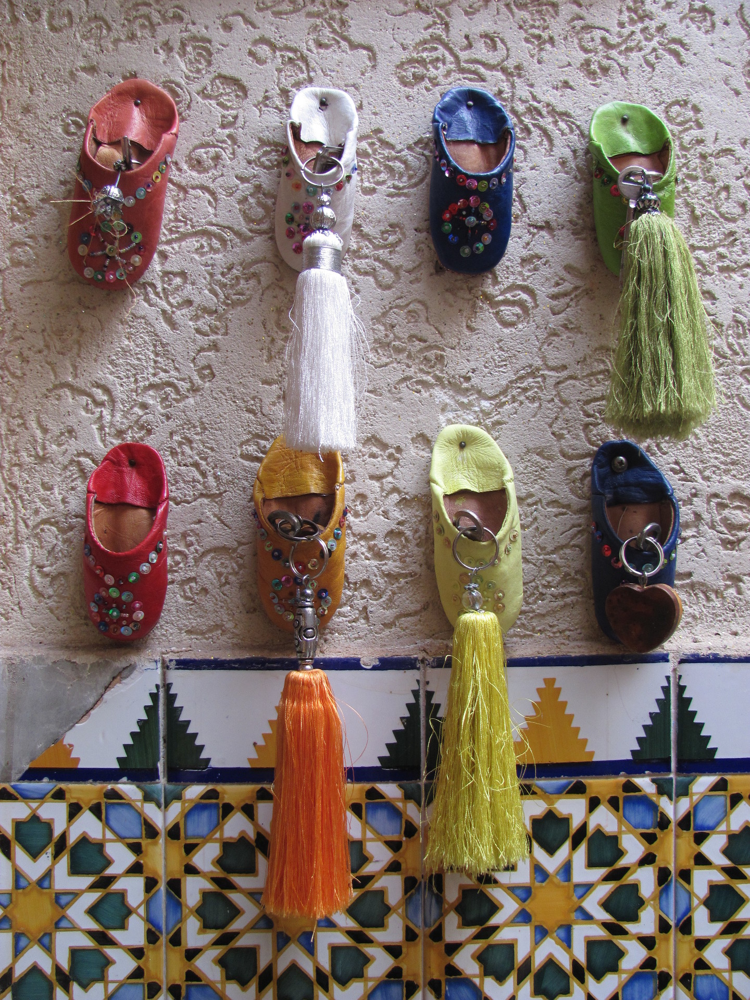
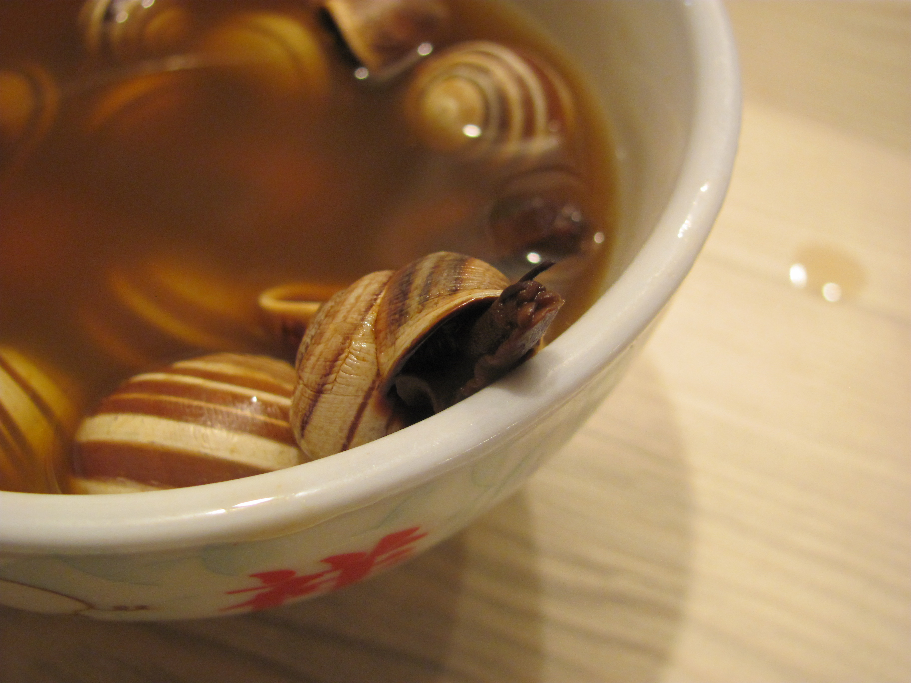

## Dienstag, 10. März 2015: Marrakesch

Acht Jahre, acht verdammt lange Jahre... So lange ist nun mein letzter Reisebericht auf diesen Seiten, in meinen Emails
geschrieben in abgelegenen, stickigen oder hektischen Internetcafes dieser Welt her...

Und doch, diese acht Jahre umgerechnet in knapp 41 Millionen mal Augenblinzeln, kommen mir vor wie nur einer, ich
schließe die Augen in Tansania und öffne sie hier in Marokko wieder. Und all das dazwischen, Brasilien, Kap Verde,
Teneriffa, Curacao, Prag, Dublin, nur ein Traum, von dem ich euch nichts erzählt habe. Eines Tages berichte ich euch
vielleicht noch von diesen Träumen. Doch wie solche nach dem Aufwachen einem noch frisch vor den Augen herumtanzen, und
man nicht glauben mag, was einem dort alles passiert ist, so lassen sie sich später nicht mehr fassen, wenn man sie
nicht rechtzeitig einfängt mit seinen Fingern und sie verblassen wie die Details meiner Erinnerungen an diese Reisen mit
jedem Tag ein wenig mehr. Eventuell lasse ich meine unzähligen Fotos euch von diesen teils fernen Ländern berichten but
first things first: was mache ich also in Marokko?

Die harten Fakten zuerst, um sie aus dem Weg zu haben wie die Passkontrolle am Flughafen Schönefeld: 12 Tage nur, aber
raus aus Berlin, rein in was sonniges war das einzige was zählte als wir vor nichtmal drei Wochen buchten. Umso
erfreuter war mein Chef über diese Spontanität und Kurzfristigkeit, aber wat mit dat mut. Und da ich gewissenhaft meine
Arbeiten übergab und alles pikkobello in guten Händen zurückließ (auch meinen Kater Baghira, danke hier nochmal an Katja
fürs Babycatsitten) stand also kein Chef mit Schwimmflügelchen um 7 Uhr morgens am Check-In-Schalter, um an meiner
Stelle mit Stef gen Adagio zu fliegen. easyjet war die Fluglinie und so überraschend günstig wie der Flug war, so
unspektakulär war er auch. In einem Anfall von Dekadenz buchte ich jedoch zum ersten Mal Sitze mit mehr Beinfreiheit am
Notausgang, vielleicht komm ich der ersten Klasse nie so nah wie da, aber ich muss sagen: Nie haben sich 10 cm mehr
besser angefühlt. Okay, bei einem schönen Stück Spießbraten schon, also für die Nicht-Hunsrücker ist das ein großes
gerolltes Stück Fleisch, welches nach einmaligem Konsum schon süchtig machen kann...

Je mehr ich drüber nachdenke, desto schlüpfriger wird hier die Metapher... Deshalb ein Themenwechsel:

Gebucht hatten wir auch schon die erste Nacht in einem kleinen Riad in Agadir, einer halb touristischen, halb normalen
Stadt am Atlantik. Die (auch einheimischen) Touristen halten sich meist in den Hotelanlagen am Meer auf, das normale
Leben findet in den Straßen weiter drinnen statt, was für uns natürlich der interessantere Teil war. Gebucht war ebenso
schon ein Taxi, was uns am Flughafen abholen sollte...

“Moment mal” hör ich da vielleicht einen von euch rufen, was redest du da von acht Jahren Reisebericht-Pause, war da
nicht dieser Costa Rica Bericht Ende 2015? Richtig, dort waren wir ein halbes Jahr nach Marokko. Und in letztgenanntem
hab ich nur via Notizbuch mitgeschrieben und wollte später es digital euch zur Verfügung stellen. Tja, und was ist
passiert, nachdem ich diese ersten Zeilen schon ins Digitale überführt hatte? Richtig, mein Notizbuch ging verloren.
Zurückgelassen auf einem Tisch einer Retro-Computer-Party in Marzahn muss ich nun ohne meine Schriftstücke versuchen in
den nächsten Tagen die Erlebnisse anhand meiner Fotos zu rekonstruieren, mein Gedächtnis ist wie man sieht ja nicht
besser geworden. Tja, und sowas einzugestehen ist auch nicht einfach für mich, deshalb hat es fast 2 Jahre gedauert bis
ich dieses Projekt wieder aufgenommen habe. Also, seid gespannt, was mit dem Taxi noch war (bzw nicht war), was man nach
einem Stromausfall essen sollte und wieso ich bis heute denke, dass alte marokkanische Fischer mich mit ihrem
Kartenspiel in den Wahnsinn treiben wollten.

Gespannt? Ich hoffe ihr auch, V
