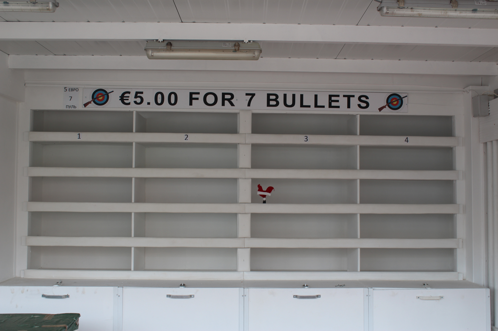

## TODO Zypern

Heute melde ich mich mal mit einer leicht anderen Format aus dem Urlaub. Es liegen zwar ganze zwei Wochen Zypern hintern
uns, aber die Zeit haben wir ausgiebigst genutzt auf der faulen Haut zu liegen, getreu dem Motto: „Kulturprogramm ist
was für andere Leute.“ Es würde also nicht reichen um daraus einen Mehrteiler daraus zu machen. Von daher hier die grobe
Reiseroute, die euch heute erwartet: Eine Woche in Larnaka im Südosten gefolgt von einer Woche in Paphos im Westen der
Insel.

In beiden Orten Appartement auf einer bekannten Vermittlungsplattform von „privat“ gebucht, aber wer das glaubt, glaubt
auch daran, dass Internetkonzern den vollen Steuersatz zahlen. Egal, beide Gastgeber wirkten symphatisch, aber beide
waren irgendwie verplant. Die erste, Georgia und ihr Mann Varikis, informierten uns zum Beispiel einen Tag vor unserem
Abflug darüber, dass bedauerlicherweise unser Appartement in Strandnähe außerhalb der Stadt leider am ersten Tag noch
vergeben wäre. Wir könnten aber ein Appartement ovn ihnen in Larnak Innenstadt für den gleichen Preis an dem Tag oder
sogar für die ganze Woche bekommen. Ein Blick auf die Fotos der Ersatzbude machte aber klar, dass wir in diesem 70er
Jahre befliesste im 2. Stock an der Parallelstraße zur Uferpromenade geräuschvoll gelegenen Büdchen nicht mehr als die
eine Nacht verbringen würden :-)

Wie das erst in der Hochsaison sein würde mag man sich nicht vorstellen. SO jedenfalls war es schon unangenehm. Das
eigentliche Appartement war hingegen ein lauschiges Träumchen, 50 Meter zu einer Kaffeekette, 50 meter zum Strand.
Wobei, Wasser und Tagestemperatur luden uns jetzt nicht zum Abkühlen ein, aber das war ja auch nicht Sinn des Urlaubs.
Faul herumliegen, Kaffee trinken, Abends lecker kochen und mal im Restaurant Fisch essen, das wars. Einmal in ne Touri
Ecke gefahren, wo die Saison noch im Winterschlaf liegt, die meisten Restaurants und Geschäfte also entweder geschlossen
oder in Renovierung gerade sind.

Absolute Nebensaison hat d dort im Apartment in Strandnähe. Dann eine Woche im Westen in Paphos ebenfalls in einem
Appartement, diesmal mit Meerblick, wenn wir den Bildern Glauben schenken durften.
